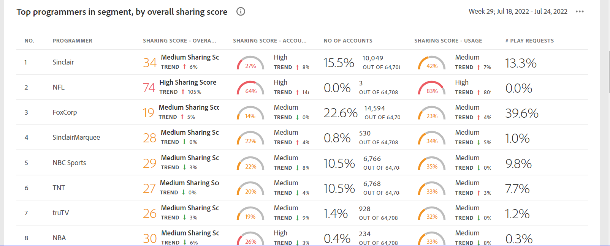

# Dashboard {#dashboard}

Il dashboard riepiloga e aggrega i dati in una raccolta di grafici e rapporti progettati per fornire una panoramica di alto livello dell&#39;ambito e dell&#39;impatto della condivisione dei conti. Fornisce una singola pagina contenente i report principali e le metriche da Account IQ.

*Figura: Dashboard*

## Punteggio di condivisione medio - aggregato per il segmento corrente {#aggregated-sharing}

Il pannello Punteggio di condivisione aggregata fornisce una lettura della riga principale che riassume la quantità e l’impatto della condivisione in termini di account e volume in streaming.

I valori consentono di comprendere l’entità della condivisione delle credenziali da parte degli abbonati, fornendo quindi una misura della necessità di agire su di essa.

*Figura: Pannello del punteggio medio di condivisione - aggregato per il segmento corrente*

Le tre metriche seguenti sono componenti del punteggio medio di condivisione.

### Livello di condivisione {#sharing-level}

L&#39;indicatore del livello di condivisione mostra la percentuale di tutti gli account degli abbonati (nel segmento definito) che vengono condivisi, durante l&#39;intervallo di tempo selezionato.

Un valore calcolato in base alla media della probabilità di condivisione calcolata per ogni conto nell&#39;insieme di MVPD selezionati che è stato trasmesso da uno dei canali programmatori selezionati durante l&#39;intervallo di tempo selezionato.

*Figura: Livello di condivisione*

L’indicatore Tendenza mostra la variazione percentuale del valore della metrica in rispetto all’intervallo di tempo precedente.

### Utilizzo dagli account condivisi {#usage-from-shared-accounts}

Questo indicatore indica la percentuale di utilizzo di tutti gli account utente iscritto dagli account condivisi per il segmento e il periodo di tempo definiti. Il contatore indica gli intervalli di utilizzo (da account condivisi) nella scala da 0 a 100%. Questi intervalli, denominati Bassa, Media, Alta e Anormale, si basano sulla media del settore.

Puoi anche vedere l&#39;indicatore Tendenza, che rappresenta un aumento o una diminuzione dell&#39;utilizzo da account condivisi rispetto all&#39;intervallo di tempo precedente.

*Figura: Utilizzo dagli account condivisi*

### Punteggio di condivisione complessivo {#overall-sharing-score}

Il punteggio di condivisione complessivo è composito dei punteggi di condivisione, tra cui &quot;Livello di condivisione&quot; e &quot;Utilizzo z dagli account condivisi&quot;.

Fornisce un valore inteso per riflettere l&#39;impatto relativo della condivisione rispetto al settore. La sua funzione è simile a quella di un punteggio di credito, che riassume la situazione con un singolo numero. Ma in questo caso, più alto è il numero, maggiore è il danno potenziale.

*Figura: Punteggio di condivisione complessivo*

<!--### MVPDs in segment {#mvpd-in-segment}

It is a table of risk indices and accounts totals for the top MVPDs ranked by overall usage or account sharing.

-->

## Punteggi complessivi di condivisione a livello di industria per MVPD {#top-mvpds}

Questa tabella fornisce una visualizzazione comparativa dei diversi Punteggi di condivisione aggregata per gli MVPD nel segmento.

>[!NOTE]
>
>Questa tabella utilizza i dati industriali complessivi a fini comparativi, non i dati rappresentati da tali MVPD nel segmento.

*Figura: MVPD principali nel segmento per punteggio complessivo*

## Condivisione dei punteggi per canali e MVPD {#sharin-score-by-channels-and-mvpds}

Questa tabella fornisce una visualizzazione comparativa della condivisione dei punteggi dei canali selezionati per gli MVPD nel segmento corrente.

*Figura: Condivisione dei punteggi per canali e MVPD*

## Probabilità di condivisione degli account {#accounts-sharing-probability}

Questo grafico divide gli account in intervalli di quote di probabilità di condivisione da molto basso (0-20%) a molto alto (80=100%).

>[!NOTE]
>
>Il grafico a barre utilizza una scala logaritmica.

*Figura: Numeri e percentuali degli account abbonati in diversi intervalli di probabilità di condivisione*

## Numero di account e utilizzo condividendo il livello di probabilità {#number-of-accounts-usage-sharing-probability}

Questo pannello fornisce una visualizzazione tabulare degli account suddivisi in intervalli di condivisione dei quintili di probabilità da molto basso (0-20%) a molto alto (80-100%) con l’utilizzo associato di ciascun quintile dagli account condivisi.

*Figura: Numero di account, tendenze e utilizzi che rientrano in vari intervalli di probabilità*

<!--
+++Dashboard for programmers

*Figure: The dashboard*

## Average sharing score - aggregated for the current segment {#aggregated-sharing}

The Aggregated Sharing Score panel provides a top line readout summarizing the quantity and impact of sharing in terms of accounts and streaming volume.

The values help you understand the magnitude of credential sharing by your subscribers, hence providing a measure of the need to act upon it.

*Figure: Average sharing score panel - aggregated for the current segment*

The following three metrics are components of the Average Sharing Score.

### Sharing level {#sharing-level}

The sharing level gauge shows the percentage of all your subscriber accounts (in the defined segment) that are shared, during the selected time frame.  

A value calculated based on an average of the sharing probability computed for every account in the set of selected MVPDs that has streamed from a one of the selected programmer channels during the selected time frame.

*Figure: Sharing level*

The Trend indicator shows the percentage change in the value of the metric in from the previous time frame.

### Usage from shared accounts {#usage-from-shared-accounts}

This gauge indicates what percent of the usage of all the subscriber accounts is from the shared accounts for the defined segment and time period. The gauge marks the ranges of usage (from shared accounts) on the scale of 0 to 100%. These ranges—named Low, Medium, High, and Abnormal—are based on the industry average.

You can also see the Trend indicator, which depicts a rise or fall in the usage from shared accounts as compared to the previous time frame.

*Figure: Usage from shared accounts*

### Overall sharing score {#overall-sharing-score}

Overall sharing score is composite of sharing scores including “Sharing level” and “z Usage from shared accounts”.

It provides a value meant to reflect the relative impact of sharing when compared to the industry. It’s purpose is similar to that of a credit score, summarizing the situation with a single number. But in this case, the higher the number the greater the potential harm.

*Figure: Overall sharing score*

<!--### MVPDs in segment {#mvpd-in-segment}

It is a table of risk indices and accounts totals for the top MVPDs ranked by overall usage or account sharing.

### Industrywide overall sharing scores for MVPDs {#top-mvpds}

This table provides a comparative view of the different Aggregated Sharing Scores for the MVPDs in the segment.

>[!NOTE]
>
>This table uses overall industry data for comparative purposes, not the data represented by those MVPDs in the segment.

*Figure: Top MVPDs in segment by overall score*

### Sharing score by channels and MVPDs {#sharin-score-by-channels-and-mvpds}

This table provides a comparative view of sharing scores of the selected channels for the MVPDs in the current segment.

*Figure: Sharing scores by channels and MVPDs*

### Accounts sharing probability {#accounts-sharing-probability}

This chart partitions accounts into ranges of sharing probability quintiles from very low (0-20%) to very high (80=100%).

>[!NOTE]
>
>The bar graph uses a logarithmic scale.

*Figure: Numbers and percentages of subscriber accounts in different sharing probability ranges*

### Number of accounts and usage by sharing probability level {#number-of-accounts-usage-sharing-probability}

This panel provides tabular view of  accounts partitioned into ranges of sharing probability quintiles from very low (0-20%) to very high (80-100%) with each quintile’s associated usage from shared accounts.

*Figure: Number of accounts, trends, and usages falling in various probability ranges*

+++

+++Dashboard for MVPDs
The dashboard for MVPD users is slightly different from those of the programmer users.

*Figure: MVPD's Dashboard*

## Top programmers in segment by overall sharing score {#}

*Figure: Panel showing top programmers in a segment*
+++

+++Dashboard for MVPDs
The dashboard for MVPD users is slightly different from those of the programmer users.

*Figure: MVPD's Dashboard*

## Top programmers in segment by overall sharing score {#}

*Figure: Panel showing top programmers in a segment*
+++
-->