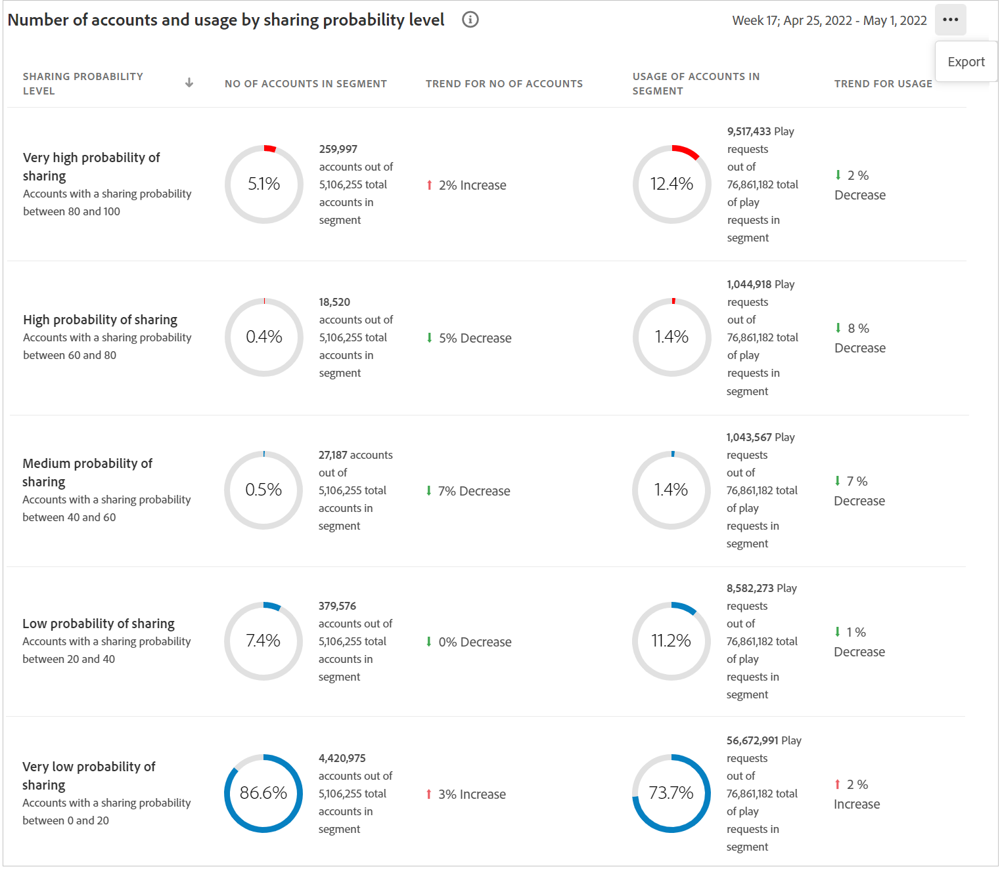

# Dashboard {#dashboard}

Il dashboard riepiloga e aggrega i dati in una raccolta di grafici e rapporti progettati per fornire una panoramica di alto livello dell&#39;ambito e dell&#39;impatto della condivisione dei conti. Fornisce una singola pagina contenente i report principali e le metriche da Account IQ.

## Punteggio di condivisione aggregato {#aggregated-sharing}

Il pannello Punteggio di condivisione aggregata fornisce una lettura della riga principale che riassume la quantità e l’impatto della condivisione in termini di account e volume in streaming.

I valori consentono di comprendere l’entità della condivisione delle credenziali da parte degli abbonati, fornendo quindi una misura della necessità di agire su di essa.

Le tre metriche seguenti sono componenti del punteggio di condivisione aggregato.

### Livello di condivisione {#sharing-level}

L&#39;indicatore del livello di condivisione mostra la percentuale di tutti gli account degli abbonati (nel segmento definito) che vengono condivisi, durante l&#39;intervallo di tempo selezionato.

Un valore calcolato in base alla media della probabilità di condivisione calcolata per ogni conto nell&#39;insieme di MVPD selezionati che è stato trasmesso da uno dei canali programmatori selezionati durante l&#39;intervallo di tempo selezionato.

L’indicatore Tendenza mostra la variazione percentuale del valore della metrica in rispetto all’intervallo di tempo precedente.

### Utilizzo dagli account condivisi {#usage-from-shared-accounts}

Questo indicatore indica la percentuale di utilizzo di tutti gli account utente iscritto dagli account condivisi per il segmento e il periodo di tempo definiti. Il contatore indica gli intervalli di utilizzo (da account condivisi) nella scala da 0 a 100%. Questi intervalli, denominati Bassa, Media, Alta e Anormale, si basano sulla media del settore.

Puoi anche vedere l&#39;indicatore Tendenza, che rappresenta un aumento o una diminuzione dell&#39;utilizzo da account condivisi rispetto all&#39;intervallo di tempo precedente.

### Punteggio di condivisione complessivo {#overall-sharing-score}

Il punteggio di condivisione complessivo è composito dei punteggi di condivisione, tra cui &quot;Livello di condivisione&quot; e &quot;Utilizzo z dagli account condivisi&quot;.

Fornisce un valore inteso per riflettere l&#39;impatto relativo della condivisione rispetto al settore. La sua funzione è simile a quella di un punteggio di credito, che riassume la situazione con un singolo numero. Ma in questo caso, più alto è il numero, maggiore è il danno potenziale.

<!--### MVPDs in segment {#mvpd-in-segment}

It is a table of risk indices and accounts totals for the top MVPDs ranked by overall usage or account sharing.

-->

### Punteggi complessivi di condivisione a livello di industria per MVPD {#top-mvpds}

Questa tabella fornisce una visualizzazione comparativa dei diversi Punteggi di condivisione aggregata per gli MVPD nel segmento.

>[!NOTE]
>
>Questa tabella utilizza i dati industriali complessivi a fini comparativi, non i dati rappresentati da tali MVPD nel segmento.

### Condivisione dei punteggi per canali e MVPD {#sharin-score-by-channels-and-mvpds}

Questa tabella fornisce una visualizzazione comparativa della condivisione dei punteggi dei canali selezionati per gli MVPD nel segmento corrente.

### Probabilità di condivisione degli account {#accounts-sharing-probability}

Questo grafico divide gli account in intervalli di quote di probabilità di condivisione da molto basso (0-20%) a molto alto (80=100%).

>[!NOTE]
>
>Il grafico a barre utilizza una scala logaritmica.

### Numero di account e utilizzo condividendo il livello di probabilità {#number-of-accounts-usage-sharing-probability}

Questo pannello fornisce una visualizzazione tabulare degli account suddivisi in intervalli di condivisione dei quintili di probabilità da molto basso (0-20%) a molto alto (80=100%) con l’utilizzo associato di ciascun quintile dagli account condivisi.

