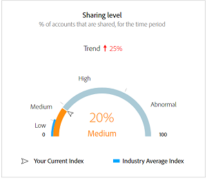

# Dashboard {#dashboard}

Il dashboard riepiloga e aggrega i dati in una raccolta di grafici e rapporti progettati per fornire una panoramica ad alto livello dell’ambito e dell’impatto della condivisione degli account. Fornisce una singola pagina contenente i rapporti e le metriche principali dell’Account IQ.

+++Programmatore- dashboard

Figura: Dashboard per utenti programmatori

+++

+++Dashboard MVPD-

La dashboard per gli utenti MVPD è leggermente diversa da quelle degli utenti programmatori.

Figura: Dashboard per utenti MVPD

+++

## Punteggio medio di condivisione - aggregato per il segmento corrente {#aggregated-sharing}

Il pannello Punteggio di condivisione aggregato fornisce una lettura della riga superiore che riepiloga la quantità e l’impatto della condivisione in termini di conti e volume di streaming.

I valori ti aiutano a comprendere l’entità della condivisione delle credenziali da parte degli abbonati, fornendo così una misura della necessità di agire di conseguenza.

*Figura: Pannello punteggio medio di condivisione, aggregato per il segmento corrente*

Le tre metriche seguenti sono componenti del punteggio medio di condivisione.

### Livello di condivisione {#sharing-level}

Il contatore dei livelli di condivisione mostra la percentuale di tutti gli account abbonato (nel segmento definito) condivisi, durante l’intervallo di tempo selezionato.

Un valore calcolato sulla base di una media della probabilità di condivisione calcolata per ogni account nel set di MVPD selezionati che è stato inviato in streaming da uno dei canali del programmatore selezionati durante l’intervallo di tempo selezionato.

*Figura: Livello di condivisione*

L’indicatore Tendenza mostra la variazione percentuale nel valore della metrica rispetto all’intervallo di tempo precedente.

### Utilizzo da account condivisi {#usage-from-shared-accounts}

Questo indicatore indica la percentuale di utilizzo di tutti i conti sottoscrittori rispetto ai conti condivisi per il segmento e il periodo di tempo definiti. Il contatore contrassegna gli intervalli di utilizzo (da account condivisi) sulla scala da 0 a 100%. Questi intervalli, denominati Basso, Medio, Alto e Anormale, sono basati sulla media del settore.

È inoltre possibile visualizzare l’indicatore Tendenza, che mostra un aumento o una diminuzione nell’utilizzo da account condivisi rispetto all’intervallo di tempo precedente.

*Figura: Utilizzo da account condivisi*

### Punteggio di condivisione complessivo {#overall-sharing-score}

Il punteggio di condivisione complessivo è composito di punteggi di condivisione che includono &quot;Livello di condivisione&quot; e &quot;Utilizzo z da account condivisi&quot;.

Fornisce un valore destinato a riflettere l&#39;impatto relativo della condivisione rispetto al settore. Il suo scopo è simile a quello di un punteggio di credito, che riassume la situazione con un singolo numero. Ma in questo caso, più alto è il numero, maggiore è il danno potenziale.

*Figura: Punteggio di condivisione complessivo*

<!--### MVPDs in segment {#mvpd-in-segment}

It is a table of risk indices and accounts totals for the top MVPDs ranked by overall usage or account sharing.

-->

## Punteggi complessivi di condivisione a livello di settore per MVPD {#top-mvpds}

Questa tabella fornisce una visualizzazione comparativa dei diversi punteggi aggregati di condivisione per gli MVPD nel segmento.

>[!NOTE]
>
>Questa tabella utilizza i dati complessivi del settore per scopi comparativi, non i dati rappresentati da tali MVPD nel segmento.

*Figura: MVPD principali nel segmento per punteggio complessivo*

## Condivisione del punteggio per canali e MVPD {#sharin-score-by-channels-and-mvpds}

Questa tabella fornisce una visualizzazione comparativa dei punteggi di condivisione dei canali selezionati per gli MVPD nel segmento corrente.

*Figura: Condivisione di punteggi per canali e MVPD*

## Probabilità di condivisione account {#accounts-sharing-probability}

Questo grafico suddivide gli intervalli di quintili di probabilità di condivisione da molto basso (0-20%) a molto alto (80=100%).

>[!NOTE]
>
>Il grafico a barre utilizza una scala logaritmica.

*Figura: Numeri e percentuali degli account degli abbonati in diversi intervalli di probabilità di condivisione*

## Numero di account e utilizzo condividendo il livello di probabilità {#number-of-accounts-usage-sharing-probability}

Questo pannello fornisce una vista tabulare degli account suddivisi in intervalli di quintili di probabilità di condivisione da molto basso (0-20%) a molto alto (80-100%) con l’utilizzo associato di ciascun quintile dagli account condivisi.

*Figura: Numero di account, tendenze e utilizzi che rientrano in vari intervalli di probabilità*

<!--
+++Dashboard for programmers

*Figure: The dashboard*

>>>>>>> 7ab48cf61552febab21a5d5c05586e0aefe8ce17
## Average sharing score - aggregated for the current segment {#aggregated-sharing}

The Aggregated Sharing Score panel provides a top line readout summarizing the quantity and impact of sharing in terms of accounts and streaming volume.

The values help you understand the magnitude of credential sharing by your subscribers, hence providing a measure of the need to act upon it.

*Figure: Average sharing score panel - aggregated for the current segment*

The following three metrics are components of the Average Sharing Score.

### Sharing level {#sharing-level}

The sharing level gauge shows the percentage of all your subscriber accounts (in the defined segment) that are shared, during the selected time frame.  

A value calculated based on an average of the sharing probability computed for every account for the selected MVPD(s) that has streamed from a one of the selected programmer channels during the selected time frame.

*Figure: Sharing level*

The Trend indicator shows the percentage change in the value of the metric in from the previous time frame.

### Usage from shared accounts {#usage-from-shared-accounts}

This gauge indicates what percent of the usage of all the subscriber accounts is from the shared accounts for the defined segment and time period. The gauge marks the ranges of usage (from shared accounts) on the scale of 0 to 100%. These ranges (named Low, Medium, High, and Abnormal) are based on the industry average.

You can also see the Trend indicator, which depicts a rise or fall in the usage from shared accounts as compared to the previous time frame.

*Figure: Usage from shared accounts*

### Overall sharing score {#overall-sharing-score}

Overall sharing score is composite of sharing scores including "Sharing level" and "Usage from shared accounts".

It provides a value meant to reflect the relative impact of sharing when compared to the industry. Its purpose is similar to that of a credit score, summarizing the situation with a single number. But in this case, the higher the number the greater the potential harm.

*Figure: Overall sharing score*

## Industrywide overall sharing scores {#mvpd-in-segment}

+++Programmer- MVPDs in segment

This table provides a comparative view of the different Aggregated Sharing Scores for the MVPDs in the segment.

*Figure: Panel showing top MVPDs in a segment*

>[!NOTE]
>
>This table uses overall industry data for comparative purposes, not the data represented by those MVPDs in the segment.

+++

+++MVPD- Programmers in segment

This table provides a comparative view of the different Aggregated Sharing Scores for the programmers in the segment.

*Figure: Panel showing top programmers in a segment*

+++

## Sharing score by channels and MVPDs {#sharin-score-by-channels-and-mvpds}

+++Programmer- MVPDs in segment

This table provides a comparative view of sharing scores of the selected channels for the MVPDs in the current segment.

*Figure: Sharing scores by channels and MVPDs*

>[!NOTE]
>
>**Sharing score by channels and MVPDs** panel is available only for programmer login.

+++

## Accounts sharing probability distribution{#accounts-sharing-probab-dist}

This panel partitions accounts into ranges of sharing probability quintiles from very low (0-20%) to very high (80-100%).

Pie chart shows the proportions (in term of percentages) of user accounts in various sharing probability ranges. Whereas, column chart shows the absolute numbers of accounts in different probability ranges.

>[!NOTE]
>
>The column chart uses a logarithmic scale.

*Figure: Percentages and number of subscriber accounts in different sharing probability ranges*

### Accounts over threshold in current segment {#acc-over-threshold-in-segment}

You can select a level of sharing probability, out of the following to view number and percentage of accounts above it:

* Over very low (0%-20%) probability

* Over low (20%-40%) probability

* Over moderate (40%-60%) probability

* Over high (60%-80%) probability

## Number of accounts and usage by sharing probability level {#number-of-accounts-usage-sharing-probability}

This panel provides tabular view of  accounts partitioned into ranges of sharing probability quintiles from very low (0-20%) to very high (80-100%) with each quintile's associated usage from shared accounts.

*Figure: Number of accounts, trends, and usages falling in various probability ranges*

-->