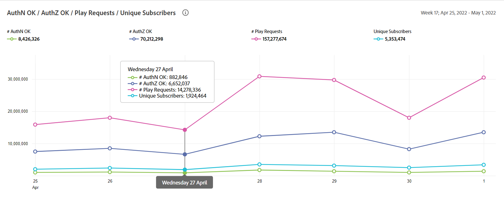
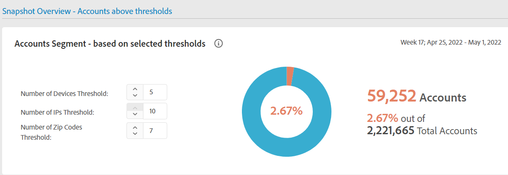
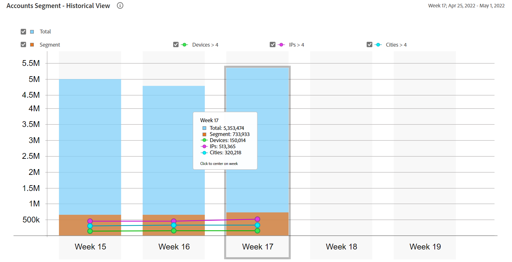

# Rapporti generali sull&#39;utilizzo {#general-usage-reports}

I rapporti IQ dell’account sono strumenti di analisi di base e rapporti che ti consentono di approfondire i tuoi dati per isolare [coorti](/help/AccountIQ/product-concepts.md#segmet-def), identificare le anomalie e acquisire una comprensione delle caratteristiche dell’account.

La pagina Rapporti sull’utilizzo generale fornisce gli strumenti per eseguire lo sviluppo delle metriche dei sottogruppi in base al numero di dispositivi dell’account in uso, agli IP rilevati e ai rispettivi codici postali.

<!--Divide the content in cohorts.

Content filters
device filters

segment and definition replicate to cohorts. Number of people and number of account that ......
content consumption.....-->

I rapporti sono tutti basati sul segmento corrente selezionato utilizzando [Segmenti e intervalli di tempo](/help/AccountIQ/howto-select-segment-timeframe.md) pannello. Puoi ottimizzare la selezione e restringerla ulteriormente specificando (numero di dispositivi, numero di IP e numero di codici postali) le soglie in [Panoramica snapshot - Account al di sopra delle soglie](#snapshot-overview) pannello.

<!--To view General Usage Reports:

1. Select the desired MVPDs from the **MVPDs in Segment** option.

2. Select the desired programmer channels from the **Channels in Segment** Option.

3. Select an appropriate time frame from the **Granularity and time frame** option.

   Using the above options you have defined segments for your analysis. Based on your segment selection, following graphs and reports are displayed.

4. You can fine tune your selection and further narrow it down by specifying (number of devices, number of IPs, and number of zip codes) thresholds in [Snapshot Overview - Accounts above thresholds](#snapshot-overview) widget/panel.-->

## AuthN OK / AuthZ OK / Play Requests / Univoci Sottoscrittori {#authn-authz-playreq-uniquesubs}

I grafici a linee forniscono una visualizzazione delle modifiche nel tempo in valori di AuthN OK, AuthZ OK, Play Requests e Unique Subscribers in un intervallo di tempo selezionato per il segmento definito.

L’asse x presenta le unità entro l’intervallo di tempo corrente e l’asse y rappresenta le metriche di base dell’attività degli utenti abbonati durante tale periodo. I grafici a linee consentono di confrontare i seguenti valori per gli abbonati a MVPD e canali selezionati nel pannello di selezione dei segmenti:

* **AuthN OK**

   AuthN OK indica il numero di autenticazioni riuscite. Per ulteriori informazioni e definizioni vedi [Concetti di prodotto: AuthN OK](/help/AccountIQ/product-concepts.md#authn-ok-def).

* **AuthZ OK**

   AuthZ OK è il numero di autorizzazioni riuscite. Per ulteriori informazioni e definizioni vedi [Concetti di prodotto: AuthZ OK](/help/AccountIQ/product-concepts.md#authz-ok-def).

* **Riproduci richieste**

   Le richieste di riproduzione sono il numero di richieste di riproduzione. Per ulteriori informazioni e definizioni vedi [Concetti di prodotto: Richieste di riproduzione](/help/AccountIQ/product-concepts.md#play-requests-def)

* **Sottoscrittori univoci**

   Gli abbonati univoci sono il numero di abbonati univoci riusciti. Per ulteriori informazioni e definizioni vedi [Concetti di prodotto: Abbonati univoci](/help/AccountIQ/product-concepts.md#unique-subscriber-def)

   >[!NOTE]
   >
   >Il numero totale di abbonati univoci include anche il numero di dispositivi univoci se l&#39;uso di un programmatore di TempPass Adobe (cioè anteprima gratuita) fa parte del segmento.

## Panoramica snapshot - Account al di sopra delle soglie {#snapshot-overview}

Ottimizza le tue analisi e i tuoi report utilizzando questo filtro aggiuntivo per impostare diverse soglie di utilizzo. Una volta definito il segmento (o coorte) per l’analisi selezionando gli MVPD e i canali desiderati, puoi anche utilizzare i filtri seguenti per analizzare il comportamento degli abbonati:

* Soglia numero di dispositivi

* Soglia del numero di IP

* Soglia codici ZIP

Quando si aggiornano i valori di soglia in [Segmento di account - in base alle soglie selezionate](#account-segments-basedon-segments) potete visualizzare l&#39;effetto in:

* [Dispositivi per settimana (o mese) per account](#devices-week-account)

* [Posizioni per settimana (o mese) per conto](#locations-week-account)

* [IP a settimana (o mese) per account](#ip-week-account)

* [Vista storica del segmento dei conti](#account-segment-historical-view)

>[!NOTE]
>
>Il valore predefinito per ciascuna delle soglie è 4. Ciò significa che la pagina Uso generale mostra l’analisi per gli MVPD con gli abbonati che utilizzano quattro (e più di quattro) dispositivi, consumando contenuti da quattro (e più) posizioni geografiche diverse e quattro (e più) codici postali diversi.

### Segmento di account - in base alle soglie selezionate {#account-segments-basedon-segments}

La **Segmento di account - in base alle soglie selezionate** Il pannello offre le opzioni per impostare le soglie (tra 1 e 10) per il numero di dispositivi, il numero di IP e il numero di codici ZIP.

Il grafico mostra i seguenti elementi:

* numero assoluto di conti sottoscrittori, e

* percentuale dei conti totali degli abbonati in quel segmento,

   che utilizzano un numero X di dispositivi, un numero Y di IP e un numero Z di codici ZIP per utilizzare contenuti dal canale per gli MVPD (segmento definito di), per un intervallo di tempo.

## Dispositivi a settimana (o mese) per account {#devices-week-account}

La **grafico a barre** fornisce informazioni sul comportamento di utilizzo in termini di come gli abbonati agli MVPD utilizzano i loro dispositivi per accedere ai contenuti dal tuo canale.

L&#39;asse x traccia il numero di account e l&#39;asse y il numero di dispositivi. In base alla soglia impostata per il numero di dispositivi per account, indica il numero assoluto di account abbonati che consumano contenuti da un numero specifico di dispositivi nella durata di una settimana.

Quando passi il cursore su una barra (specifica per il numero di dispositivi), viene visualizzata un’etichetta che fornisce informazioni sul numero di account di abbonati (e sulla percentuale sul totale degli account di abbonati nel segmento) che stanno trasmettendo il contenuto del canale utilizzando questi molti dispositivi in una settimana.

Il grafico indica anche quanto segue:

* Una linea rossa per contrassegnare la soglia impostata.

* Una linea verde per contrassegnare la media del numero di dispositivi diversi utilizzati da un account utente iscritto per settimana (o mese).

Puoi confrontare il livello di soglia con la media settimanale del numero di dispositivi diversi utilizzati da un account, per valutare il livello di condivisione.

Il grafico fornisce anche un&#39;occhiata alla percentuale di account abbonati che utilizzano più dispositivi della soglia impostata.

Il grafico ad anello ti aiuta a valutare rapidamente l’entità degli account abbonati che consumano contenuti del canale utilizzando dispositivi che superano la soglia impostata (in un arco temporale).

## Posizioni per settimana (o mese) per account {#locations-week-account}

Simile [Dispositivi a settimana (o mese) per account](#devices-week-account), le posizioni settimanali (o mensili) per metrica Account consentono di analizzare l’utilizzo dell’account utente iscritto da posizioni diverse, per identificare più da vicino la condivisione delle password. L&#39;asse x traccia il numero di conti e l&#39;asse y traccia il numero di posizioni.

Risultati di questa metrica combinati con numero di [Dispositivi a settimana (o mese) per account](#devices-week-account) e il numero [IP a settimana (o mese) per account](#ip-week-account) consente di giudicare più accuratamente le istanze di condivisione della password; in modo che gli utenti autentici non siano conteggiati.

Una volta definito un segmento (selezionando MVPD e canali) e impostato la soglia per il numero di posizioni, puoi identificare dal grafico:

* Numero (e percentuale) di abbonati che consumano contenuti da (uno specifico) x numero di posizioni in una settimana.

* Percentuale di account abbonati totali che visualizzano contenuto da più posizioni rispetto alla soglia.

* Confronta la media settimanale (numero di posizioni diverse per un account) con Soglia.

## IP a settimana (o mese) per account {#ip-week-account}

Simile a [Dispositivi a settimana (o mese) per account](#devices-week-account) e [Posizioni per settimana (o mese) per account](#locations-week-account), **Numero di IP a settimana per account** consente di analizzare la condivisione delle password in modo più preciso e con maggiore granularità.

L&#39;asse x traccia il numero di account e l&#39;asse y il numero di IP.

Una volta definito un segmento (selezionando MVPD e canali) e impostato la soglia per il numero di IP, puoi identificare dal grafico:

* Numero (e percentuale) di abbonati che consumano contenuti da (uno specifico) x numero di IP in una settimana.

* Percentuale di account di abbonati totali che visualizzano il contenuto da più indirizzi IP della soglia.

* Confronta la media settimanale (numero di IP diversi per un account) con Soglia.

## Segmento Account - Vista storica {#account-segment-historical-view}

Il grafico a barre Vista storica consente di confrontare le metriche di utilizzo tra diversi intervalli di tempo. Inoltre, traccia collettivamente le varie metriche di utilizzo, come [Dispositivi a settimana (o mese) per account](#devices-week-account), [Posizioni per settimana (o mese) per account](#locations-week-account)e [IP a settimana (o mese) per account](#ip-week-account).

* L’asse x traccia l’intervallo di tempo e l’asse y traccia il numero di account utente, dispositivi, posizioni e IP.

* Le barre colorate arancioni indicano i segmenti in diversi intervalli di tempo.

* Il grafico a linee traccia le modifiche in [Dispositivi a settimana (o mese) per account](#devices-week-account), [Posizioni per settimana (o mese) per account](#locations-week-account)e [IP a settimana (o mese) per account](#ip-week-account) in base alla soglia.

* Le barre blu indicano il numero totale di abbonati attivi nel settore per un intervallo di tempo.

* Potete selezionare legende specifiche che vi aiutano a ridimensionare il grafico.

>[!MORELIKETHIS]
>
>* Scopri come esportare i rapporti per i primi 1000 abbonati per gli MVPD selezionati utilizzando i filtri nel rapporto sull’utilizzo generale utilizzando [Esporta i primi 1000 account](/help/AccountIQ/export-acc-information.md) opzione .

