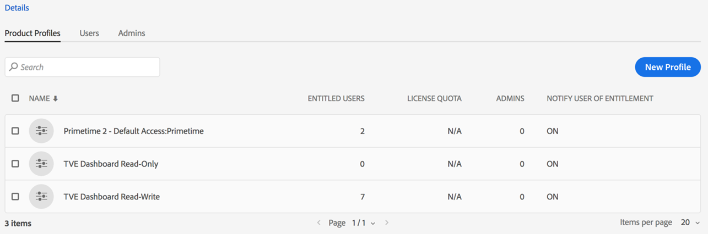
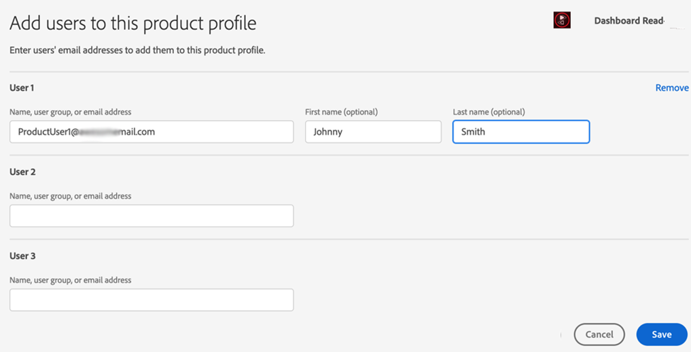

# Come effettuare l’onboarding e iniziare a utilizzare Account IQ {#onboard}

L&#39;account IQ è un&#39;applicazione web in hosting. Per iniziare a utilizzare questo strumento di analisi come provider di streaming, programmatore o distributore D2C (MVPD) e attenuare la condivisione delle credenziali, devi far sì che la tua organizzazione sia integrata nelle organizzazioni Adobe Experience Cloud e assegnare gli utenti dell&#39;organizzazione a **IQ account Primetime** profilo su [Adobe Admin Console](https://adminconsole.adobe.com/). Continua a leggere per conoscere i prerequisiti e i dettagli da inserire.

## Prerequisiti per il browser {#browser-prerequisites}

Account IQ è compatibile con le versioni più recenti dei seguenti browser:

* Google Chrome
* Safari
* Mozilla Firefox

## Passaggi a bordo {#steps-to-onboard}

1. Per ottenere la registrazione della tua organizzazione in **Adobe Experience Cloud** contatti organizzazioni **Adobe** inviando un’e-mail a tve-support@adobe.com.

1. Assegna utenti organizzazione a **Lettura e scrittura del dashboard TVE** o **Sola lettura dashboard TVE** profili in [Adobe Admin Console](https://adminconsole.adobe.com/).

   Gli utenti amministratori della tua organizzazione possono creare utenti e concedere loro l&#39;accesso alla dashboard e ai report di IQ account. Per concedere agli utenti dell&#39;organizzazione l&#39;accesso a Account IQ, gli amministratori dell&#39;organizzazione devono:

   1. Accedi a [Adobe Admin Console](https://adminconsole.adobe.com/).

      

   1. Seleziona **Adobe Primetime** da **Prodotti e servizi**.

   1. Da **Profili di prodotto**, seleziona **Lettura e scrittura del dashboard TVE** o **Sola lettura dashboard TVE** profilo.

      

      >[!NOTE]
      >
      >In un futuro prossimo, Primetime Account IQ verrà separato dal dashboard TVE.

   1. Da qui puoi creare gruppi di utenti o selezionare i gruppi esistenti a cui aggiungere utenti.

      

   1. Seleziona **Aggiungi utente** per aggiungere utenti.

>[!IMPORTANT]
>
>Se i tuoi utenti non sono in grado di accedere alla dashboard IQ account, contatta il supporto Adobe per assicurarti che l’ID della tua organizzazione sia inserito nella whitelist dell’account IQ.

