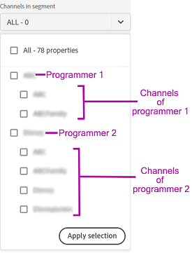

# Definire un segmento e un intervallo di tempo {#define-segment}

Tutte le analisi o i rapporti visualizzati in IQ account iniziano con la definizione del segmento e la selezione dell’intervallo di tempo per la valutazione. [Segmento](/help/AccountIQ/product-concepts.md#segmet-def) si riferisce a tutti gli abbonati o i visualizzatori che soddisfano i criteri di valutazione (abbonamento a un MVPD e visualizzazione di canali specifici).

*Figura: Selezione di segmenti e intervalli di tempo*

Nella parte superiore di tutte le pagine dei report in Account IQ, è presente un pannello per definire il segmento selezionando MVPD, programmatori di canali, granularità e intervallo di tempo.

## Selezione di segmenti {#select-segment}

### Selezionare MVPD nel segmento {#select-segment-mvpds}

Per selezionare gli MVPD da **MVPD nel segmento** opzione:

1. Tocca o fai clic su **MVPD nel segmento** opzione a discesa .

   >[!NOTE]
   >
   >**Tutto** Gli MVPD del settore sono selezionati per impostazione predefinita. Da qui, puoi selezionare uno dei **Primi 10 MVPD condividendo il punteggio**, **Primi 10 MVPD per utilizzo**, **Primi 10 MVPD per account** o singoli MVPD. Tuttavia, per selezionare singoli MVPD è necessario deselezionare **Tutto**.

1. Tocca o fai clic sugli MVPD desiderati.

   È possibile rimuovere un MVPD dalla selezione deselezionandolo.

1. Tocca o fai clic su **Applica selezione** affinché la selezione abbia effetto. In caso contrario, perderai la selezione effettuata.

   >[!NOTE]
   >
   >Se si seleziona la modalità Isolamento, non è possibile selezionare nessuno degli altri MVPD.

### Selezionare i canali nel segmento {#select-segment-channels}

Per selezionare i canali di programmazione desiderati dalla **Canali nel segmento** opzione:

1. Tocca o fai clic su **Canali nel segmento** opzione a discesa .

   >[!NOTE]
   >
   >**Tutto** i canali di programmazione per la tua azienda sono selezionati per impostazione predefinita. Per selezionare singoli canali o programmatori è necessario prima deselezionare **Tutto**.

1. Tocca o fai clic sui canali o programmatori desiderati.

   Gli elementi di elenco di primo livello nel **Canali nel segmento** sono [programmatore](/help/AccountIQ/product-concepts.md#programmer-def) le aziende e le voci di elenco sotto i nomi dei programmatori sono loro [canali](/help/AccountIQ/product-concepts.md#channel-def). È possibile selezionare singoli canali sotto i programmatori, oppure selezionare i programmatori e tutte le attività dei canali sotto quel programmatore sono incluse nei risultati dei report e dei grafici.

   

   *Figura: Programmatori e canali elencati nel selettore canali*

   >[!IMPORTANT]
   >
   >I risultati della selezione dei singoli canali sotto un programmatore non sono gli stessi della selezione del programmatore.
   >
   >
   >Quando selezioni singoli canali, le attività di tali canali vengono suddivise singolarmente in alcuni rapporti. Tuttavia, quando selezioni il programmatore padre di tutti questi canali, tutte le attività di questi canali sono incluse ma non sono suddivise singolarmente nei rapporti.

1. Tocca o fai clic su **Applica selezione** affinché la selezione abbia effetto.

>[!NOTE]
>
>Non è possibile selezionare più di 10 elementi nei menu a discesa MVPD o programmatore.

### Deselezionare MVPD e canali {#deselect-segment-mvpds-channels}

Oltre a modificare la selezione nella **MVPD nel segmento** e **Canali nel segmento** selettori di segmenti, puoi deselezionare gli MVPD e i canali selezionati in precedenza:

* Selezione della **Rimuovi** icona () sui nomi di questi MVPD selezionati e dei canali visualizzati sotto il selettore dei segmenti.

* È inoltre possibile utilizzare **Cancella selezione** per rimuovere tutti gli MVPD o i canali precedentemente selezionati.

*Figura: MVPD e canali selezionati nel pannello dei segmenti e dell’intervallo temporale*

*Figura: MVPD e canali selezionati nel pannello dei segmenti e dell’intervallo temporale*

## Granularità e selezione dell&#39;intervallo di tempo {#granularity-timeframe}

Per selezionare un periodo di tempo di valutazione:

1. Seleziona la **Granularità e arco temporale** selezione data.

1. Seleziona o **Settimana** o **Mese** da **Aggrega per** per impostare la granularità per la valutazione.

   

   *Figura: Selezione data per selezionare Granularità e intervallo temporale*

1. Dopo aver selezionato la granularità, è possibile utilizzare le frecce avanti o indietro per spostarsi avanti o indietro nel tempo.

1. Specifica un periodo di tempo trascorso (in mese o in settimana in base alla granularità selezionata) per la valutazione.

1. Seleziona **Applica selezione** per assicurarti che la selezione abbia effetto.
