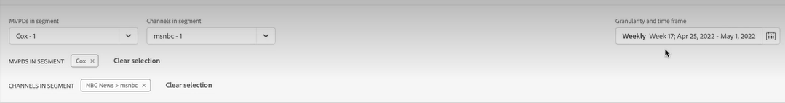

# Creare un’operazione su un segmento utente {#operation-to-track-segment}

Ogni pagina di rapporti su Account IQ ha una **Crea nuova operazione** opzione che consente di creare flussi di lavoro per automatizzare (e semplificare) varie azioni (collettive) sugli account degli abbonati; definisci regole per specificare un esempio, definire azioni, registrare e analizzare gli effetti di tali azioni. Nella pagina per la creazione delle operazioni è possibile definire il campione di gruppi di utenti su cui verranno eseguite le operazioni e pianificare l&#39;esecuzione dell&#39;operazione in una data futura.

Per creare un&#39;operazione:

1. Definisci il segmento (coorte) per l’analisi in una qualsiasi pagina dei rapporti o delle dashboard, seguendo i passaggi descritti in [Definizione di segmenti e arco temporale](/help/AccountIQ/howto-select-segment-timeframe.md).

1. Seleziona **Crea nuova operazione** disponibile in una qualsiasi delle pagine dei report o delle dashboard. Il **Crea nuova operazione** viene visualizzata.

   
   *Figura: Pagina per creare una nuova operazione*

1. Il giorno **Crea nuova operazione** , compila i dettagli nei campi del modulo per:

   * [Nome operazione](#operation-details) in Dettagli operazione
   * Segmento su cui eseguire l&#39;operazione [Segmento di destinazione](#segment) e perfeziona il segmento utilizzando [Segmentazione aggiuntiva](#additional-segmentation)
   * [Tipo di segmento](#segment-type) in [Segmento di destinazione](#segment)
   * [Azione](#action)
   * [Pianifica attivazione](#schedule)

1. [Salva l’operazione](#save-operation).

## Dettagli operazione {#operation-details}

+++Dettagli sul funzionamento del programmatore

Denomina la nuova operazione in **Nome operazione** in Dettagli operazione. Ad esempio, &quot;*Verificare l&#39;effetto dell&#39;autenticazione a più fattori sugli abbonati a MVPD X&quot; o &quot;Limitare il numero di flussi nel monitoraggio della concorrenza&quot; o &quot;Limitare gli abbonati a MVPD D che visualizzano il canale &#39;N&#39; da più di 20 dispositivi*&quot;.

+++

+++MVPD- dettagli operativi

Denomina la nuova operazione in **Nome operazione** in Dettagli operazione. Ad esempio, &quot;*Verificare l’effetto dell’autenticazione a più fattori sui visualizzatori del canale N&quot; o &quot;Limitare il numero di flussi nel monitoraggio della concorrenza&quot; o &quot;Limitare gli abbonati che visualizzano il canale N&quot; da 20 dispositivi in più*&quot;.

+++

## Segmento di destinazione {#segment}

+++Programmatore- Segmento di destinazione

Il **Segmento** qui definisce gli utenti che verranno gestiti da questa operazione; o il gruppo di esempio per l’operazione. Il segmento predefinito è **segmento** hai selezionato utilizzando [pannello segmento e intervallo temporale](/help/AccountIQ/howto-select-segment-timeframe.md) nella pagina dei report o delle dashboard principali nel passaggio 1 precedente.

<!--* The first segment entry in the **Segment** section, by default, shows the **segment** you selected in the step 1.

* The **segment evaluation period** is the time period of analysis you selected in step 1 from **Granularity and Timeframe** option.

*Figure: Segment and timeframe selection on the main page*-->

Questo segmento definisce i sottoscrittori che saranno interessati dall’operazione creata. Ad esempio, il segmento selezionato potrebbe specificare *tutti gli account abbonati di MVPD denominati &quot;C&quot; che visualizzano il canale &quot;N Sports&quot;*.

+++

+++MVPD- Segmento di destinazione

Il **Segmento** qui definisce gli utenti che verranno gestiti da questa operazione; o il gruppo di esempio per l’operazione. Il segmento predefinito è **segmento** hai selezionato utilizzando [pannello segmento e intervallo temporale](/help/AccountIQ/howto-select-segment-timeframe.md) nella pagina dei report o delle dashboard principali nel passaggio 1 precedente.

<!--* The first segment entry in the **Segment** section, by default, shows the **segment** you selected in the step 1.

* The **segment evaluation period** is the time period of analysis you selected in step 1 from **Granularity and Timeframe** option.

*Figure: Segment and timeframe selection on the main page*-->

Questo segmento definisce i tuoi abbonati (visualizzatori di canali specifici) che saranno interessati dall’operazione creata. Ad esempio, il segmento (predefinito) include *tutti gli account abbonati che visualizzano il canale &quot;N Sports&quot;*.
+++

### Segmentazione aggiuntiva {#additional-segmentation}

Inoltre, puoi perfezionare il segmento di destinazione aggiungendo più metriche. Ad esempio, puoi aggiungere come altra metrica una probabilità di condivisione superiore al 90%. Così, ora la dichiarazione del problema si legge *&quot;creare un&#39;operazione per gli account sottoscrittori di MVPD denominati &#39;C&#39; che visualizzano il canale &#39;N Sport&#39; con una probabilità di condivisione maggiore del 90%&quot;*.

*Figura: Segmentazione aggiuntiva*

Inoltre, se si perfeziona l’operazione aggiungendo un’altra metrica per il numero di dispositivi, l’istruzione di problema aggiornata recita *&quot;creare un&#39;operazione per gli account sottoscrittori di MVPD denominati &#39;C&#39; che visualizzano il canale &#39;N Sport&#39; con un punteggio di condivisione superiore a 90 e che utilizzano più di 5 dispositivi per visualizzare il contenuto durante il periodo di valutazione&quot;*.

*Figura: Segmento di esempio perfezionato con punteggio di condivisione complessivo e metriche del numero di dispositivi*

In questo modo, il gruppo di utenti diventa più perfezionato. Pertanto, aggiungendo ulteriori metriche e condizioni, il segmento viene ulteriormente qualificato per definire gli account su cui operare.

### Tipo di segmento {#segment-type}

Tipo di segmento è il modo in cui un segmento viene trattato durante il periodo di valutazione dell&#39;operazione.

*Figura: Perfezionare il numero di segmenti su cui operare utilizzando il tipo di segmento*

<!--The segment type option allows you to further refine your segment based on the evaluation period (or time).

**Fixed number of accounts** 

When you select **Fixed number of accounts** segment type, then you need to specify an evaluation period as well.

By doing so, you are fixing the sample size for evaluation in terms of numbers. You are making Account IQ identify a specific set of users (that meet the criteria of defined evaluation period and segment metrics) to operate on. The analysis and graphs will be generated for this specific set of users only (identified initially) throughout the operation.

**Variable number of accounts**

When you select **Variable number of accounts** segment type, you do not limit the number of accounts in segment. The accounts which fall under the defined segment metrics are the part of the segment, and the number of accounts will change continuously during the course of operation.-->

>[!IMPORTANT]
>
>È possibile utilizzare solo **Numero fisso di account** opzione, al momento. Opzione da selezionare **Numero variabile di account** sarà disponibile nelle prossime versioni.

<!--

you tell Account IQ in the beginning of the operation which number of accounts to operate on.

Account IQ system only has a segment definition, and during the operation it looks into all the accounts that fit that segments.

the number of accounts in segment is not limited, the accounts that fall under defined segment metrics will be part of the segment, and the no of accounts will change continuously, as there are no specific limitations - like an evaluation period in the past.When the segment is defined (which in this example is, subscriber accounts of MVPD 'C' who are viewing the channel 'N Sports' that have a sharing score above 80 and are using 10 different IPs) and we also identified a time period to evaluate a segment. This identifies X number of accounts as sample (for example 5000). How many devices they are using?
It identifies x-number of accounts (5000)...a very specific set of users that meet this criteria.
for every period that we schedule (within that operation) during that operation) we will look at those 5K users that are originally identified and we will present graph about them. How are the sharing scores coming up?u We identified a period. Are their sharing scores going up? Are there fewer of them who are meeting this definition?
Fixed versus variable is the way the treated in fixed or variable way.

1. we identified a fixed set of accounts.
2. we evaluate those specific accounts on criteria throughout the operation.

General idea independent of graph is that we will evaluate a set of accounts identified initially, for no of periods during operation and generate graphs against that.
Those are the 5000 users for which I will create graphs for for every period of the operation.

**Variable number of accounts**
We do not identify any initial set of accounts, we just have a segment definition.
Each period during the operation, we go and look into all the accounts that fit that segments.
If it is not a fixed segment, I won't initially evaluate it. I won't have an initial set of 5000. Instead at every period during the evaluation I will evaluate the segment then, and then I will produce graph about the next 3000 users.
the......will vary from period to period.

if not fixed segment, then I won't initially evaluate or have initial set of 5000, instead at every period during an operation and the.-->

## Azione {#action}

Il **Azione** definisce l’operazione da eseguire sul segmento definito.

È possibile eseguire due tipi di azioni:

* Azioni che utilizzano sistemi integrati con Account IQ; come **Monitoraggio concorrenza** <!--[Concurrency Monitoring](https://tve.helpdocsonline.com/concurrency-monitoring-introduction), or Adobe Target-->.

* Azioni per creare ed elaborare flussi di lavoro esterni all’Account IQ e non integrati con il sistema Account IQ. Ad esempio, un’azione per il programmatore di canale &quot;N&quot; per inviare e-mail in blocco a tutti gli abbonati di MVPD &quot;C&quot;.

>[!NOTE]
>
>Creando le operazioni, non solo si specificano le azioni e se ne definisce l&#39;ambito, ma si inizia anche a registrare l&#39;effetto di tali operazioni.

## Pianificazione{#schedule}

È possibile pianificare l&#39;attivazione per l&#39;operazione impostando le date di inizio e di fine.

>[!NOTE]
>
>La data di inizio e la data di fine hanno una granularità pari alla granularità selezionata per la valutazione quando definisci il segmento utilizzando **pannello segmento e intervallo temporale**, nel passaggio 1.
>
>
>Pertanto, se hai selezionato la granularità come Settimana, le date di inizio e fine sono in termini di settimana (ad esempio Settimana 14); se hai selezionato Granularità come Mese, le date di inizio e fine sono in termini di mesi.

>[!IMPORTANT]
>
>La data di inizio deve essere successiva al periodo di valutazione e alla data corrente. Analogamente, anche la data di fine deve essere successiva alla data di inizio e alla data corrente.

### Salva l’operazione {#save-operation}

Quando salvi l’operazione, viene visualizzata una schermata con un messaggio che ti informa che il segmento definito in questa operazione viene salvato anche per il futuro. Tuttavia, devi denominare questo segmento.

*Figura: Operazione Salva e specifica il nome del segmento*

>[!NOTE]
>
>È consigliabile denominare l’operazione in base all’azione che stai intraprendendo in combinazione con il segmento su cui agirai.

<!--In future you can select this saved segment when defining a segment for your analysis on the main reports page. Moreover, the saved segment is also listed when you create an operation the next time.

*Figure: Saved segments in segment selector on Create new operations page* 

>[!IMPORTANT]
>
>When creating an operation, if you select a segment that was previously created then you cannot add new metrics to it and refine it.
>
>Adding new metrics creates a new segment, but you cannot modify an existing segment.-->

Dopo aver creato un&#39;operazione, questa verrà eseguita dalla data di inizio alla data di fine specificata.

I dettagli dell&#39;operazione salvata possono essere visualizzati sulla [Operazioni](/help/AccountIQ/operations.md) pagina.

*Figura: La nuova operazione creata viene elencata nella pagina Operazioni principale*
