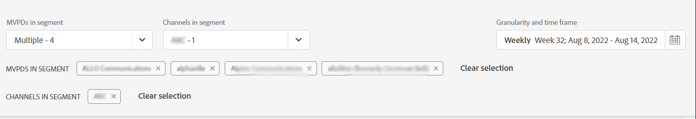

# Segmenti di abbonati e intervallo temporale {#cohorts-segments}

Quando accedi a Account IQ, c&#39;è un pannello nella parte superiore che ti consente di definire l&#39;utente iscritto [segmento](/help/AccountIQ/product-concepts.md#segment-segmet-def) filtrare i risultati per visualizzare i rapporti relativi al comportamento e ai pattern di condivisione degli utenti.

<!---->

+++Pannello di selezione dei segmenti per Programmatore

<!---->

Per definire i segmenti vengono utilizzate le seguenti opzioni a discesa:

**MVPD nel segmento**

La **MVPD nel segmento** il selettore consente di scegliere il [MVPD](/help/AccountIQ/product-concepts.md#mvpd-def) (singoli utenti o gruppi) per i quali desideri visualizzare i rapporti di condivisione dell’account.

In questo selettore, oltre a selezionare i singoli MVPD, è anche possibile selezionare i seguenti gruppi:

* [Primi 10 MVPD condividendo il punteggio](/help/AccountIQ/product-concepts.md#top-mvpds-def)

* [Primi 10 MVPD per utilizzo](/help/AccountIQ/product-concepts.md#top-mvpds-def)

* [Primi 10 MVPD per account](/help/AccountIQ/product-concepts.md#top-mvpds-def)

* [Modalità di isolamento](/help/AccountIQ/isolation-mode.md)

**Canali nel segmento**

Quando hai effettuato l&#39;accesso come utente programmatore, puoi selezionare i tuoi canali per visualizzare le analisi di condivisione del loro account. Utilizza la **Canali nel segmento** opzione a discesa per selezionare uno o più canali nell’organizzazione.

+++

Pannello di selezione +++Segment per MVPD

Per definire i segmenti vengono utilizzate le seguenti opzioni a discesa:

**Canali nel segmento**

La **Canali nel segmento** Il selettore consente di restringere ulteriormente il filtro per selezionare i canali corrispondenti agli MVPD selezionati.

* [Top 10 programmatori condividendo il punteggio](/help/AccountIQ/product-concepts.md#top-mvpds-def)

* [10 programmatori principali per uso](/help/AccountIQ/product-concepts.md#top-mvpds-def)

* [Primi 10 programmatori per account](/help/AccountIQ/product-concepts.md#top-mvpds-def)

**MVPD(s) nel segmento**

Quando hai effettuato l&#39;accesso come utente MVPD, il tuo nome viene visualizzato nel campo per **MVPD nel segmento**.

+++

<!--For example, you can define your segment as the "subscribers of the MVPD A that watched the channels X, Y, and Z".-->

## Granularità e arco temporale {#granularity-timeframe}

La **Granularità e arco temporale** Il selettore consente di specificare le date e la durata o la dimensione del tempo per il quale visualizzare il comportamento di condivisione degli abbonati.

Così, con questi controlli puoi definire la tua dichiarazione del problema come &quot;abbonati al MVPD A che hanno guardato i canali X, Y e Z nel mese di maggio&quot;.

