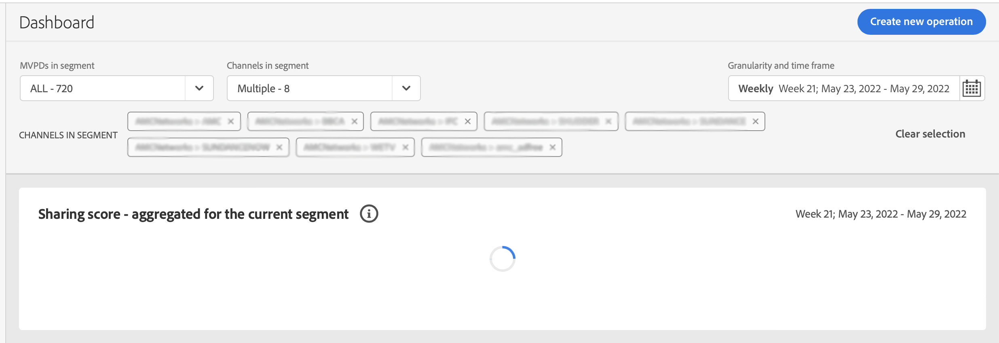

# Risoluzione dei problemi relativi all&#39;account IQ {#troubleshoot}

Problemi relativi a dati e grafici che richiedono troppo tempo per essere caricati o rapporti non esportati o altri problemi relativi a metriche e grafici? Continua a leggere per ottenere aiuto rapido.

* Se il caricamento di una pagina o dei singoli pannelli richiede troppo tempo, prova ad aggiornare la pagina. Per la versione corrente, a seconda della selezione di MVPD e programmatori, il caricamento di una pagina può richiedere fino a un minuto.

   

* Se non riesci a visualizzare alcun dato o grafico anche dopo l&#39;aggiornamento, disconnettiti da Account IQ e accedi di nuovo.

* Se nessuno dei metodi di risoluzione di cui sopra aiuta, o se hai altre domande relative ai dati o all&#39;incapacità di esportare statistiche, contatta il supporto Adobe inviando un&#39;e-mail a tve-support@adobe.com o chiama il numero di telefono +1-205-693-9813.
