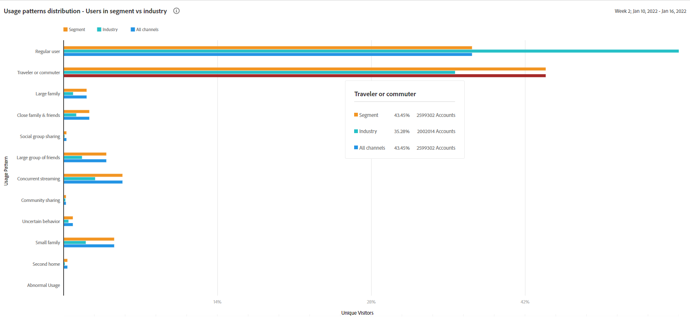

# Pattern di utilizzo {#usage-patterns}

L&#39;account IQ classifica gli utenti degli account utente in varie categorie in termini di comportamento sociale, come il viaggiatore o il pendolare, la grande famiglia e la condivisione della comunità. La **Pattern di utilizzo** In questa pagina sono visualizzate diverse analisi e rapporti per queste tipologie di utenti. Ad esempio: **Distribuzione dei pattern di utilizzo: utenti nel segmento rispetto al totale** confronta il comportamento di utilizzo del segmento corrente con l’intero settore.

Come le altre pagine dell&#39;app, le analisi e i rapporti qui sono basati sul segmento corrente come definito nella [pannello dei segmenti](/help/AccountIQ/segments-timeframe.md).

## Distribuzione dei pattern di utilizzo {#usage-pattern-dis}

Il grafico a barre in **Distribuzione dei pattern di utilizzo: utenti nel segmento rispetto al totale** rappresenta il numero e le percentuali degli abbonati per ogni comportamento social o modello di utilizzo. Oltre a confrontare ogni pattern di utilizzo nel segmento corrente con l’intero settore, vengono confrontati anche con un segmento contenente tutti i tuoi canali.

## Distribuzione del pattern di utilizzo nel segmento (#usage-pattern-dis-segment)

La **Distribuzione dei pattern di utilizzo nei segmenti** Il pannello presenta le seguenti informazioni per ogni pattern utente:

* Condivisione dell&#39;intervallo di probabilità in cui rientrano i singoli conti
* Numero e percentuale di conti in tale schema
* Totale e percentuale dell&#39;utilizzo da parte degli abbonati in quella categoria in termini di richieste di riproduzione

Ad esempio, nell’immagine precedente:

* Un utente normale (da uno a pochi con un numero limitato di dispositivi in una sola posizione) nel segmento definito ha la probabilità di condivisione dell&#39;account tra 0 a 5%.

* E il 36,8% (2.201.935) del totale degli abbonati (5.981.648) sono utenti abituali.

* E il 15,7% (24.073.311) delle richieste di gioco totali (153.076.350) sono effettuate da utenti abituali.

## Distribuzione dei pattern di utilizzo per partner di segmenti {#usage-pattern-dis-mvpd}

+++Programmatore- Distribuzione del pattern di utilizzo per segmenti totali e partner di segmenti

La **Distribuzione dei pattern di utilizzo** La tabella fornisce un confronto tra la distribuzione dei pattern di utilizzo per gli MVPD nel segmento corrente.

+++

+++MVPD- Distribuzione del pattern di utilizzo per segmenti totali e partner di segmenti

La **Distribuzione dei pattern di utilizzo** La tabella fornisce un confronto tra la distribuzione dei pattern di utilizzo per i canali di programmazione nel segmento corrente.

+++
