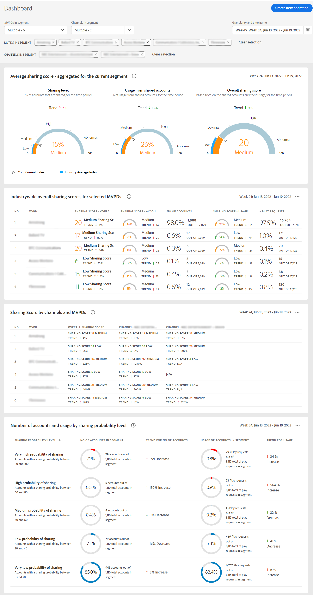

# Visualizzare rapporti di condivisione account per più MVPD {#viewreport-multiple-mvpd}

L&#39;account IQ, uno strumento di analisi affidabile e scalabile, consente di visualizzare, analizzare e confrontare le statistiche di condivisione degli account degli abbonati non solo per uno, due o tre ma per più MVPD in un dato momento.

>[!NOTE]
>
>Tuttavia, a partire da ora è possibile selezionare al massimo 10 MVPD individuali dal pannello del segmento e dell&#39;intervallo di tempo per visualizzare le statistiche di condivisione degli abbonati.

Per visualizzare le statistiche di condivisione degli account degli abbonati per più MVPD:

1. Definisci un segmento desiderato seguendo i passaggi descritti in [Come definire il segmento e selezionare l’intervallo temporale](/help/AccountIQ/howto-select-segment-timeframe.md) per la valutazione da [pannello relativo al segmento e al calendario](/help/AccountIQ/segments-timeframe.md).

1. Seleziona la pagina dei rapporti desiderata dal menu di navigazione a sinistra:

* [Dashboard](/help/AccountIQ/dashboard.md) (il dashboard fornisce un&#39;occhiata ai grafici selezionati da diverse pagine dei rapporti).

   

   *Figura: Report dashboard per più MVPD*

* [Utilizzo generale](/help/AccountIQ/general-usage-reports.md)

* [Account condivisi](/help/AccountIQ/shared-acc-reports.md)

* [Pattern di utilizzo](/help/AccountIQ/usage-patterns.md)

Ciascuna di queste pagine riflette l’attività .
