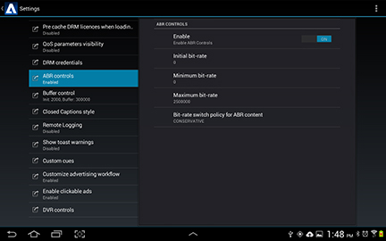

# Velocità bit multiple {#multiple-bit-rates}

Il TVSDK può riprodurre video che hanno più profili con velocità bit diverse, passando da un livello di qualità all&#39;altro in base alla larghezza di banda disponibile.

È possibile impostare velocità bit iniziali, minime e massime, nonché i criteri di commutazione ABR (Adaptive Bit Rate) per un flusso MBR (Multiple Bit Rate). Il TVSDK passa automaticamente al bitrate che fornisce la migliore esperienza di riproduzione all’interno della configurazione specificata.

L’implementazione di riferimento configura i seguenti parametri ABR in [IPlaybackConfig](https://help.adobe.com/en_US/primetime/api/reference_implementation/android/javadoc/com/adobe/primetime/reference/config/IPlaybackConfig.html).

| Parametro | Descrizione |
|--- |--- |
| Bitrate iniziale: getABRInitialBitRate | Velocità in bit di riproduzione desiderata (in bit al secondo) per il primo segmento. All’avvio della riproduzione, per il primo segmento viene utilizzato il profilo più vicino (uguale o maggiore della velocità in bit iniziale).  Se viene definita una velocità in bit minima e la velocità in bit iniziale è inferiore alla minima, TVSDK seleziona il profilo con la velocità in bit più bassa al di sopra della velocità in bit minima. Analogamente, se il tasso iniziale è superiore al tasso massimo, TVSDK seleziona il tasso più alto al di sotto del massimo. Se il bit rate iniziale è zero o non definito, il bit rate iniziale è determinato dalla policy ABR.  Restituisce un valore intero che rappresenta il profilo byte al secondo. |
| Bitrate minimo: getABRMinBitRate | La velocità bit minima consentita alla quale l&#39;ABR può passare. La commutazione ABR ignora i profili con una velocità di trasmissione inferiore a questa. Restituisce un valore intero che rappresenta il profilo bit al secondo. |
| Velocità bit massima: getABRMaxBitRate | La velocità bit massima consentita alla quale l&#39;ABR può passare. Quando si cambia ABR, vengono ignorati i profili con una velocità di trasmissione superiore a questa. Restituisce un valore intero che rappresenta il profilo bit al secondo. |
| Criteri di cambio ABR: getABRPolicy | Quando possibile, la riproduzione passa gradualmente al profilo con il bit rate più alto. È possibile impostare il criterio per il passaggio ABR, che determina la velocità con cui TVSDK passa da un profilo all’altro. L&#39;impostazione predefinita è Moderato. <ul><li>*Conservatore*: passa al profilo con la velocità in bit successiva più elevata quando la larghezza di banda è del 50% superiore alla velocità in bit corrente. </li><li>*Modera*: passa al profilo con velocità in bit successiva più elevata quando la larghezza di banda è del 20% superiore alla velocità in bit corrente.</li><li>*Aggressivo*: passa immediatamente al profilo di velocità in bit più alto quando la larghezza di banda è superiore alla velocità in bit corrente</li></ul> Se il bitrate iniziale è zero o non è specificato e viene specificato un criterio, la riproduzione inizia con il profilo di bitrate più basso per Conservative, il profilo più vicino al bitrate mediano dei profili disponibili per Moderate e il profilo di bitrate più alto per Aggressive.  Questa policy funziona all’interno dei vincoli delle velocità di trasmissione minima e massima, se specificate.  Restituisce l&#39;impostazione corrente dall&#39;enumerazione ABRControlParameters: <ul><li>ABR_CONSERVATIVE</li><li>ABR_MODERATE </li><li>ABR_AGGRESSIVO</li></ul> Vedi anche [ABRPolicy](https://help.adobe.com/en_US/primetime/api/psdk/javadoc/com/adobe/mediacore/ABRControlParameters.ABRPolicy.html). |

>[!NOTE]
>
>* Il meccanismo di failover di TVSDK potrebbe ignorare queste impostazioni, perché TVSDK favorisce un’esperienza di riproduzione continua rispetto al rispetto rigoroso dei parametri di controllo.
>* Quando la velocità di trasmissione cambia, TVSDK invia `onProfileChanged` eventi in `PlaybackEventListener`.

## Abilitazione del controllo ABR personalizzato nell’implementazione di riferimento {#section_72A6E7263E1441DD8D7E0690285515E6}

Per impostazione predefinita, in TVSDK è abilitato il bit rate adattivo (ABR). È possibile utilizzare l&#39;interfaccia utente Impostazioni Primetime per sostituire il comportamento TVSDK predefinito nell&#39;implementazione di riferimento configurando il controllo ABR personalizzato.

Per attivare l&#39;ABR personalizzato tramite l&#39;interfaccia utente Impostazioni:

* Apri la finestra di dialogo Impostazioni Primetime.
* Seleziona **[!UICONTROL ABR controls]**.

   

* Tocca il [!UICONTROL Enable ON] in modo che venga visualizzato `OFF`.

Il `PlaybackManager` imposta i parametri ABR solo se [isABRControlEnabled](https://help.adobe.com/en_US/primetime/api/reference_implementation/android/javadoc/com/adobe/primetime/reference/config/IPlaybackConfig.html) restituisce true (ON). Se restituisce false (OFF), il `PlaybackManager` utilizza il controllo ABR predefinito in modo che le velocità bit iniziale, minima e massima siano tutte pari a 0 e che i criteri ABR siano `ABR_MODERATE`.

## Configurazione per basse velocità di trasmissione {#section_5451691CBBD24542AD54A474D222CD39}

Per alcune basse velocità di riproduzione, il TVSDK, per impostazione predefinita, passa al flusso di solo audio e la riproduzione appare bloccata. Puoi configurare il lettore in modo che non si verifichi mai una situazione in cui passa alla modalità solo audio.

* Implementare [IPlaybackConfig](https://help.adobe.com/en_US/primetime/api/reference_implementation/android/javadoc/com/adobe/primetime/reference/config/IPlaybackConfig.html) Interfaccia:

* Assicurati che [getABRMinBitRate](https://help.adobe.com/en_US/primetime/api/reference_implementation/android/javadoc/com/adobe/primetime/reference/config/IPlaybackConfig.html#getABRMinBitRate()) è superiore al bitrate di solo audio (superiore a 64000).
* Assicurati che [isABRControlEnabled](https://help.adobe.com/en_US/primetime/api/reference_implementation/android/javadoc/com/adobe/primetime/reference/config/IPlaybackConfig.html#isABRControlEnabled()) è attivo.
