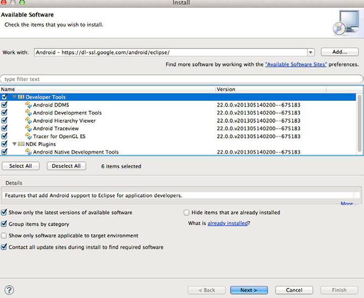

# Download e configurazione del software {#download-and-configure-prerequisite-software}

1. Scaricate il JDK da [https://www.oracle.com/technetwork/java/javase/downloads/](https://www.oracle.com/technetwork/java/javase/downloads/).

   Il processo di installazione è semplice. Se nel sistema è già installato il JDK, è possibile saltare questo passaggio, ma tenere presente che JDK, Eclipse IDE e OS devono essere compatibili.
1. Scaricate Eclipse IDE for Java Developers da [https://www.eclipse.org/downloads](https://www.eclipse.org/downloads).

   Dopo aver decompresso il pacchetto, potete eseguire direttamente Eclipse. Nessun programma di installazione.
1. Scaricate il pacchetto ADT dell&#39;SDK per Android da [https://developer.android.com/sdk/index.html](https://developer.android.com/sdk/index.html).

   Questo pacchetto include Eclipse. Se nel sistema è già installato Eclipse, puoi scaricare gli strumenti SDK per la piattaforma dalla sezione [!UICONTROL Use An Existing IDE].

   Scomprimere e installare in una posizione che ricorderete. Dovrai fare riferimento a questo in un secondo momento.
1. Configurare l’SDK per Android.
   1. Aprite un terminale (in Mac OS X) o un prompt dei comandi (in Windows).
   1. Andate alla directory in cui avete scaricato/decompresso l’SDK per Android.
   1. Passate alla cartella degli strumenti, che contiene un file denominato [!DNL android].
   1. Eseguite i comandi seguenti:

      * Per Mac OS X/Unix:

         ```
         chmod +x android 
         android update sdk --no-ui
         ```

      * Per Windows:

         ```
         android update sdk --no-ui
         ```

         Questo processo richiede un po&#39; di tempo.

1. Configurare Eclipse.
   1. Avviate Eclipse.

      In Windows, se Eclipse non viene avviato e il problema segnalato è che Eclipse non è in grado di trovare un file Java richiesto, provare quanto segue:

      * aggiungere `-vm C:\[path to your JDK bin]\javaw.exe` al file [!DNL eclipse.ini].
   1. Selezionare **[!UICONTROL Help]** > **[!UICONTROL Install New Software]** .
   1. Clic **[!UICONTROL Add...]**.
   1. Immettere `Android` come nome.
   1. Immettere `https://dl-ssl.google.com/android/eclipse/` per il collegamento **[!UICONTROL Work with]**.
   1. Clic **[!UICONTROL OK]**.

      Verrà visualizzata una finestra di dialogo simile alla seguente:

      

   1. Selezionate i pacchetti risultanti (quelli in Strumenti per sviluppatori e Plug-in NDK) e fate clic su **[!UICONTROL Next]**.

      In questo modo viene scaricato Android Development Tools (ADT).
   1. Al termine del download, riavviate Eclipse.

   L&#39;SDK Android ora è installato. 1. Configura Eclipse per trovare l’SDK Android e utilizzarlo come risorsa.
   1. Aprite Eclipse.
   1. Selezionare **[!UICONTROL Window]** > **[!UICONTROL Preferences]** in Windows;  **[!UICONTROL ADT]** > **[!UICONTROL Preferences]** in Mac OS X.
   1. Selezionare la scheda **[!UICONTROL Android]**.
   1. Individuate il percorso dell’SDK Android.
   1. Clic **[!UICONTROL Apply]**.

      


