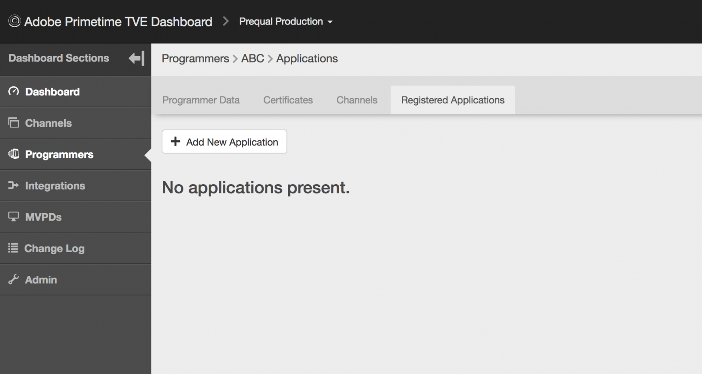

# Dynamic Client Registration Management {#dynamic-client-registration-management}

>[!NOTE]
>
>Il contenuto di questa pagina viene fornito solo a scopo informativo. L’utilizzo di questa API richiede una licenza corrente di Adobe. Non è consentito alcun uso non autorizzato.

## Panoramica {#overview}

Con l&#39;adozione generalizzata di [Schede personalizzate Android Chrome](https://developer.chrome.com/multidevice/android/customtabs){target_blanck} e [Controller visualizzazione Apple Safari](https://developer.apple.com/documentation/safariservices/sfsafariviewcontroller){target_blanck} nelle applicazioni dei nostri clienti, stiamo aggiornando il flusso di autenticazione degli utenti in Adobe Primetime Authentication. In particolare, non è più possibile raggiungere l’obiettivo di mantenere lo stato in modo che il flusso dell’agente utente di autenticazione di un abbonato MVPD possa essere tracciato tra i reindirizzamenti. Questa operazione era già stata eseguita in precedenza utilizzando i cookie HTTP. Questa limitazione è il driver per iniziare a migrare tutte le API a OAuth 2.0 [RFC6749](https://tools.ietf.org/html/rfc6749){target_blanck}.

Con questo aggiornamento, i client di autenticazione Adobe diventano client OAuth 2.0 e viene distribuito un server di autorizzazione OAuth 2.0 personalizzato per soddisfare le esigenze del servizio di autenticazione Adobe Primetime.

Affinché le applicazioni client possano utilizzare l&#39;autorizzazione OAuth 2.0, il server deve registrarsi in modo dinamico per ottenere informazioni specifiche (credenziali client) per poter interagire con essa. Come parte del processo di registrazione, il client deve presentare un set di metadati incorporati all’endpoint di registrazione del client.

Questi metadati vengono comunicati come un&#39;istruzione software, che contiene un &quot;software_id&quot; per consentire al nostro server di autorizzazione di correlare diverse istanze di un&#39;applicazione utilizzando la stessa istruzione software.

A **rendiconto software** è un JSON Web Token (JWT) che asserisce i valori dei metadati sul software client come bundle. Quando viene presentata al server di autorizzazione come parte di una richiesta di registrazione client, l&#39;istruzione software deve essere firmata digitalmente o MACed utilizzando la firma Web JSON (JWS).

Per maggiori informazioni sulle istruzioni software e sul loro funzionamento, consulta la documentazione ufficiale. [RFC7591](https://tools.ietf.org/html/rfc7591).

L&#39;istruzione software deve essere distribuita con l&#39;applicazione sul dispositivo dell&#39;utente.

Prima di questo aggiornamento, disponevamo di due meccanismi per consentire alle applicazioni di eseguire chiamate all’autenticazione Adobe Primetime:

* i client basati su browser sono registrati tramite consentiti [elenco domini](/help/authentication/programmer-overview.md#reg-and-init)
* i client delle applicazioni native, come le applicazioni iOS e Android, vengono registrati tramite **richiedente firmato** meccanismo

Con il meccanismo di autorizzazione Registrazione client, è necessario aggiungere le applicazioni al dashboard TVE.

Per iniziare a implementare il nuovo SDK per Android e il prossimo SDK per iOS, il cliente ha bisogno di un’istruzione software. Un&#39;istruzione software identifica un&#39;applicazione creata nel dashboard TVE.

Seguire i passaggi descritti nelle sezioni seguenti per creare un&#39;applicazione registrata nel dashboard TVE.

## Creazione di un&#39;applicazione registrata {#create_app}

È possibile creare un&#39;applicazione registrata in TVE Dashboard in due modi:

* [Livello del programmatore](#prog-level) - consente di creare un&#39;applicazione registrata e di collegarla a uno o a tutti i canali del programmatore.

* [Livello del canale](#channel-level) : consente di creare un&#39;applicazione registrata collegata in modo permanente solo a questo canale.

### Creazione di un&#39;applicazione registrata a livello di programmatore {#prog-level}

Vai a **Programmatori** > **Applicazioni registrate** scheda.

Nella scheda Applicazioni registrate fare clic su **Aggiungi nuova applicazione**. Compila i campi obbligatori nella nuova finestra.

Come mostrato nell’immagine seguente, i campi da compilare sono:

* **Nome applicazione** - il nome della domanda

* **Assegnato al canale** - il nome del canale, ta cui è collegata l&#39;applicazione. L’impostazione predefinita nella maschera a discesa è **Tutti i canali.** L’interfaccia consente di selezionare un canale o tutti i canali.

* **Versione applicazione** : per impostazione predefinita, è impostato su &quot;1.0.0&quot;, ma si consiglia vivamente di modificarlo con la propria versione dell’applicazione. Come best practice, se decidi di modificare la versione dell’applicazione, rifletterla creando una nuova applicazione registrata.

* **Piattaforme applicative** - le piattaforme con cui l’applicazione deve essere collegata. È possibile selezionarli tutti o più valori.

* **Nomi dominio** : i domini con cui l’applicazione deve essere collegata. I domini nell’elenco a discesa sono una selezione unificata di tutti i domini da tutti i canali. È possibile selezionare più domini dall&#39;elenco. Il significato dei domini è URL di reindirizzamento [RFC6749](https://tools.ietf.org/html/rfc6749). Nel processo di registrazione del client, l’applicazione client può richiedere di essere autorizzata a utilizzare un URL di reindirizzamento per la finalizzazione del flusso di autenticazione. Quando un’applicazione client richiede un URL di reindirizzamento specifico, questo viene convalidato in base ai domini inseriti nella whitelist di questa applicazione registrata associata all’istruzione software.

Dopo aver riempito i campi con i valori appropriati, fai clic su &quot;Fine&quot; per salvare l’applicazione nella configurazione.

Tieni presente che esiste **nessuna opzione per modificare un&#39;applicazione già creata**. Se si scopre che un elemento creato non soddisfa più i requisiti, sarà necessario creare e utilizzare una nuova applicazione registrata con l’applicazione client di cui soddisfa i requisiti.

### Registrazione di una nuova applicazione a livello di canale {#channel-level}

Per creare un’applicazione registrata a livello di canale, passa al menu &quot;Canali&quot; e scegli quello per il quale desideri creare un’applicazione. Quindi, dopo essere passati alla scheda &quot;Applicazioni registrate&quot;, fare clic sul pulsante &quot;Aggiungi nuova applicazione&quot;.

Come mostrato di seguito, ciò che qui differisce leggermente, rispetto alla stessa azione eseguita a livello di Programmatore, è il menu a discesa &quot;Assigned Channels&quot; (Canali assegnati) che non è abilitato e pertanto non è possibile associare l’applicazione registrata a un canale diverso da quello corrente.

## Elencare applicazioni {#list-reg-app}

Dopo aver creato l&#39;applicazione registrata, è possibile ottenere una dichiarazione software per presentare il server di autorizzazione come parte di una richiesta.

Per eseguire questa operazione, passare al Programmatore o al Canale per il quale sono state create le applicazioni registrate, dove sono elencate.

Come illustrato di seguito, ogni voce dell’elenco sarà identificata da un nome, una versione e dei simboli relativi alle piattaforme alle quali è stata associata.

Per ciascuno di essi è possibile:

* [Visualizza](#view)
* [Scaricare un rendiconto software](#download-statement)

### Visualizza un&#39;applicazione registrata {#view}

Nell&#39;elenco delle applicazioni, scegliendo una di esse e facendo clic sul pulsante &quot;Visualizza&quot; verranno visualizzati i dettagli utilizzati al momento della creazione. Come accennato in precedenza, non è possibile modificare nulla.

### Scarica la dichiarazione del software {#download-statement}

Facendo clic sul pulsante &quot;Download&quot; nella voce dell’elenco per la quale è necessaria un’istruzione software, verrà generato un file di testo. Questo file contiene un elemento simile all’output di esempio seguente.

Il nome del file viene identificato in modo univoco tramite il prefisso &quot;software_statement&quot; e l’aggiunta della marca temporale corrente.

Si noti che, per la stessa applicazione registrata, ogni volta che si fa clic sul pulsante di download verranno ricevute istruzioni software diverse, ma ciò non invalida le istruzioni software ottenute in precedenza per l&#39;applicazione. Questo accade perché vengono generate sul posto, per richiesta di azione.

Ce n&#39;è uno **limitazione** per quanto riguarda l’azione di download. Se un’istruzione software viene richiesta facendo clic sul pulsante &quot;Scarica&quot; poco dopo la creazione dell’applicazione registrata e tale istruzione non è stata ancora salvata e il json di configurazione non è stato sincronizzato, nella parte inferiore della pagina viene visualizzato il seguente messaggio di errore.

Viene eseguito il wrapping di un codice di errore HTTP 404 Non trovato ricevuto da Core poiché l&#39;ID dell&#39;applicazione registrata non è stato ancora propagato e il Core non ne è a conoscenza.

Dopo aver creato l&#39;applicazione registrata, la soluzione consiste nell&#39;attendere al massimo 2 minuti per la sincronizzazione della configurazione. In questo caso, il messaggio di errore non verrà più ricevuto e il file di testo con l&#39;istruzione software sarà disponibile per il download.

Per informazioni dettagliate sul funzionamento del processo end-to-end o per ottenere informazioni approfondite sull’esecuzione delle richieste e sulle risposte da attendersi, consulta il collegamento in Informazioni correlate riportato di seguito, insieme ad altri collegamenti utili.

<!--
## Related Information {#related}

* [Dynamic Client Registration API](/help/authentication/dynamic-client-registration-api.md)
* [TVE Dashboard User Guide](/help/authentication/tve-dashboard-user-guide.md)
-->

## Demo sulle funzioni {#tutorial}

Osserva [questo webinar](https://my.adobeconnect.com/pzkp8ujrigg1/) che offre un contesto più ampio delle funzioni e contiene una demo su come gestire le istruzioni software utilizzando TVE Dashboard e come testare quelle generate utilizzando un’applicazione demo fornita da Adobe come parte dell’SDK per Android.
