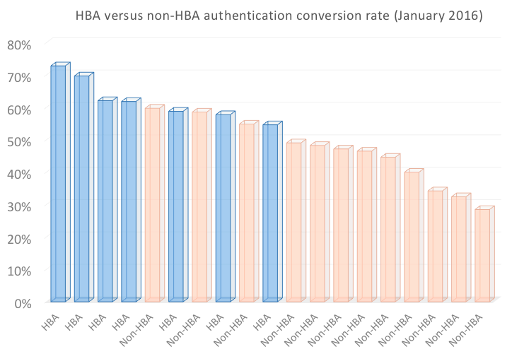

# Autenticazione basata su casa per TV ovunque

>[!NOTE]
>
>Il contenuto di questa pagina viene fornito solo a scopo informativo. L’utilizzo di questa API richiede una licenza corrente a partire da Adobe. Non è consentito alcun uso non autorizzato.

## Che cos’è l’autenticazione basata su Home? {#whatis-home-based-authn}

Home Based Authentication (HBA) è una funzione TV Everywhere che consente agli abbonati a pay-TV di visualizzare i contenuti TV online senza inserire le credenziali MVPD quando sono a casa, migliorando in modo significativo l&#39;esperienza utente del flusso di autenticazione.

Definizione dell&#39;autenticazione basata sull&#39;abitazione da parte del comitato per la tecnologia dell&#39;autenticazione aperta (OATC): &quot;Autenticazione automatica interna è il processo tramite il quale un MVPD/OVD utilizza le caratteristiche della rete domestica (o identificatori automaticamente accessibili tra i dispositivi della rete domestica) per autenticare l&#39;account utente associato alla rete domestica, in modo che gli utenti non debbano immettere manualmente le credenziali quando stabiliscono una sessione TVE per accedere al contenuto protetto TVE.&quot;

Per ulteriori informazioni su HBA e sugli standard di settore, consultare il [Casi d’uso e requisiti dell’OATC](https://dzf8vqv24eqhg.cloudfront.net/userfiles/258/326/ckfinder/files/Defining%20TVE%20Home-Based%20Authentication%20(HBA)%20%20Use%20Cases%20and%20Requirements%20Recommended%20Practice%20Version%201_0%20FINAL%20DRAFT%20FOR%20BOARD%20APPROVAL.pdf){target=_blank} documentazione e **Linee guida per l&#39;esperienza utente OATC per l&#39;HBA**.

>[!NOTE]
>
>Alcuni flussi di HBA fanno parte del pacchetto del flusso di lavoro Premium. Per utilizzare questa funzionalità, contatta il tuo rappresentante commerciale Primetime .

## Perché l&#39;HBA è importante per te {#why-hba}

L&#39;HBA è importante perché elimina praticamente la barriera di accesso per i visualizzatori che sono a casa e che dispongono già di un abbonamento via cavo. Inoltre, l&#39;autenticazione basata sulla casa può aumentare significativamente il coinvolgimento dei tuoi spettatori e offrire un&#39;esperienza utente migliore per il tuo contenuto TV ovunque.

Al momento, quasi la metà dei tentativi di accesso non sono riusciti.

Una volta che l&#39;HBA è stato attivato da uno dei primi 5 MVPD, il suo tasso di conversione di autenticazione **aumentato del 40%** (dal 45% al 63%)

Di seguito è inoltre riportato il tasso di conversione di accesso per un canale integrato con diversi MVPD: quelli che hanno abilitato l&#39;HBA e quelli che non dispongono di HBA. Il tasso di conversione per coloro che utilizzano HBA è significativamente superiore a quelli senza HBA.

Sei mesi dopo l&#39;abilitazione dell&#39;HBA per la maggior parte dei canali integrati con questo MVPD, abbiamo notato un aumento dell&#39;82% degli utenti unici (il numero di utenti che accedono ai canali TV Everywhere attraverso questo MVPD è quasi raddoppiato).

A differenza di 2w3In, come si può vedere nel grafico seguente, altri MVPD che non avevano abilitato HBA hanno avuto solo un aumento del 26% negli utenti unici negli ultimi 6 mesi.

Dai dati raccolti 6 mesi prima e 6 mesi dopo l&#39;abilitazione dell&#39;HBA è emerso un notevole aumento del coinvolgimento dei visualizzatori per i canali abilitati per l&#39;HBA. Praticamente gli utenti di MVPD che hanno abilitato HBA tendono a guardare in media il 30% in più di contenuti rispetto agli utenti di MVPD che non hanno abilitato HBA.

## Supporto HBA di Primetime Authentication {#auth-hba-support}

Questa sezione descrive il supporto HBA fornito dall&#39;autenticazione Primetime, il comportamento delle piattaforme di autenticazione Primetime nei flussi HBA e offre anche dettagli tecnici utili per l&#39;implementazione dell&#39;HBA.

Funzionalità di autenticazione di Primetime che supportano l&#39;HBA

* Possibilità di impostare diversi TTL di autenticazione per le autenticazioni HBA o non HBA (richiede anche il supporto MVPD)
* Possibilità di selezionare automaticamente un MVPD (saltare il selettore MVPD) se l&#39;autenticazione è scaduta. Questo è utile soprattutto quando i TTL HBA sono di piccole dimensioni.
* Possibilità di esporre ai programmatori se l&#39;autenticazione era HBA o meno (richiede anche il supporto MVPD)

### Esperienza utente HBA sulle piattaforme di autenticazione Primetime {#hba-user-exp}

Le tabelle seguenti forniscono informazioni sull&#39;esperienza utente delle piattaforme supportate quando l&#39;HBA è abilitato e l&#39;HBA non è abilitato:

| Flusso utente - Tipo di piattaforma | swf, iOS, Android |
|---|---|
| Con HBA abilitato | Quando gli utenti sono a casa, vengono autenticati automaticamente. Dopo la scadenza del token AuthN dell&#39;HBA, gli utenti vengono automaticamente nuovamente autenticati. |
| Senza HBA | Agli utenti viene richiesto di selezionare il proprio MVPD e di immettere le proprie credenziali, anche se si trovano a casa.Dopo la scadenza del token AuthN, gli utenti devono immettere di nuovo le proprie credenziali. |

| Flusso utente - Tipo di piattaforma | js, Windows (nativo) |
|---|---|
| Con HBA abilitato | Quando gli utenti sono a casa, vengono autenticati automaticamente. Dopo la scadenza del token AuthN dell&#39;HBA, gli utenti devono selezionare nuovamente il proprio MVPD dal selettore e verranno autenticati automaticamente. |
| Senza HBA | Agli utenti viene chiesto di selezionare il proprio MVPD e di immettere le proprie credenziali, anche se si trovano a casa. Dopo la scadenza del token AuthN, gli utenti devono immettere di nuovo le proprie credenziali. |

| Flusso utente - Tipo di piattaforma | API REST senza client (autenticazione a seconda schermata) |
|---|---|
| Con HBA abilitato | Quando gli utenti sono a casa e utilizzano un’app API Clientless REST, vengono autenticati automaticamente sul secondo schermo dopo aver inserito il codice di registrazione e aver selezionato il loro MVPD. Dopo la scadenza del token AuthN dell&#39;HBA, gli utenti vengono automaticamente nuovamente autenticati (sul secondo dispositivo schermo). |
| Senza HBA | Agli utenti viene chiesto di selezionare il proprio MVPD e di immettere le proprie credenziali, anche se si trovano a casa. Dopo la scadenza del token AuthN, gli utenti devono immettere di nuovo le proprie credenziali. |

### Informazioni tecniche sull&#39;implementazione dell&#39;HBA {#tech-details-hba}

#### Protocollo OAuth 2.0 {#oauth-2-protocol}

Nel flusso dell&#39;HBA per gli MVPD integrati con il protocollo di autenticazione OAuth 2.0, l&#39;MVPD invia un token di aggiornamento e l&#39;Adobe emette un token di autenticazione dell&#39;HBA:

* Il token di aggiornamento ha un TTL determinato dai requisiti aziendali del MVPD.
* TTL token di autenticazione dell&#39;HBA **deve essere minore o uguale a** il token di aggiornamento TTL.

*Descrizione del flusso di autenticazione dell’HBA per il protocollo OAuth 2.0*

| Azioni utente | Azioni di sistema |
|---|---|
| L&#39;utente accede al sito del programmatore. Quando si tenta di riprodurre un video, viene visualizzato il selettore MVPD. L&#39;utente seleziona il proprio MVPD e clicca su login. | Viene effettuato un controllo di fondo. L&#39;MVPD applica il proprio set di regole per il rilevamento dell&#39;utente (ad esempio, mappa l&#39;indirizzo IP dell&#39;utente con l&#39;indirizzo MAC dei modem forniti dal distributore o dei set-top box collegati a banda larga). |
| Viene visualizzata una schermata che persiste per circa 3 secondi. È possibile visualizzare una pagina interstiziale per informare l&#39;utente che l&#39;accesso avviene automaticamente utilizzando il proprio account MVPD. | <ol><li>AccessEnabler, installato sul lato del programmatore, invia una richiesta di autenticazione (come richiesta HTTP) all&#39;endpoint di autenticazione di Adobe Primetime.</li><li>L&#39;endpoint di autenticazione Primetime reindirizzerà la richiesta all&#39;endpoint di autenticazione MVPD.  **Nota:** La richiesta contiene `hba_flag` parametro (tentativo HBA = true) che indica che MVPD deve tentare l&#39;autenticazione HBA.</li><li>L&#39;endpoint di autenticazione MVPD invia un codice di autorizzazione all&#39;endpoint di autenticazione Adobe Primetime.</li><li>L’autenticazione Adobe Primetime utilizza il codice di autorizzazione per richiedere un token di aggiornamento e un token di accesso dall’endpoint token MVPD.</li><li>L&#39;MVPD invia una decisione di autenticazione e `hba_status` (true/false) nel `id_token`.</li><li>Viene inviata una chiamata all’endpoint del profilo utente MVPD per esporre [chiave hba_status nei metadati utente](/help/authentication/user-metadata-feature.md#obtaining).</li><li>L&#39;MVPD imposta il token di aggiornamento TTL su un valore concordato MVPD e l&#39;Adobe imposta il token AuthN TTL su un valore minore o uguale al valore del token di aggiornamento.</li></ol> |
| L&#39;utente è autenticato e può ora sfogliare il contenuto TV Everywhere intitolato. | Il token di autenticazione viene passato all&#39;utente che può ora sfogliare correttamente il sito del programmatore. |

#### Protocollo SAML {#saml-protocol}

Descrizione del flusso di autenticazione dell&#39;HBA per il protocollo di autenticazione SAML

| Azioni utente | Azioni di sistema |
|---|---|
| L&#39;utente accede al sito del programmatore. Quando si tenta di riprodurre un video, viene visualizzato il selettore MVPD. L&#39;utente seleziona il proprio MVPD e clicca su login. | Viene effettuato un controllo di fondo. L&#39;MVPD applica il proprio set di regole per il rilevamento dell&#39;utente (ad esempio, mappa l&#39;indirizzo IP dell&#39;utente con l&#39;indirizzo MAC dei modem forniti dal distributore o dei set-top box collegati a banda larga). |
| Viene visualizzata una schermata che persiste per circa 3 secondi. È possibile visualizzare una pagina interstiziale per informare l&#39;utente che l&#39;accesso avviene automaticamente utilizzando il proprio account MVPD. | <ol><li>AccessEnabler, installato sul lato del programmatore, invia una richiesta di autenticazione (come richiesta HTTP) all&#39;endpoint di autenticazione di Adobe Primetime.</li><li>L&#39;endpoint di autenticazione Primetime reindirizzerà la richiesta all&#39;endpoint di autenticazione MVPD.</li><li>L&#39;MVPD deve inviare una decisione di autenticazione sotto forma di risposta SAML che deve contenere il flag dell&#39;HBA: hba_status (true/false).</li><li>Viene inviata una chiamata all’endpoint del profilo utente MVPD per esporre [chiave hba_status nei metadati utente](/help/authentication/user-metadata-feature.md#obtaining).</li></ol> |
| L&#39;utente è autenticato e può ora sfogliare il contenuto TV Everywhere intitolato. | Il token di autenticazione viene passato all&#39;utente che può ora sfogliare correttamente il sito del programmatore. |

## Come attivare l&#39;HBA {#how-to-activate-hba}

* **Protocollo OAuth:**
   * Per abilitare l&#39;HBA, vedere [Guida utente di Primetime TVE Dashboard](/help/authentication/tve-dashboard-user-guide.md)
* **Protocollo SAML:** L&#39;autenticazione basata sulla pagina principale è attivata sul lato MVPD. Nessuna azione è richiesta dal programmatore o dall&#39;Adobe.
Per ulteriori informazioni sugli MVPD che supportano l&#39;autenticazione basata su Home, vedi [Stato dell&#39;HBA per gli MVPD](/help/authentication/hba-status-mvpds.md).

## Domande frequenti {#faqs}

**Domanda:** Perché la separazione tra autenticazione basata su Home con i protocolli SAML e OAuth2?

**Risposta:** Il flusso dell&#39;HBA è diverso per i due protocolli. Dal punto di vista di un programmatore, non è necessario agire per garantire che l&#39;HBA sia abilitato per gli MVPD SAML, mentre per gli MVPD OAuth2, l&#39;HBA può essere attivato o disattivato nel dashboard TVE Primetime.

**Domanda:** Gli utenti devono compilare un nome utente e una password la prima volta che si autenticano quando l&#39;HBA è abilitato?

**Risposta:** No, nome utente e password non sono richiesti.

**Domanda:** Come si fanno applicare i controlli genitori?

**Risposta 1:** L&#39;Adobe può disattivare l&#39;HBA per le integrazioni con i canali che necessitano dell&#39;approvazione del controllo genitori.

**Risposta 2:** L&#39;Adobe sta lavorando con OATC su un documento UX che raccomanda come impostare l&#39;esperienza HBA con i controlli parentali.

**Domanda:** I provider che supportano l&#39;HBA dispongono di finestre TTL più brevi per l&#39;HBA e quindi lo fanno per l&#39;autenticazione regolare?

**Risposta:** L’impostazione TTL è configurabile. È consigliabile impostare un TTL più breve per i token di autenticazione HBA per evitare errori di gestione.

## Informazioni utili {#useful-info}

* [Recommendations con accesso istantaneo (HBA)](http://www.ctamtve.com/instantaccess){target=_blank} - di CTAM
* [Implementazione di esempio di HBA sull&#39;app Programmer](https://dzf8vqv24eqhg.cloudfront.net/userfiles/258/326/ckfinder/files/HBA_Flow_Sample.pdf?dc=201604222139-1346){target=_blank} - per Adobe
   <!--* [Home Based Authentication User Experience Guidelines for TV Everywhere](http://oatc.us/Standards/DownloadRecommendedPractices.aspx){target=_blank} - by OATC-->
* [Casi d&#39;uso e requisiti dell&#39;autenticazione basata su Home](https://dzf8vqv24eqhg.cloudfront.net/userfiles/258/326/ckfinder/files/Defining%20TVE%20Home-Based%20Authentication%20(HBA)%20%20Use%20Cases%20and%20Requirements%20Recommended%20Practice%20Version%201_0%20FINAL%20DRAFT%20FOR%20BOARD%20APPROVAL.pdf){target=_blank} da OATC
* [Infografica dell&#39;autenticazione basata su Home](https://dzf8vqv24eqhg.cloudfront.net/userfiles/258/326/ckfinder/files/AdobeNewsletterHBA.pdf?dc=201604260953-2640){target=_blank} - per Adobe
* [Autenticazione tramite il protocollo OAuth 2.0](/help/authentication/authn-oauth2-protocol.md)
* [Autenticazione con MVPD SAML](/help/authentication/authn-usecase.md)
* [Guida utente di Primetime TVE Dashboard](/help/authentication/tve-dashboard-user-guide.md)
* [metadati utente hba_status](/help/authentication/user-metadata-feature.md#obtaining)

