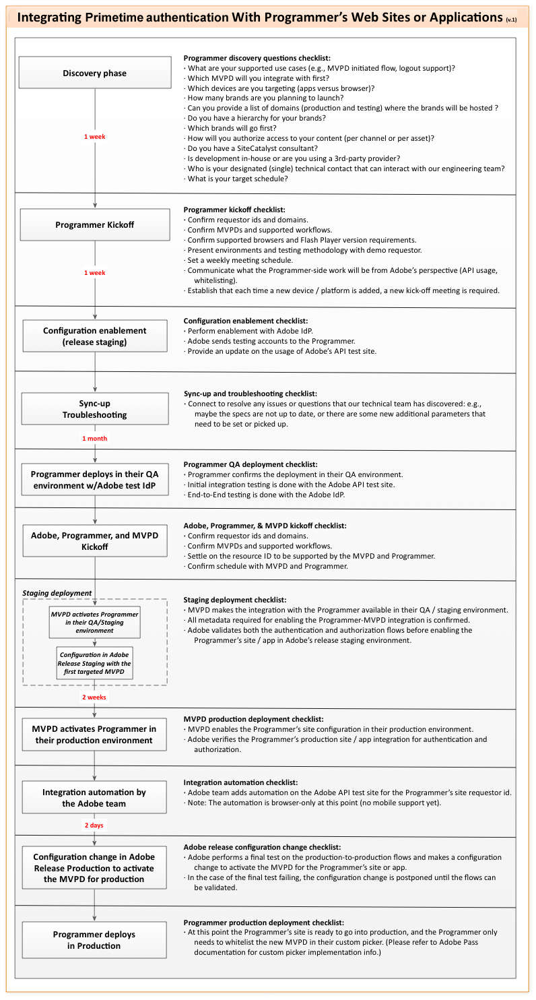

# Panoramica Per Programmatori {#programmers-overview}

>[!NOTE]
>
>Il contenuto di questa pagina viene fornito solo a scopo informativo. L’utilizzo di questa API richiede una licenza corrente di Adobe. Non è consentito alcun uso non autorizzato.

## Introduzione {#introduction}

Questa panoramica è destinata al provider di contenuti (Programmatore) che prevede di integrare Adobe® Pass nel proprio sito web o applicazione. Per ulteriore documentazione, comprese le guide per Kick-Start e l’integrazione, consulta Informazioni correlate di seguito.

Oggi i tuoi spettatori possono accedere a Internet in qualsiasi momento e ovunque e richiedere l’accesso a contenuti protetti direttamente da te, dal Programmatore. È possibile che vogliano guardare un evento occasionale o che vogliano ottenere i diritti di visualizzazione per un&#39;intera serie televisiva che si sta trasmettendo.

Ma prima di consentire l’accesso al contenuto protetto, devi determinare se un cliente ha il diritto di visualizzarlo. Hanno un abbonamento con un MVPD (Multichannel Video Programming Distributor)? In caso affermativo, l’abbonamento include la tua programmazione?

Determinare il diritto di un visualizzatore non è sempre semplice per un programmatore. Gli MVPD detengono i dati identificativi e i privilegi di accesso per i loro clienti.  Aggiungiamo il fatto che gli spettatori che cercano di accedere ai contenuti protetti si abbonano a una varietà di MVPD, ciascuno dei quali ha sistemi diversi, ed è facile vedere che determinare il diritto degli spettatori a contenuti protetti può diventare rapidamente complicato e tecnicamente difficile:

*Figura: Diritto Utente Determinato Direttamente Dal Programmatore*

L&#39;autenticazione Adobe Primetime per TV Everywhere media in modo sicuro queste transazioni di adesione tra Programmatori e MVPD. L’autenticazione Adobe Primetime consente ai programmatori di fornire contenuti protetti a clienti validi in modo semplice, rapido e sicuro:

*Figura: Autenticazione utente mediata da Adobe Primetime*

L’autenticazione Adobe Primetime funge da proxy negli scambi con gli MVPD partecipanti, consentendo di presentare ai visualizzatori un’interfaccia cross-site coerente. L’autenticazione Adobe Primetime consente inoltre di fornire ai visualizzatori l’autenticazione e l’autorizzazione Single Sign-On (SSO). L’autenticazione e l’autorizzazione vengono tracciate per tutti i servizi partecipanti, in modo che un abbonato non debba effettuare di nuovo l’accesso dopo la prima autenticazione sul proprio sistema.

* **Autenticazione** - Il processo di conferma con un MVPD che un determinato utente è un cliente noto.
* **Autorizzazione** : processo di conferma con un MVPD che un utente autenticato dispone di un abbonamento valido a una risorsa specificata.

### Funzionamento dell’autenticazione di Adobe Primetime {#HowItWorks}

L’applicazione di visualizzazione dei contenuti del programmatore interagisce con l’autenticazione di Adobe Primetime utilizzando il componente client Access Enabler o i servizi web RESTful dell’API senza client (per dispositivi non compatibili con il web come smart TV, console di giochi, set-top box, ecc.). L’Access Enabler viene eseguito sul sistema dell’utente, facilitando tutti i flussi di lavoro relativi ai diritti.  Il componente Access Enabler viene scaricato dal sito di hosting all&#39;Adobe in cui i clienti accedono al sito e richiedono contenuto protetto.  I server di autenticazione di Adobe Primetime ospitano i servizi web RESTful utilizzati nella soluzione Clientless.

L’autenticazione di Adobe Primetime gestisce i flussi di lavoro effettivi per i diritti, fornendo al contempo le primitive utilizzate per:

* Imposta la tua identità. Il Programmatore è il &quot;richiedente&quot; nel flusso di adesioni all’autenticazione di Adobe Primetime.
* Autentica un utente con un MVPD specifico.  L’MVPD è il &quot;provider di identità&quot; o &quot;IdP&quot; nel flusso di adesione all’autenticazione di Adobe Primetime.
* Autorizza un utente con MVPD per una particolare risorsa.
* Disconnetti l&#39;utente.

Il programmatore è responsabile della pagina web di livello superiore o dell’applicazione del lettore che esegue le seguenti operazioni:

* Implementa l’interfaccia utente di
* Interagisce con Access Enabler o i servizi web API senza client

L’obiettivo dell’autenticazione Adobe Primetime è quello di creare un modo semplice e modulare per consentire ai programmatori e agli MVPD di gestire la verifica dell’adesione.

## Informazioni sui token {#understanding-tokens}

La soluzione Adobe Primetime per l’autenticazione è incentrata sulla generazione di parti specifiche di dati create al completamento dei flussi di lavoro di autenticazione e autorizzazione. Questi dati sono denominati token. I token hanno una durata limitata; quando scadono, i token devono essere ririlasciati tramite la riattivazione dei flussi di lavoro di autenticazione e autorizzazione.

Per informazioni dettagliate sui token, consulta le sezioni seguenti:

* [Tipi di token](#token-types)
* [Archiviazione token](#token-storage)
* [Sicurezza dei token](#token-security)
* [Condivisione dei token](#token-sharing)

### Tipi di token {#token-types}

Durante i flussi di lavoro di autenticazione e autorizzazione vengono rilasciati tre tipi di token. I token AuthN e AuthZ sono &quot;di lunga durata&quot; e forniscono continuità nell’esperienza di visualizzazione dell’utente. Il Media Token è un token di breve durata che fornisce supporto per le best practice di settore al fine di prevenire le frodi attraverso la copia di flusso. I programmatori specificano i valori TTL (time-to-live) per ciascun tipo di token in base agli accordi stipulati con gli MVPD. I programmatori decidono il valore TTL più adatto alle esigenze della tua azienda e dei tuoi clienti.

* **Token AuthN** (&quot;Di lunga durata&quot;): una volta completata l’autenticazione, Adobe Primetime crea un token AuthN associato sia al dispositivo richiedente che a un identificatore univoco globale (GUID).
   * L’autenticazione Adobe Primetime invia il token AuthN all’Access Enabler, che lo memorizza in cache in modo sicuro sul sistema del client.  Il token AuthN, disponibile e non scaduto, è disponibile per tutte le applicazioni che utilizzano l’autenticazione Adobe Primetime. Access Enabler utilizza il token AuthN per il flusso di autorizzazione.
   * In un dato momento viene memorizzato nella cache un solo token AuthN. Ogni volta che viene rilasciato un nuovo token AuthN e ne esiste già uno vecchio, l’autenticazione Adobe Primetime sovrascrive il token memorizzato in cache.
* **Token AuthZ** (&quot;Di lunga durata&quot;): se l’autorizzazione viene concessa correttamente, l’autenticazione Adobe Primetime crea un token AuthZ associato al dispositivo richiedente e a una risorsa protetta specifica.  La risorsa protetta è identificata da un ID risorsa univoco.
   * L’autenticazione Adobe Primetime invia il token AuthZ all’Access Enabler, che lo memorizza in cache in modo sicuro sul sistema locale. L’Access Enabler utilizza quindi il token AuthZ per creare il token Media di breve durata utilizzato per l’accesso effettivo alla visualizzazione.
   * In qualsiasi momento viene memorizzato nella cache un solo token AuthZ per risorsa. L’autenticazione Adobe Primetime può memorizzare in cache più token AuthZ, purché siano associati a risorse diverse. Ogni volta che viene rilasciato un nuovo token AuthZ e ne esiste già uno per la stessa risorsa, l’autenticazione Adobe Primetime sovrascrive il token memorizzato in cache.
* **Token multimediale** (&quot;Breve durata&quot;): Access Enabler utilizza il token AuthZ per generare un token multimediale di breve durata (impostazione predefinita: 7 minuti). Questo è il punto in cui si considera che una richiesta di riproduzione sia andata a buon fine.
   * Prima di fornire l’accesso alla risorsa protetta, il server multimediale deve utilizzare un componente di autenticazione Adobe Primetime, Media Token Verifier, per convalidare il token multimediale.
   * Poiché il token Media non è associato al dispositivo, la sua durata è significativamente più breve (impostazione predefinita: 7 minuti) rispetto a quella dei token AuthN e AuthZ di lunga durata.
   * Il token multimediale di breve durata è limitato all’utilizzo una tantum e non viene mai memorizzato nella cache. Viene recuperato dal server di autenticazione di Adobe Primetime ogni volta che viene chiamata un’API di autorizzazione.

### Archiviazione token {#token-storage}

Access Enabler memorizza i token a vita lunga (AuthN e AuthZ) nelle posizioni specifiche del proprio ambiente:

* **Flash 10.1** (o versione successiva): i token di lunga durata vengono memorizzati come oggetti condivisi locali.
* **HTML5**: i token a lunga durata vengono conservati in modo sicuro nel negozio locale del browser HTML5.
* **iOS**: i token a vita lunga sono memorizzati su una bacheca persistente, dove sono accessibili da altre applicazioni client di autenticazione di Adobe Primetime.
* **Android**: i token di lunga durata vengono memorizzati in un file di database condiviso, dove sono accessibili da altre applicazioni client di autenticazione di Adobe Primetime.
* **Dispositivi API senza client**: i token vengono memorizzati nei server di autenticazione Primetime.

### Sicurezza dei token {#token-security}

Il server di autenticazione di Adobe Primetime firma digitalmente tutti i token a vita lunga utilizzando l’ID dispositivo (derivato dalle caratteristiche hardware del dispositivo). La firma digitale varia a seconda dell’ambiente in cui viene generata, protetta e convalidata:

* **Flash 10.1** (o versione successiva) - L’ID dispositivo si basa sulle credenziali del dispositivo, un certificato univoco rilasciato dal server Adobe Individualization. Questa sicurezza equivale alla tecnologia FAXS DRM. Questa convalida lato server confronta l’ID dispositivo univoco nel token con le credenziali del dispositivo (comunicate in modo sicuro dal Flash Player all’autenticazione Adobe Primetime). Le credenziali del dispositivo identificano anche la versione del client FAXS e la versione del Flash Player (o AIR) a cui è stata rilasciata. Il binding del dispositivo è più forte rispetto a HTML5, pertanto il time-to-live (TTL) per i token è in genere più lungo con il Flash.
* **HTML5** - Il dispositivo è personalizzato sul lato client. Utilizza le caratteristiche disponibili tramite JavaScript per produrre un ID pseudo-dispositivo che include le versioni del browser e del sistema operativo, un indirizzo IP e un GUID di cookie del browser (identificatore univoco globale). Questo ID dispositivo token viene confrontato con l’ID pseudo-dispositivo corrente del dispositivo. Poiché l’indirizzo IP può cambiare durante il normale utilizzo, anche nella stessa sessione, l’autenticazione Adobe Primetime memorizza i token HTML5 in due posizioni: localStorage e sessionStorage. Se l’IP cambia e il token sessionStorage è ancora valido, la sessione viene mantenuta. Con HTML5, il binding del dispositivo non è così forte, pertanto il TTL per i token è in genere più breve rispetto a quello per il Flash.
* **Client nativi** (iOS e Android) - I token a vita lunga contengono informazioni di personalizzazione native dell’ID dispositivo e sono quindi associati al dispositivo richiedente. Le richieste di autenticazione e autorizzazione vengono inviate tramite HTTPS e le informazioni sull’ID dispositivo sono firmate digitalmente dalla libreria di Access Enabler prima di inviarle ai server back-end. Sul lato server, le informazioni dell’ID dispositivo vengono convalidate in base alla firma digitale associata.
* **Client API senza client** : la soluzione API client dispone di un set di protocolli di sicurezza che richiedono la firma digitale di tutte le chiamate API. I token generati durante i flussi di adesione vengono memorizzati in modo sicuro sui server di autenticazione di Adobe Primetime.

L’autenticazione Adobe Primetime convalida ogni token di lunga durata per garantire che il dispositivo che accede al contenuto sia lo stesso che ha emesso il token. Per tutti i token, una convalida lato client assicura che la firma digitale sia intatta e che l’integrità del token sia preservata. Quando la convalida dell’ID del dispositivo non riesce, la sessione di autenticazione viene invalidata e all’utente viene richiesto di accedere nuovamente, ripristinando i token.

### Condivisione dei token {#token-sharing}

Le applicazioni su piattaforme diverse non condividono token. Questo fenomeno è dovuto a diversi fattori, tra cui:

* Come descritto in [Archiviazione token](#token-storage), il metodo di memorizzazione dei token varia tra le piattaforme (ad esempio, Oggetti condivisi locali per il Flash, WebStorage per JavaScript).
* Il grado di sicurezza dei token varia tra le piattaforme. Ad esempio, i token di Flash sono fortemente associati a un dispositivo utilizzando FAXS. I token in un ambiente JavaScript puro non dispongono dello stesso livello di supporto DRM del Flash.  La condivisione di token JS con applicazioni di Flash aumenterebbe la possibilità di utilizzare token meno sicuri in un ambiente più sicuro.

## Ciclo di vita dell’integrazione dei programmatori {#prog-integ-lifecycle}

*Figura: Integrazione dell’autenticazione con il sito web e l’applicazione del programmatore*

## Flussi logici {#logical-flows}

### Diagramma di flusso diritto {#chart}

Il seguente diagramma di flusso illustra il processo complessivo di conferma dell’adesione (utilizzando il componente client di Adobe Primetime authentication Access Enabler):

*Figura: Processo di conferma dell’adesione*

### Passaggi di autenticazione {#authn-steps}

I passaggi seguenti presentano un esempio del flusso di autenticazione di Adobe Primetime.  Questa è la parte del processo di adesione in cui un programmatore determina se l&#39;utente è un cliente valido di un MVPD.  In questo caso, l’utente è un abbonato valido a un MVPD.  L’utente sta tentando di visualizzare il contenuto protetto utilizzando un’applicazione di Flash del programmatore:

1. L’utente passa alla pagina web del programmatore, che carica l’applicazione di Flash del programmatore e i componenti Adobe Primetime authentication Access Enabler sul computer dell’utente. L&#39;applicazione di Flash utilizza Access Enabler per impostare l&#39;identificazione del programmatore con l&#39;autenticazione Adobe Primetime e l&#39;autenticazione Adobe Primetime prepara l&#39;Access Enabler con i dati di configurazione e stato per quel programmatore (il &quot;richiedente&quot;). L’Access Enabler deve ricevere questi dati dal server prima di eseguire qualsiasi altra chiamata API. Nota tecnica: il programmatore imposta la propria identità con l’opzione di abilitazione all’accesso `setRequestor()` metodo; per ulteriori informazioni, vedere [Guida all’integrazione dei programmatori](/help/authentication/programmer-integration-guide-overview.md).
1. Quando l&#39;utente cerca di visualizzare il contenuto protetto del programmatore, l&#39;applicazione del programmatore presenta all&#39;utente un elenco di MVPD, da cui l&#39;utente seleziona un provider.
1. L’utente viene reindirizzato a un server di autenticazione Adobe Primetime, in cui un’istanza crittografata [SAML](https://en.wikipedia.org/wiki/Security_Assertion_Markup_Language) viene creata una richiesta per l&#39;MVPD selezionato dall&#39;utente. Questa richiesta viene inviata come richiesta di autenticazione per conto del programmatore a MVPD. A seconda del sistema dell&#39;MVPD, il browser dell&#39;utente viene quindi reindirizzato al sito dell&#39;MVPD per effettuare l&#39;accesso, oppure viene creato un iFrame di accesso nell&#39;app del programmatore.
1. In entrambi i casi (redirect o iFrame), MVPD accetta la richiesta e visualizza la relativa pagina di accesso.
1. L&#39;utente accede con MVPD, quest&#39;ultimo convalida lo stato dell&#39;utente come cliente pagante e quindi crea la propria sessione HTTP.
1. Quando l’utente viene convalidato, MVPD crea una risposta (SAML e crittografata) che viene inviata nuovamente all’autenticazione di Adobe Primetime.
1. L’autenticazione Adobe Primetime riceve la risposta MVPD, rileva che è aperta una sessione HTTP di autenticazione Adobe Primetime, convalida la risposta SAML da MVPD e reindirizza al sito del programmatore.
1. Il sito del programmatore viene ricaricato, l&#39;Access Enabler viene ricaricato e il programmatore chiama nuovamente setRequestor().  La seconda chiamata a setRequestor() è necessaria perché la configurazione corrente è stata modificata. È ora presente un flag che informa Access Enabler che un token AuthN è in attesa di essere generato sul server.
1. Access Enabler rileva un’autenticazione in sospeso e richiede il token dal server di autenticazione di Adobe Primetime. Il token viene recuperato dal server richiamando le funzionalità DRM del Flash Player.
1. Il token AuthN viene memorizzato nella cache LSO del Flash Player del programmatore; l’autenticazione è ora completa e la sessione viene eliminata sul server di autenticazione di Adobe Primetime.

### Passaggi di autorizzazione {#authz-steps}

I seguenti passaggi proseguono dalla [Passaggi di autenticazione](#authn-steps):

1. Quando l’utente tenta di accedere al contenuto protetto del Programmatore, l’applicazione del Programmatore verifica innanzitutto la presenza di un token AuthN sul computer o sul dispositivo locale dell’utente.  Se tale token non è presente, il token [Passaggi di autenticazione](#authn-steps) sono seguite le indicazioni precedenti.  Se il token AuthN è presente, il flusso di autorizzazione procede con l’applicazione del programmatore che avvia una chiamata all’Access Enabler con una richiesta per ottenere i diritti di visualizzazione dell’utente per un elemento specifico di contenuto protetto.
1. L’elemento specifico di contenuto protetto è rappresentato da un &quot;identificatore di risorsa&quot;.  Potrebbe trattarsi di una stringa semplice o di una struttura più complessa, ma in ogni caso la natura dell’identificatore della risorsa viene concordata in anticipo tra il Programmatore e l’MVPD.  L&#39;applicazione del programmatore passa l&#39;identificatore della risorsa all&#39;Access Enabler.  Access Enabler verifica la presenza di un token AuthZ sul computer o sul dispositivo locale dell&#39;utente.  Se il token AuthZ non è presente, Access Enabler trasmette la richiesta al server di autenticazione Adobe Primetime back-end.
1. Il server di autenticazione di Adobe Primetime comunica con l’endpoint di autorizzazione MVPDs utilizzando protocolli standardizzati.  Se la risposta dell’MVPD indica che l’utente ha il diritto di visualizzare il contenuto protetto, il server di autenticazione di Adobe Primetime crea un token AuthZ e lo trasmette nuovamente all’Access Enabler, che memorizza il token AuthZ sul computer dell’utente.
1. Con un token AuthZ memorizzato sul computer o sul dispositivo dell’utente, l’applicazione del programmatore chiama l’Access Enabler per ottenere un token multimediale dal server di autenticazione di Adobe Primetime e fornisce tale token all’applicazione del programmatore.
1. Infine, l’applicazione del programmatore utilizza il componente Media Token Verifier per confermare che l’utente giusto sta visualizzando il contenuto corretto e, con il Media Token attivo, può visualizzare il contenuto protetto.

## Registrazione e inizializzazione {#reg-and-init}

Il primo passaggio nell’utilizzo dell’autenticazione Adobe Primetime consiste nel registrarsi presso Adobe o un partner autorizzato all’autenticazione Adobe Primetime.

Quando ti registri, fornisci un elenco dei domini da cui comunicherai con l’autenticazione di Adobe Primetime. Ad esempio, i domini Turner Broadcasting System includono tbs.com e tnt.tv come domini registrati per l’autenticazione in Adobe Primetime. A ciascuno di questi siti di contenuti viene dato l’accesso all’autenticazione Adobe Primetime e viene assegnato il proprio ID richiedente (ad esempio, &quot;TBS&quot; e &quot;TNT&quot;). Se decidi di aggiungere altri siti, devi informare Adobe dei nomi di dominio aggiuntivi per farli inserire nell’elenco dei domini consentiti e ricevere gli ID richiedente aggiuntivi.

>[!WARNING]
>
>Durante il test dell’integrazione, accertati che il server di test si trovi su un dominio registrato che intendi utilizzare in produzione. Le richieste, anche quelle di test, provenienti da domini non inseriti nella whitelist vengono ignorate. Ad esempio, se hai richiesto l’utilizzo di domain.com in produzione, assicurati di distribuire l’integrazione dei test in domain.com, test.domain.com e staging.domain.com.
>
>Le richieste che contengono il nome utente e/o la password nell’URL vengono ignorate anche se i domini sono inseriti nella whitelist. Esempio: `//username@registered-domain/`

L’ID richiedente identifica in modo univoco il client del programmatore in tutte le comunicazioni con il componente client Access Enabler di Adobe Primetime Authentication. Tutti i dati statici di autenticazione di Adobe Primetime associati al programmatore vengono convertiti in questo ID.

>[!TIP]
>
>Oltre all’ID richiedente, quando si effettua la registrazione si ricevono anche URL funzionali per il componente client Access Enabler e Media Token Verifier.

## Passaggi dell’integrazione {#integration-steps}

>[!TIP]
>
>Se utilizzi il Open Source Media Framework Adobe (&quot;OSMF&quot;) per lo sviluppo del lettore multimediale, il modo più rapido per utilizzare l’autenticazione Adobe Primetime è integrare il plug-in OSMF *(Obsoleto)* nel codice del lettore.
>
><!--For details, see [Adobe Primetime authentication Plugin For OSMF](https://tve.helpdocsonline.com/9-2-2) in the Programmer Integration Guide.-->

1. [Impostazione richiedente](#requestor)
1. [Gestione dell’autenticazione e dell’autorizzazione](#authn-authz)
1. [Supporto di disconnessione singola](#ssl)

### 1. Impostazione richiedente {#requestor}

#### 1 bis. Registrazione con l&#39;Adobe

Il primo passaggio consiste nel registrarti a Adobe o a un partner autorizzato di autenticazione Adobe Primetime.  Al momento della registrazione vengono rilasciati uno o più identificatori univoci globali (GUID). Ogni GUID emesso è associato a un dominio da cui è consentito l&#39;accesso all&#39;autenticazione di Adobe Primetime. Si passa un GUID (denominato ID richiedente) per il dominio richiedente per registrare l&#39;identità per ogni sessione in cui si interagisce con Access Enabler. Per ulteriori informazioni, consulta [Registrazione e inizializzazione](#reg-and-init) nella Guida all’integrazione dei programmatori.

#### 1 ter. Integrazione iniziale di Access Enabler

Il passaggio successivo consiste nell’integrare Access Enabler nell’app o nella pagina web del lettore multimediale esistente:

* Puoi incorporare la versione del Flash, `AccessEnabler.swf`, in un lettore video basato su Flash, oppure puoi incorporarlo direttamente nel HTML della pagina web. È possibile comunicare con Access Enabler SWF in ActionScript o JavaScript. L’API di base è ActionScript, ma se preferisci lavorare con JavaScript, è disponibile una libreria wrapper completa da includere nelle pagine.
* Per gli ambienti non di Flash, è possibile:
   * Utilizza la versione HTML5/JavaScript, AccessEnabler.js, e comunica con essa tramite l’API JavaScript
   * Utilizza l’estensione nativa di AIR per l’autenticazione di Adobe Primetime per combinare il codice nativo con le classi ActionScript integrate
   * Utilizzare una delle versioni client native della libreria Access Enabler (iOS o Android)

### 2. Gestione dell’autenticazione e dell’autorizzazione {#authn-authz}

#### 2 bis. Comunicazione con Access Enabler

La comunicazione tra Access Enabler e la pagina web o l’app del lettore è asincrona. L&#39;applicazione chiama i metodi Access Enabler e Access Enabler risponde tramite i callback registrati con la libreria Access Enabler.

* Quando l&#39;applicazione effettua una richiesta di autorizzazione, Access Enabler avvia automaticamente una richiesta di autenticazione, se nel sistema locale non è già presente un token AuthN valido. Quando l’autenticazione ha esito positivo, il token AuthN dell’utente viene memorizzato localmente, pertanto non è necessario effettuare nuovamente l’accesso. Se l’autenticazione è avvenuta correttamente tramite l’autenticazione di Adobe Primetime in qualsiasi altro contesto (ad esempio, tramite il sito web MVPD o con un altro programmatore), Access Enabler ha accesso al token di autenticazione locale e non è necessaria un’autenticazione aggiuntiva.
* Quando un utente tenta di accedere al contenuto protetto, invia una richiesta di autorizzazione all’Access Enabler. Dopo aver verificato (o avviato) l’autenticazione, Access Enabler contatta l’MVPD (tramite il server di autenticazione di Adobe Primetime) per determinare se il cliente ha il diritto di visualizzare il contenuto protetto. L’applicazione deve solo inviare la richiesta all’Access Enabler e quindi gestire la risposta (autorizzazione riuscita o non riuscita). Se l&#39;autorizzazione ha esito positivo, nel sistema client viene memorizzato un token AuthZ.  Infine, l’applicazione riceve un token Media di breve durata da utilizzare nella procedura di autorizzazione.

>[!NOTE]
>
>* L’autenticazione si verifica come scambio SAML, tra Adobe Primetime authentication as the Service Provider (SP) e MVPD as the Identity Provider (IdP).
>
>* L’autorizzazione utilizza uno scambio di servizi web back-channel (server-to-server) tra l’autenticazione Adobe Primetime (l’SP) e un MVPD (l’IdP).

#### 2 ter. Interfaccia Utente Di Adesione {#entitlement-ui}

Fornisci la tua interfaccia utente per l’accesso degli utenti ai tuoi contenuti. Alcuni elementi, come il processo di accesso effettivo, sono forniti da MVPD e alcuni elementi sono facoltativamente disponibili come parte dell’autenticazione di Adobe Primetime. Effettua almeno le seguenti operazioni:

* **Implementa un’interfaccia di selezione MVPD che consente a un nuovo utente di identificare il proprio MVPD e di accedere per la prima volta**. Per lo sviluppo, Access Enabler fornisce un&#39;interfaccia utente di base che offre al cliente la possibilità di scegliere tra MVPD e avvia il processo di accesso. Per la produzione, è necessario implementare una finestra di dialogo del selettore MVPD personalizzata. Alcuni MVPD reindirizzano al proprio sito per l&#39;accesso e altri richiedono che le loro pagine di accesso siano visualizzate all&#39;interno di un iFrame. Devi implementare un callback che crei questo iFrame per gestire i casi in cui il MVPD dell&#39;utente visualizza la propria pagina di accesso in un iFrame.
* **Identificare i contenuti protetti**. Il contenuto protetto richiede l&#39;autorizzazione di accesso. L’interfaccia deve indicare quale contenuto è protetto e quale contenuto è stato autorizzato.  Lo stato di autorizzazione viene spesso indicato con icone &quot;sbloccato&quot; e &quot;bloccato&quot;.
* **Mostra che un utente è autenticato**. È necessario indicare lo stato di autenticazione di un utente come parte di qualsiasi mezzo utilizzato per identificare il contenuto protetto. È possibile eseguire una query sull&#39;attivatore di accesso per determinare se il cliente è già stato autenticato.

#### 2 quater. Integrazione di Media Token Verifier {#int-media-token-ver}

Devi integrare il componente Media Token Verifier di autenticazione Adobe Primetime nel server multimediale.  In questo modo, il verificatore token esistente può riconoscere i token Media di breve durata forniti dall’autenticazione Adobe Primetime con un’autorizzazione riuscita. Il Media Token Verifier convalida i token multimediali come ultimo passaggio di sicurezza prima di fornire all’utente l’accesso al contenuto protetto. Ricevi la posizione da cui scaricare Media Token Verifier quando ti registri con Adobe.

### 3. Supporto della disconnessione singola {#ssl}

Nella maggior parte dei casi, il lettore multimediale è responsabile della gestione dei logout degli utenti tramite una semplice API Access Enabler. Quando si chiama logout(), Access Enabler esegue le operazioni seguenti:

* Disconnette l&#39;utente corrente
* Cancella tutte le informazioni di autenticazione e autorizzazione per l&#39;utente disconnesso
* Elimina tutti i token AuthN e AuthZ dal sistema locale dell&#39;utente

Se l&#39;utente lascia il computer inattivo per un tempo sufficiente a far scadere i token, può comunque tornare alla sessione e avviare correttamente la disconnessione. L’autenticazione di Adobe Primetime garantisce che tutti i token vengano eliminati e notifica all’MVPD di eliminare anche la loro sessione.

Quando la disconnessione viene avviata da un sito che non è integrato con l&#39;autenticazione di Adobe Primetime, MVPD può richiamare il servizio di disconnessione singola di autenticazione di Adobe Primetime tramite un reindirizzamento del browser.

## Informazioni sugli ID utente {#user-ids}

Concettualmente, ogni utente che avvia un flusso di adesione è associato a un singolo ID utente univoco.  Tuttavia, attraverso il corso di un flusso di adesione, tale ID utente può essere presentato in modi diversi, a seconda dell’API da cui ottieni l’ID.

Il GUID sessione nel token per contenuti multimediali brevi è il formato sicuro dell’ID utente, disponibile tramite la chiamata sendTrackingData().   In tutte le integrazioni correnti, si tratta di un GUID persistente per l&#39;utente nel tempo e nei dispositivi, ma l&#39;origine del GUID inizia con l&#39;UserID nella risposta SAML di MVPD.   Tuttavia, alcuni MVPD potrebbero cambiare idea in futuro e iniziare a inviare un GUID transitorio.  Se un programmatore vuole garantire che l’ID utente sorgente MVPD nella risposta AuthN sia persistente, deve provvedere in tal senso nei suoi accordi con gli MVPD.

Di seguito sono riportati i diversi modi in cui l’ID utente viene rappresentato nelle API di autenticazione di Adobe Primetime:

* `sendTrackingData()` Proprietà GUID: versione con hash di Adobe dell&#39;ID utente MVPD.  Viene eseguito l&#39;hashing in modo che questo ID utente non possa essere tracciato fino alla sorgente dall&#39;MVPD.   Questo ID è univoco e tipicamente persistente, ma non può essere condiviso con MVPD per confrontare comportamenti di utilizzo specifici con quelli che gli MVPD hanno dalla loro parte.   Non è firmato digitalmente, quindi non è inattaccabile per la prevenzione delle frodi, ma è abbastanza buono per le analisi.  Questo modulo dell’ID utente viene fornito lato client per tutti gli eventi generati dall’autenticazione Adobe Primetime nel flusso AuthN/AuthZ.
* Token file multimediali brevi `sessionGUID` proprietà: uguale all’ID utente tramite `sendTrackingData()`Tuttavia, questa è firmata digitalmente per proteggerne l’integrità.  Questo rende questo valore sufficientemente valido per il tracciamento delle frodi relative all’utilizzo simultaneo. Deve essere elaborato sul lato server dopo aver utilizzato la nostra libreria di convalida e può essere analizzato per individuare eventuali pattern di frode prima di rilasciare il flusso video al client.  È compito del programmatore eseguire una qualsiasi di queste operazioni.
* `getMetadata() userID `proprietà: questa proprietà consente ad Adobe di esporre l&#39;ID utente MVPD di origine effettivo al programmatore. Sarà crittografato con la chiave pubblica del certificato che abbiamo dal programmatore, in modo che non sia esposto in chiaro al client. Questo dà al programmatore l&#39;effettivo UserID dal MVPD, quindi è qualcosa che può essere utilizzato per il collegamento dell&#39;account o l&#39;indagine di frode direttamente con il MVPD.

**In conclusione**

* L’ID utente MVPD è un ID univoco persistente che è generalmente, ma non è garantito **generate dagli MVPD e trasmesse all&#39;Adobe in caso di autenticazione riuscita**. Generalmente è coerente in tutte le reti, con alcune eccezioni.
* L&#39;ID utente MVPD non contiene dati PII e NON è un numero di account. Non è necessario esporlo in forma crittografata poiché abbiamo verificato con tutti gli MVPD che non viene inviato alcun PII.

La modalità di utilizzo dell’ID utente dipende dal caso d’uso:

* Se ne hai bisogno per il tracciamento/analisi, il punto più pratico è ottenerlo da `sendTrackingData()`.
* Se ne hai bisogno sul lato server per la versione di flusso, la frode o i dati operativi, puoi ottenerli da Media Token Validator.
* Se ne hai bisogno per il collegamento dell’account e per frodi più profonde, verifica la disponibilità con il tuo contatto di Adobe.

<!--
>[!RELATEDINFORMATION]
>
>* **Kickstart Guides** These guides explain the initial steps to take once you have decided to begin integrating with Adobe Primetime authentication.
>* **Programmer Integration Guide** This is a lower level technical guide for Programmers, directed primarily to the software engineers who code and test the applications and systems involved in the integration.
>* [Overview For MVPDs](/help/authentication/mvpd-overview.md) This provides a similar level of conceptual information as in this Programmer overview, but is directed toward MVPDs.
-->
