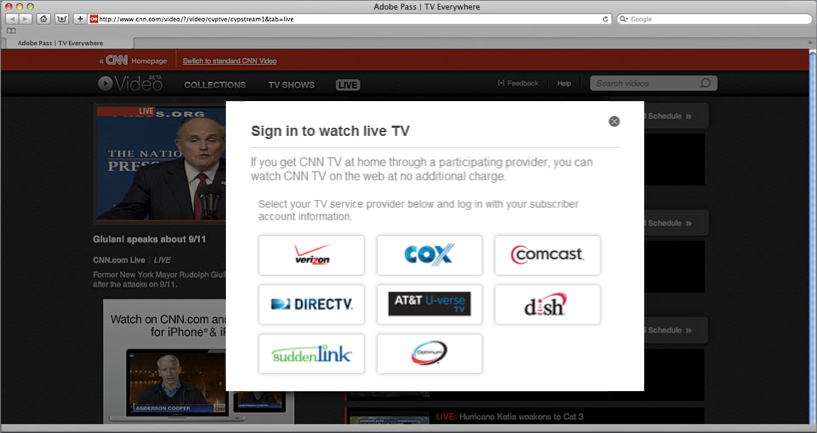

# Informazioni sull&#39;autenticazione Adobe Primetime e TV Everywhere {#about-auth-tve}

>[!NOTE]
>
>Il contenuto di questa pagina viene fornito solo a scopo informativo. L’utilizzo di questa API richiede una licenza corrente a partire da Adobe. Non è consentito alcun uso non autorizzato.

## Informazioni sulla TV Ovunque {#about-tve}

I telespettatori di oggi possono andare online in qualsiasi momento o luogo, e si aspettano che la loro capacità di accedere ai contenuti di Pay TV sia proprio lì con loro. Inoltre, il pubblico visualizza i contenuti utilizzando una gamma sempre più ampia di dispositivi compatibili con Internet, tra cui:

* Notebook
* Tablet
* Smartphone
* Siti Web
* App federate
* Console di gioco
* Set-top box
* Smart TV

TV Everywhere è il movimento di settore che supporta la capacità degli abbonati a Pay TV di accedere agli stessi contenuti che stanno già pagando, attraverso più dispositivi, sia all&#39;interno che all&#39;esterno delle loro case. Mentre la maggior parte dei programmi televisivi è ancora in corso sulla televisione tradizionale, lineare, la crescita del consumo è in contenuti a tempo variabile, video online e schermi alternativi. Di conseguenza, il mercato attuale della distribuzione video si trova in uno stato di disagio, e TV Everywhere è emersa come la soluzione che allinea gli interessi dei programmatori, dei fornitori di Pay TV e degli abbonati a Pay TV.

L&#39;obiettivo tecnico di TV Everywhere è quello di consentire ai clienti di Pay TV di accedere ai contenuti a cui si abbonano già su tutti i loro dispositivi e piattaforme.

Gli obiettivi commerciali di TV Everywhere sono:

* **Mantenere le relazioni esistenti con i clienti e attivarne di nuove**
* Consenti ai programmatori e ai proprietari di contenuti di raggiungere il pubblico più ampio e acquisire più valore dai contenuti premium
* Estendi i brand tramite l’interazione online diretta con i visualizzatori

## Sfide televisive ovunque {#tve-challenges}

Insieme alle opportunità della TV Ovunque ci sono sfide. Al centro di questi c&#39;è il diritto. Prima che un visualizzatore acceda al contenuto dell’abbonamento, è necessario determinare se ha diritto a tale accesso.

L&#39;utente ha un abbonamento con un provider di Pay TV? In caso affermativo, tale sottoscrizione include il contenuto richiesto? Il diritto è particolarmente difficile per i programmatori e i proprietari dei contenuti determinare direttamente, perché sono gli operatori di Pay TV a disporre dei dati identificativi per i loro clienti, così come i privilegi di accesso dei loro clienti.

Oltre all&#39;adesione, sono presenti una serie di sfide tecniche e di integrazione correlate, tra cui:

* Sviluppo e attuazione di una strategia globale multi-dispositivo
* Coordinare le miriadi di relazioni tra programmatori e fornitori di Pay TV
* Prevenire l&#39;accesso fraudolento o l&#39;abuso delle condizioni di servizio
* Fornire un’esperienza di autenticazione coerente e senza frustrazioni per gli utenti di siti web e app diversi
* Mantenere un tempo rapido per il mercato per tenere il passo con le offerte di affiliazione
* Gestione dei costi associati a più integrazioni

Queste sfide rendono le prestazioni e il mantenimento di integrazioni complesse e dirette tra i programmatori e i sistemi di autenticazione di più fornitori di Pay TV ad alta intensità di risorse, richiedendo tempo e sofisticazioni tecniche.

La soluzione? **Autenticazione Adobe® Primetime**.

## Introduzione all’autenticazione Adobe Primetime {#authentication-intro}

Con l&#39;autenticazione Adobe Primetime, i programmatori e i fornitori di Pay TV devono solo effettuare una semplice integrazione, utilizzando le API di autenticazione Adobe Primetime, per accedere all&#39;intero ecosistema, tra cui:

* Programmatori come Turner Broadcasting (TBS, TNT, CNN), Fox Broadcast Networks e Hulu

* Tutti i migliori fornitori di Pay TV negli Stati Uniti, che rappresentano oltre il 90% di tutte le famiglie americane di Pay TV

Inoltre, l’autenticazione Adobe Primetime fornisce il framework che rende l’autenticazione e l’autorizzazione degli utenti semplice e sicura.

*Figura 1: Solo alcuni programmatori e fornitori di Pay TV che si connettono attraverso l&#39;autenticazione Adobe Primetime...*

Adobe Pass consente di mediare in modo sicuro le transazioni di adesione tra programmatori e fornitori di Pay TV, facilitando l&#39;accesso dei visualizzatori al contenuto dell&#39;abbonamento. O, in altre parole...

**L’autenticazione Adobe Primetime consente ai clienti giusti di accedere ai contenuti giusti in modo semplice e rapido.**

**Per chi è l’autenticazione Adobe Primetime?**

* **Programmatori** che desiderano integrarsi facilmente con i fornitori di Pay TV (noti anche come &quot;MVPD&quot; o &quot;distributori di programmazione video multicanale&quot;), raggiungendo il pubblico più ampio, per ottenere profitti ottimali. Utilizzando l’autenticazione Adobe Primetime, i programmatori possono autenticare i visualizzatori in tutti i principali provider, indipendentemente dalla piattaforma client.

* **Provider TV a pagamento/MVPD** che cercano una connettività indolore con più programmatori e una maggiore soddisfazione dei clienti facilitando l&#39;accesso ai contenuti di abbonamento online.

* **Clienti della TV a pagamento** che desiderano un facile accesso ai contenuti a cui si abbonano già, ovunque si trovino, senza costi aggiuntivi. Il single sign-on fornisce un’autenticazione sicura del visualizzatore sul web o tra app mobili, senza richiedere download da parte del cliente o accessi ripetuti, nonché una buona esperienza utente.

Per **Programmatori**, l’autenticazione Adobe Primetime fornisce:

* Facile integrazione e connettività immediata con i principali fornitori di Pay TV, senza il dolore di integrazioni multiple e dirette
* Ottimizzazione sia dell’abbonamento (licenze) che dei ricavi pubblicitari grazie al supporto di un pubblico il più ampio possibile per i contenuti
* Autenticazione sicura, con accesso al contenuto premium concesso solo a utenti/dispositivi autorizzati
* Un quadro aperto e flessibile, indipendente dalla piattaforma DRM; la riproduzione può avvenire su un&#39;ampia gamma di piattaforme, tra cui iOS, Android, Windows 8, console giochi, set-top box e altro ancora.
* Compatibilità con qualsiasi tecnologia DRM, ad esempio Adobe Flash Access® o Play Ready®.
* Supporto per l’autenticazione e l’autorizzazione Single Sign-On (SSO), in modo che gli abbonati non debbano effettuare nuovamente l’accesso dopo la loro prima autenticazione sul proprio sistema.

Per **Provider TV a pagamento/MVPD**, l’autenticazione Adobe Primetime fornisce:

* Facile integrazione con i proprietari dei contenuti, offrendo connettività immediata con più programmatori utilizzando un&#39;unica integrazione
* Migliore coinvolgimento dei clienti grazie al supporto di un’esperienza fluida e con brand per la visualizzazione dei contenuti su più piattaforme e dispositivi
* Autenticazione sicura che assicura che solo gli utenti/dispositivi autorizzati abbiano accesso ai contenuti premium e (facoltativamente) limiti il numero di dispositivi e flussi simultanei che possono connettersi per account domestico.

Per **Clienti della TV a pagamento**, l’autenticazione Adobe Primetime fornisce:

* **TV Ovunque!**

Il resto del presente documento fornisce un’introduzione tecnica all’autenticazione Adobe Primetime.  Mentre gran parte dei seguenti si concentra sull&#39;integrazione dei programmatori, ci sono sia informazioni generali e specifiche che si applicano anche ai fornitori di Pay TV,. Questo documento evidenzia anche la sicurezza e l&#39;integrità del funzionamento dell&#39;autenticazione Adobe Primetime come soluzione per TV Everywhere. Per ulteriori dettagli oltre a questo documento, contatta il tuo rappresentante Adobe o compila il modulo di richiesta di informazioni [qui](https://www.adobe.com/).

## Blocchi di costruzione architettonici {#arch-building-blocks}

 Di seguito sono descritte le transazioni centrali di autorizzazione dell&#39;autenticazione e dell&#39;autorizzazione. L&#39;autenticazione è il processo di conferma con un provider di Pay TV che un dato utente è un cliente noto. L&#39;autorizzazione è il processo in cui un provider di Pay TV conferma che un utente autenticato dispone di un abbonamento valido a una determinata risorsa.
L’autenticazione Adobe Primetime consiste dei seguenti componenti di base:

* Componente client (uno dei seguenti):

   * Access Enabler: una libreria specifica per la piattaforma; fornisce API di facile utilizzo ed esempi di codice per l&#39;implementazione dei flussi di adesione
   * API senza client - servizi web RESTful; fornisce endpoint per il flusso di adesione per piattaforme senza funzionalità di rendering della pagina web (come console dei giochi, set-top box, ecc.)

* Server back-end ospitati da Adobe
* Verificatore del token multimediale
* Un mezzo di scambio sicuro e centrale (token)

A un livello di base, l’autenticazione Adobe Primetime è costituita da tre componenti (Access Enabler, server di back-end ospitati da Adobe e Media Token Verifier) e da un elemento centrale di scambio (token).

### Componenti client {#client-components}

* Access Enabler
* API senza client

#### Access Enabler {#access-enabler}

Sulle piattaforme completamente supportate (tra cui Web, iOS, Android, Windows 8), i programmatori interagiscono con l’autenticazione Adobe Primetime tramite il componente client di Access Enabler. Questo componente facilita tutte le interazioni di autenticazione e autorizzazione con il cliente.  Access Enabler viene eseguito localmente sul proprio sistema. Quando un utente accede a un sito o a un&#39;applicazione Programmer e richiede contenuto, il componente Access Enabler ospitato/gestito da Adobe viene caricato in background in modo silenzioso.

Access Enabler gestisce i flussi di lavoro di adesione effettivi, mentre il programmatore mantiene la responsabilità per la pagina web o l&#39;applicazione di riproduzione di livello superiore che implementa l&#39;interfaccia utente e interagisce con Access Enabler. Queste interazioni vengono tramite un sistema asincrono di funzioni e callback, definito dall’API di Access Enabler.

Si tratta dei flussi di adesione di base, facilmente implementati tramite l&#39;API di Access Enabler:

* Impostazione dell&#39;identità del richiedente (programmatore)
* Controllo/ottenimento dell&#39;autenticazione utente rispetto a un particolare operatore Pay TV (il &quot;provider di identità&quot;)
* Controllo/ottenimento dell’autorizzazione utente per una particolare risorsa
* Disconnessione dell’utente

Access Enabler fornisce anche i seguenti servizi:

* Convalida le query del programmatore, incluso lo stato di registrazione di client specifici, i loro domini e le loro risorse/canali.
* Fornisce i dati che creano l&#39;elenco degli operatori di Pay TV da cui l&#39;utente seleziona il proprio provider. L&#39;elenco viene convalidato e definito in base alle esigenze del programmatore da cui proviene la richiesta.
* Avvia flussi di lavoro di autenticazione e autorizzazione specifici dell&#39;operatore Pay TV.
* Memorizza in cache le risposte di autorizzazione corrette per risorsa/canale programmatore per ridurre al minimo il traffico di richieste non necessarie.
* Può essere configurato per flussi di lavoro predefiniti specifici per ogni operatore Pay TV, ad esempio per la registrazione esplicita del dispositivo.

A seconda del sito web o dell’applicazione di riproduzione, Access Enabler può assumere le seguenti forme:

* File SWF eseguibile dal runtime di Flash Player
* Un file JS eseguito direttamente dal browser
* Un enabler nativo per le piattaforme supportate (tra cui iOS, Android e Windows 8)

#### API senza client {#clientless-api}

L’approccio API Clientless è per &quot;dispositivi intelligenti&quot; (console giochi, set-top box e Smart TV) che non supportano i browser web (necessari per l’autenticazione con MVPD).  Nell’approccio senza client, le app per dispositivi avanzati comunicano direttamente con l’autenticazione Adobe Primetime tramite le API dei servizi web RESTful per tutto tranne l’autenticazione, che viene eseguita su un’app a seconda schermata (browser). In altre parole, la libreria lato client di Access Enabler non viene utilizzata. Al contrario, gli sviluppatori di app per dispositivi avanzati utilizzano direttamente le API dei servizi Web di autenticazione di Adobe Primetime per implementare i flussi di adesione.

### Server back-end ospitati da Adobe {#adobe-backend-servers}

Server back-end di autenticazione Adobe Primetime, ospitati da Adobe:

* Effettuare il provisioning dei flussi di lavoro di autenticazione e autorizzazione con i provider di Pay TV che richiedono una comunicazione server-to-server tra l’autenticazione Adobe Primetime e l’operatore.
* Mantenere la configurazione per i siti e le applicazioni Programmatore.
* Ospita i file dei componenti di Access Enabler scaricabili.
* Fornisci gli endpoint del servizio Web RESTful per l’integrazione dell’API Clientless.
* Generare (e in alcuni casi archiviare) token di autenticazione e autorizzazione.

### Token e il verificatore del token multimediale {#tokens-media-token-verifier}

La soluzione di adesione all&#39;autenticazione di Adobe Primetime si basa sulla generazione di parti di dati specifiche ottenute al completamento dei flussi di lavoro di autenticazione/autorizzazione. Questi dati sono chiamati token. Hanno una durata di vita limitata e sono memorizzati in modo sicuro, sia in posizioni dipendenti dalla piattaforma sul client, o sui server di Adobe nel caso della soluzione API Clientless. Alla scadenza, i token devono essere riemessi tramite il riavvio dei flussi di lavoro di autenticazione e/o autorizzazione.

Esistono tre tipi di token che l’autenticazione di Adobe Primetime causa problemi durante i flussi di lavoro di autenticazione/autorizzazione. Due sono &quot;longevi&quot;, che forniscono continuità nell&#39;esperienza visiva dell&#39;utente. Il terzo, un token di breve durata, fornisce supporto alle best practice del settore per attenuare le frodi (dove le frodi includono, ad esempio, gli sfruttamento come le truffe dei flussi). I valori time-to-live (&quot;TTL&quot;) sono stabiliti sulla base di accordi tra programmatori e fornitori di TV a pagamento, che concordano su un valore che meglio serva a tutti gli interessati.

#### Token di autenticazione (a lunga durata) {#long-lived-auth-token}

L&#39;autenticazione si verifica quando un cliente utilizza l&#39;autenticazione Adobe Primetime per accedere correttamente al proprio account Pay TV. L’autenticazione Adobe Primetime produce quindi un token di autenticazione a lungo termine (AuthN) associato al dispositivo richiedente e (a seconda del provider di Pay TV) un identificatore univoco globale (&quot;GUID&quot;) che identifica in modo anonimo l’utente.

* L’autenticazione Adobe Primetime memorizza il token AuthN in modo sicuro in un percorso in cui è disponibile per tutte le applicazioni che utilizzano l’autenticazione Adobe Primetime. Per le integrazioni di Access Enabler, i token vengono memorizzati in modo sicuro sul lato client.  L’autenticazione Adobe Primetime utilizza il token AuthN per eseguire query di autorizzazione successive per conto dell’utente.
* In un dato momento viene memorizzato un solo token AuthN. Ogni volta che viene emesso un nuovo token AuthN e ne esiste già uno precedente, il nuovo token sovrascrive il valore memorizzato esistente.

#### Token di autorizzazione (a lunga durata) {#long-lived-authriz-token}

Una volta ottenuta l’autorizzazione, l’autenticazione Adobe Primetime crea un token di autorizzazione a lungo termine (&quot;AuthZ&quot;). Questo token non è portatile, in quanto è legato al dispositivo richiedente e a una risorsa protetta specifica (ad esempio, un canale, una serie o un episodio).

* L’autenticazione Adobe Primetime memorizza il token AuthZ in modo sicuro, insieme ad altri token di autorizzazione per altre risorse.  Anche in questo caso, come per i token AuthN, sulle piattaforme che utilizzano Access Enabler il token viene memorizzato localmente sul client; sulle piattaforme che utilizzano l’API Clientless, i token vengono memorizzati sui server di autenticazione Adobe Primetime.
* Il time-to-live (TTL) del token AuthZ a lunga vita è generalmente definito nell&#39;intervallo di giorni a settimane, a seconda dell&#39;accordo specifico tra il provider di Pay TV e il programmatore.
* In qualsiasi momento viene memorizzato un solo token AuthZ per risorsa. Possono essere memorizzati più token di autorizzazione, purché associati a risorse diverse. Ogni volta che viene rilasciato un nuovo token di autorizzazione e ne esiste già uno vecchio per la stessa risorsa, il nuovo token sovrascrive il valore cache esistente.
* L’autenticazione Adobe Primetime utilizza il token AuthZ di lunga durata per creare i token multimediali di breve durata utilizzati per l’accesso effettivo alla visualizzazione.

#### Token multimediale a breve durata {#short-lived-media-token}

Una volta che l’autenticazione Adobe Primetime genera il token AuthZ, utilizza tale token per generare un token multimediale di breve durata a uso singolo, firmato per Adobe e crittografato per evitare manomissioni durante lo scambio:

* TTL del token di breve durata (impostazione predefinita: 5 minuti) è impostato per consentire problemi di sincronizzazione dell&#39;orologio tra il server che genera il token e il server che convalida il token.
* Il token di breve durata viene esposto al sito di incorporamento prima di fornire l’accesso alla risorsa protetta, pertanto il programmatore deve convalidare il token, utilizzando il Verificatore token di supporto per le integrazioni di Access Enabler o il Servizio Verifica token nel caso di integrazioni API senza client.

#### Verificatore token multimediale {#media-token-verifier}

I programmatori sono responsabili dell’integrazione della libreria del verificatore dei token multimediali nel server applicativo esistente, in modo che il verificatore possa eseguire le convalide dell’utente finale prima che un flusso video venga effettivamente avviato. La libreria Media Token Verifier definisce:

* API di verifica del token che recupera informazioni dal token, ad esempio se è valido, quando è stato rilasciato il token e altri dati pertinenti
* Chiave pubblica Adobe utilizzata per verificare che il token provenga effettivamente dall’Adobe
* Un’implementazione di riferimento che mostra come utilizzare l’API del verificatore e come utilizzare la chiave pubblica Adobe contenuta nella libreria per verificarne l’origine

*Figura 2: Architettura di alto livello dell’ecosistema di autenticazione Adobe Primetime in un’integrazione di Access Enabler*

## Integrazione con l’autenticazione Adobe Primetime {#integrate-auth}

Che tu sia un provider di Pay TV o un programmatore, il processo di integrazione con l&#39;autenticazione Adobe Primetime richiede una certa quantità della tua partecipazione attiva. Ciascuno di questi processi è descritto di seguito.

### Il processo dei fornitori di televisione a pagamento

La responsabilità principale del provider di Pay TV con l&#39;autenticazione Adobe Primetime è quella di verificare che un utente richiedente sia effettivamente un utente noto che ha il diritto di accedere al contenuto del programmatore. Ad un livello elevato, il processo di autenticazione di Adobe Primetime per l&#39;integrazione con un nuovo provider di Pay TV richiede i seguenti passaggi:

1. Il provider firma l’accordo di non divulgazione dell’autenticazione di Adobe Primetime (NDA).
1. Il fornitore fornisce Adobi di specifiche per il loro sistema di autenticazione e autorizzazione. Per l&#39;integrazione più semplice, si consiglia agli operatori Pay TV di avere un provider di identità (IdP) basato su SAML per l&#39;autenticazione e la capacità di comunicare tramite il protocollo di accesso SOAP per l&#39;autorizzazione.
1. Il provider stabilisce la connettività tra i propri server e i server di autenticazione Adobe Primetime. Ciò include la fornitura degli endpoint e l’elenco degli IP.
1. Rilascio pre-qualificazione e QE.
1. Versione di produzione e QE.

Mentre l&#39;autenticazione Adobe Primetime può sostituire le integrazioni esistenti per i programmatori, in genere questo non è necessario per i fornitori di Pay TV. Adobe collabora con il team tecnico del provider per configurare l’autenticazione Adobe Primetime in modo da soddisfare le esigenze di eventuali integrazioni esistenti. L&#39;integrazione è gratuita per i fornitori di Pay TV, supponendo un&#39;integrazione &quot;standard&quot; e requisiti minimi di supporto (documentazione e supporto e-mail di base). Se un fornitore richiede un supporto significativo o una tempistica avanzata, può essere addebitata una tariffa di supporto o il fornitore può voler lavorare con una terza parte che ha familiarità con la nostra soluzione, come Synacor.

L&#39;autenticazione Adobe Primetime supporta anche l&#39;efficiente gestione della logica di business del provider di Pay TV, come segue:

* Per la logica di business che è indipendente e può essere applicata dall’operatore quando viene ricevuta una richiesta di autorizzazione, Adobe fornisce i dati necessari per supportare l’applicazione della logica di business quando l’operatore riceve una richiesta di autorizzazione. Questi dati possono includere, ma non possono essere limitati a, l&#39;ID dispositivo univoco per l&#39;utente che effettua la richiesta e l&#39;indirizzo IP del dispositivo.
* Per la logica di business che richiede l&#39;intervento dell&#39;utente e/o la gestione specifica da parte della soluzione Adobe, Adobe può mantenere alcune proprietà personalizzate per ogni provider di Pay TV. Queste configurazioni/criteri specifici per l’operatore includono l’abilitazione di flussi di lavoro predefiniti che possono essere avviati in punti specifici del flusso di lavoro di primo livello. Per informazioni sul supporto delle proprietà personalizzate, contatta il tuo rappresentante di Adobe.

L&#39;Adobe offre anche servizi che limitano le frodi. Contatta il tuo rappresentante Adobe per i dettagli.

### Il processo del programmatore {#programmer-process}

Per integrare correttamente l’autenticazione Adobe Primetime, i programmatori devono configurare la propria applicazione lettore multimediale o pagina web per lavorare con l’autenticazione Adobe Primetime nella gestione dei processi di adesione di base: autenticazione, autorizzazione e logout.

Prima di iniziare un’integrazione con l’autenticazione Adobe Primetime, i programmatori devono disporre di:

* Piattaforma video online esistente, incluso un lettore multimediale, sia come parte di un sito web o come applicazione indipendente
* Un sistema di gestione dei contenuti
* Un meccanismo di distribuzione, che può includere o meno una rete di distribuzione di contenuti (CDN) di terze parti

I programmatori dovrebbero aspettarsi di eseguire alcune attività di integrazione nell&#39;ambito della fornitura di servizi TV Everywhere con autenticazione Adobe Primetime. Tali attività includono:

* Integrazione della libreria Access Enabler di Adobe Primetime Authentication nella pagina web o nel lettore multimediale o implementazione dell&#39;integrazione utilizzando l&#39;approccio Clientless per &quot;dispositivi intelligenti&quot; che non sono compatibili con il web
* Lavoro lato server per integrare il componente del verificatore del token di autenticazione di Adobe Primetime nel flusso di lavoro di streaming video
* Creazione di un&#39;interfaccia utente per il flusso di lavoro di accesso al sito web o all&#39;app (alcuni elementi di questo, come il processo di accesso effettivo, sono forniti dall&#39;operatore Pay TV e alcuni elementi sono facoltativamente disponibili come parte dell&#39;autenticazione Adobe Primetime)

Questo documento fornisce una panoramica del processo di programmazione e l&#39;Adobe fornisce ulteriori indicazioni sull&#39;avvio formale dell&#39;integrazione.

#### Impostazione del richiedente (programmatore) {#requester-prog-setup}

##### Registrazione con Adobe {#registering}

Come primo passo, i programmatori devono registrarsi con l&#39;Adobe o un partner autorizzato da Adobe e specificare i domini che desiderano utilizzare con l&#39;autenticazione Adobe Primetime. I programmatori ricevono quindi un ID richiedente univoco, che viene fornito all’autenticazione Adobe Primetime per ogni sessione in cui il programmatore interagisce con Access Enabler.

##### Configurazione Per L&#39;Integrazione Iniziale Di Access Enabler {#access-enabler-int-setup}

Prima di richiedere l’accesso ai contenuti, i programmatori devono integrare il componente client di autenticazione di Adobe Primetime, Access Enabler, nella loro app o pagina web esistente per il lettore multimediale. Sono disponibili diverse opzioni per eseguire questa operazione:

* È possibile incorporare la versione di Flash AccessEnabler.swf in un lettore video basato su Flash su una pagina web o direttamente in HTML. È possibile comunicare con SWF in ActionScript o JavaScript. L’API di base è ActionScript, ma è disponibile una libreria di wrapper JavaScript completa.
* Per i dispositivi non Flash, puoi:
   * Utilizzare la versione HTML5/JavaScript, AccessEnabler.js e comunicare con essa tramite l&#39;API JavaScript, oppure
   * Utilizzare una libreria di Access Enabler nativa, ad esempio per iOS, Android o Windows 8

##### Configurazione per l’integrazione iniziale dell’API senza client {#clientless-api-int-setup}

Prima di qualsiasi cliente che richieda l&#39;accesso al contenuto, i programmatori devono implementare le chiamate RESTful web services che utilizzano l&#39;API Clientless nella propria app media player, nonché impostare un&#39;applicazione &quot;a secondo schermo&quot; per gestire l&#39;accesso dell&#39;utente al proprio Pay TV Provider sul web.

#### Gestione dell’autenticazione e dell’autorizzazione {#auth-authr-handling}

Quando un cliente richiede per la prima volta una risorsa protetta da un programmatore, il programmatore presenta al cliente un elenco di fornitori di Pay TV da cui scegliere. Quando il provider è selezionato, l&#39;utente viene reindirizzato a tale operatore per l&#39;autenticazione iniziale dell&#39;utente. Una volta completata l&#39;autenticazione, Adobe Primetime Authentication comunica con il provider Pay TV selezionato per autorizzare l&#39;accesso alla risorsa specificata. Seguono i dettagli su questi processi.

*Figura 3: Esempio di interfaccia utente per la selezione del provider*

>[!NOTE]
>
>* L&#39;autenticazione si verifica come scambio SAML tra l&#39;autenticazione Adobe Primetime come fornitore di servizi (o &quot;SP&quot;) e un provider di Pay TV come fornitore di identità (o &quot;IdP&quot;).
>* L&#39;autorizzazione utilizza uno scambio di servizi web back-channel (server-to-server) tra l&#39;autenticazione Adobe Primetime (l&#39;SP) e un provider di Pay TV (l&#39;IdP).

##### Comunicazione dei programmatori tramite Access Enabler

Il canale di comunicazione bidirezionale tra Access Enabler e la pagina web o l&#39;app di riproduzione del programmatore segue un pattern completamente asincrono. Il programmatore invia messaggi a Access Enabler tramite i metodi esposti dall&#39;API di Access Enabler. Access Enabler risponde tramite callback registrati con la libreria di Access Enabler.

* Qualsiasi richiesta di autorizzazione richiede automaticamente prima l&#39;autenticazione, se non viene trovato un token di autenticazione nel sistema locale. Quando l’autenticazione ha esito positivo, il token del cliente viene memorizzato localmente, in modo che non sia necessario eseguire nuovamente l’accesso per un determinato periodo di tempo. Se sono stati autenticati correttamente tramite la soluzione di adesione all&#39;autenticazione Adobe Primetime in qualsiasi altro contesto (ad esempio, tramite il sito web del provider di Pay TV o un altro programmatore), Access Enabler ha accesso al token locale e non richiede l&#39;esecuzione di un&#39;autenticazione aggiuntiva.
* Quando un cliente richiede una risorsa specifica, il programmatore richiede l&#39;autorizzazione al provider di Pay TV tramite Access Enabler. Dopo aver verificato (o avviato) l&#39;autenticazione, Access Enabler contatta il provider Pay TV (tramite autenticazione Adobe Primetime) per determinare se il cliente ha il diritto di visualizzare la risorsa. Adobe Primetime Authentication gestisce la comunicazione con il provider di Pay TV per ottenere l&#39;autorizzazione. Il programmatore deve solo inviare la richiesta all&#39;Access Enabler e gestire la risposta (esito positivo o negativo dell&#39;autorizzazione). Se l’autorizzazione ha esito positivo, nel sistema client viene memorizzato un token di autorizzazione e il callback riceve un token multimediale di breve durata.

##### Comunicazione dei programmatori tramite l&#39;API Clientless {#progr-comm-clientless-api}

La comunicazione tra l’app del programmatore e l’autenticazione Adobe Primetime avviene tramite i servizi web RESTful.  Sono presenti protocolli di sicurezza per tutte le chiamate API agli endpoint di autenticazione di Adobe Primetime.  I requisiti di sicurezza sono descritti nella documentazione API Clientless .

##### Flusso di lavoro di esempio con autenticazione basata su SSO del browser web SAML {#sample-wf}

1. Visualizzatore Consente di accedere a un sito (fittizio1.com) e di accedere al contenuto autorizzato.
1. La pagina/lettore video carica Access Enabler da adobe.com e, quando richiesto dall’azione dell’utente, richiede l’autorizzazione per il contenuto richiesto.
1. Access Enabler esegue e convalida il richiedente e la richiesta.
1. Access Enabler verifica la presenza di un token di autorizzazione valido nell&#39;archivio locale. Se viene trovata un&#39;autorizzazione valida, Access Enabler produce un token per contenuti multimediali di breve durata (vedere il punto 14).
1. Se non viene trovata alcuna autorizzazione valida per la risorsa richiesta ma esiste un token di autenticazione valido, Access Enabler avvia una richiesta di autorizzazione con il provider Pay TV su cui l&#39;utente è autenticato. Il server di Adobe fornisce lo scambio di richiesta/risposta di autorizzazione con il provider di Pay TV.
1. Se non viene trovato alcun token di autenticazione valido, Access Enabler richiede all&#39;utente di specificare il proprio provider Pay TV. Se si seleziona un provider che supporta l&#39;autenticazione basata su SSO del browser Web SAML, viene attivato un flusso di lavoro di autenticazione basato su SAML. Per i provider non SAML, Adobe gestisce un flusso di lavoro personalizzato simile.)
1. Access Enabler sposta il browser al servizio SAML SP (Service Provider) di Adobe, trasmettendolo tutti i parametri appropriati.
1. L&#39;SP SAML richiama l&#39;ID SAML (Identity Provider) appropriato al provider Pay TV dell&#39;utente, utilizzando il profilo del browser Web SAML come indicato nei metadati IdP. In questo modo l&#39;utente passa efficacemente al sito dell&#39;IdP (provider di Pay TV), in cui l&#39;utente esegue l&#39;autenticazione.
1. Dopo l&#39;autenticazione, l&#39;utente viene reindirizzato all&#39;SP SAML di Adobe, trasmettendolo un GUID di autenticazione nella risposta SAML.
1. L&#39;SP SAML di Adobe crea una sessione sul lato server in cui viene memorizzato il GUID di autenticazione e reindirizza l&#39;utente alla pagina Programmatore originale. La sessione server viene eliminata al recupero del token authN da parte di Access Enabler.
1. Access Enabler recupera il GUID di autenticazione dal server di Adobe per includerlo nel token con un ID dispositivo gestito dall&#39;autenticazione Adobe Primetime. Quando DRM di Flash è sul dispositivo, questo viene fatto tramite API di Flash Access (componente DRM del Flash Player) che abilitano il binding del GUID all&#39;ID dispositivo e restituiscono un token di autenticazione. In caso contrario, ciò avviene tramite API JS su HTTPS tramite l’archiviazione basata su HTML5 o tramite componenti nativi specifici.
1. Il token di autenticazione viene utilizzato da Access Enabler per effettuare richieste di autorizzazione al provider di Pay TV. Sui dispositivi abilitati per il Flash Access, le richieste vengono sempre effettuate tramite API di Flash Access in modo che il token di autorizzazione risultante sia associato al dispositivo. Su dispositivi non di Flash Access, HTTPS viene utilizzato per comunicazioni sicure da client a server.
1. Una volta ottenuta l’autorizzazione, l’autenticazione Adobe Primetime crea un token di autorizzazione a lungo termine (&quot;authZ&quot;) e lo trasmette all’Access Enabler, che lo memorizza sul sistema locale.
1. Access Enabler utilizza il token authZ per creare token multimediali di breve durata utilizzati per l&#39;accesso effettivo alla visualizzazione. Per motivi di sicurezza, questi token di breve durata devono essere convalidati da un altro componente di autenticazione Adobe Primetime, il Media Token Verifier.

*Figura 4: Flusso di lavoro di Authentication and authorization Access Enabler*

##### Fornire un’interfaccia utente di accesso {#entitlement-ui}

I programmatori devono creare una propria interfaccia utente per il flusso di lavoro di accesso al sito web o all’app. Alcuni elementi, come il processo di accesso effettivo, sono forniti dal provider di Pay TV e alcuni elementi sono facoltativamente disponibili come parte dell&#39;autenticazione Adobe Primetime. Come minimo, il programmatore effettua le seguenti operazioni:

* **Implementa un&#39;interfaccia di selezione provider** che consente a un nuovo utente di identificare il proprio provider di Pay TV e di effettuare l&#39;accesso per la prima volta. Per lo sviluppo, Access Enabler fornisce un&#39;interfaccia utente di base che offre al cliente una scelta di fornitori di Pay TV e avvia il processo di accesso. Per un ambiente di produzione, i programmatori devono implementare la finestra di dialogo del proprio selettore di provider. Alcuni provider di Pay TV eseguono il reindirizzamento al proprio sito per l&#39;accesso e altri richiedono che le pagine di accesso siano visualizzate all&#39;interno di un iframe. I programmatori devono implementare il callback che crea questo iframe, nel caso in cui il cliente scelga uno di questi provider.
* **Identifica le risorse protette.** Le risorse protette sono quelle che richiedono l’autorizzazione per accedere. Nell&#39;offrire queste risorse, l&#39;interfaccia programmatore dovrebbe indicare la necessità di un&#39;autorizzazione prima della visualizzazione. Con il successo dell’autorizzazione, l’interfaccia dovrebbe mostrare che la risorsa è ora autorizzata.
* **Crea e mantiene un elenco dei fornitori di Pay TV** per controllare l&#39;accesso degli utenti solo ai provider specificati.
* **Mostra che un utente è autenticato.** Il programmatore deve indicare lo stato di autenticazione del cliente come parte di qualsiasi mezzo utilizzato per identificare le risorse protette. I programmatori possono eseguire una query su Access Enabler per determinare se un cliente è già stato autenticato.

#### Disconnessione singola supportata {#single-logout-support}

Nella maggior parte dei casi, il programmatore è responsabile della gestione degli accessi utente tramite una semplice chiamata API. La chiamata logout() indirizza l’autenticazione Primetime per disconnettersi dall’utente corrente tramite:

* Eliminazione di tutti i token AuthN e AuthZ
* Cancellazione di tutte le informazioni di autenticazione e autorizzazione per l&#39;utente
* Avvio di un flusso di lavoro specifico per il provider di Pay TV per la cancellazione della sessione di autenticazione dell&#39;utente con il provider (ad esempio, se l&#39;autenticazione è stata eseguita utilizzando il protocollo SAML Authentication Request, è possibile eseguire l&#39;accesso utilizzando il protocollo SAML Single Logout.)

Se l’utente lascia il computer inattivo per abbastanza tempo da far scadere il token, può comunque tornare alla sessione e avviare correttamente l’logout. L&#39;autenticazione Adobe Primetime assicura che tutti i token vengano eliminati e notifica al provider di Pay TV di cancellare anche la loro sessione.

Quando l&#39;uscita viene avviata da un sito non integrato con l&#39;autenticazione Adobe Primetime, il provider di Pay TV può richiamare il servizio Single Logout di autenticazione Adobe Primetime tramite un reindirizzamento del browser.

## Oltre i flussi di diritto di base - Funzionalità aggiuntive {#beyond-basics}

I flussi di adesione di base sono Start-up, Authentication, Authorization e Logout.  Con la maturazione e lo sviluppo dell’autenticazione Adobe Primetime, sono state aggiunte e vengono aggiunte ai flussi di base una serie di funzioni aggiuntive.  Tra questi figurano:

* **Metadati utente** - A seconda degli accordi tra MVPD e programmatori, gli MVPD possono scambiare in modo sicuro metadata come Zipcode, classificazione massima, ID canale e altro ancora. I metadati consentono diversi casi d&#39;uso, tra cui i controlli dei genitori, i periodi di congelamento regionale per eventi sportivi, ecc.
* **Accesso gratuito temporaneo** - Consente ai programmatori di offrire accesso temporaneo e gratuito ai contenuti protetti (ad esempio, brevi campioni di programmazione giornaliera o presentazione gratuita di un grande evento).
* **MVPD proxy** - Un MVPD può gestire la propria integrazione con l&#39;autenticazione Adobe Primetime, e anche gestire il processo di adesione per conto di un gruppo di &quot;ProxiedMVPDs&quot; associati.

## Sicurezza {#security}

Questa sezione evidenzia la sicurezza e l’integrità dell’infrastruttura di autenticazione di Adobe Primetime.

### Sicurezza dei token {#token-security}

Uno degli obiettivi principali dell’autenticazione Adobe Primetime è garantire che il sistema possa resistere agli attacchi ai dati di adesione del contenuto da parte di un utente malintenzionato o di un aggregatore di contenuti. Pertanto, l’accesso ai dati è protetto a diversi livelli nel flusso di lavoro, con la massima importanza per la generazione e l’utilizzo dei dati del token di autorizzazione. L’architettura di autenticazione di Adobe Primetime è progettata per garantire la manutenzione sicura dei contenuti dei token e per garantire che il token rimanga sul dispositivo al quale è stato rilasciato.

* **Sicurezza token AuthN e AuthZ di lunga durata** - Tutti i token longevi sono firmati digitalmente dal server di autenticazione Adobe Primetime. La firma digitale, tuttavia, differisce da piattaforma a piattaforma, in quanto utilizza un ID dispositivo diverso nelle modalità di generazione, protezione e convalida. In tutti i casi, una convalida lato client assicura che la firma digitale sia intatta e che l’integrità del token sia preservata. Access Enabler memorizza in modo sicuro i token convalidati in posizioni specifiche dell&#39;ambiente in cui è in esecuzione. Se la convalida dell’ID dispositivo non riesce, la sessione di autenticazione viene invalidata, i token vengono reimpostati e all’utente viene richiesto di effettuare di nuovo l’accesso.
* **Sicurezza dei token multimediali di breve durata** - I token multimediali di breve durata, prodotti nella fase finale prima dell&#39;accesso ai contenuti, sono firmati per Adobe e crittografati per evitare manomissioni durante lo scambio. I token per contenuti multimediali di breve durata richiedono anche un ulteriore passaggio di convalida da parte di un componente di autenticazione Adobe Primetime aggiuntivo, il Verificatore dei token multimediali. Il TTL del token di breve durata è impostato su un valore predefinito di 5 minuti e può essere ridotto, se necessario. Il token multimediale di breve durata non viene mai memorizzato nella cache; un nuovo token viene recuperato dal server ogni volta che viene chiamata un’API di autorizzazione.

### Sicurezza dei dispositivi specifica per la piattaforma {#platform-sp-security}

Le misure di sicurezza utilizzate dall’autenticazione Adobe Primetime variano a seconda della piattaforma, ma sono tutte robuste e all’avanguardia.

* **Dispositivi abilitati per il Flash** - Quando Flash Player 10.1+ o AIR 2.5+ è sul dispositivo, l’autenticazione Adobe Primetime utilizza la funzionalità Flash Player DRM per la protezione, nota anche come Flash Access. il Flash fornisce un livello di protezione supplementare; la forte garanzia del binding dei dispositivi per i token basati su Flash indica che nella maggior parte dei casi, il time-to-live può essere più lungo, l’utente non deve effettuare l’accesso con la stessa frequenza e l’esperienza utente è generalmente più fluida.
* **Esperienze nel browser su dispositivi compatibili con HTML5**- Sui dispositivi non Flash che includono funzionalità del browser HTML5, l’autenticazione Adobe Primetime dispone di un mezzo alternativo di protezione limitata per le integrazioni basate su browser. Tuttavia, poiché il binding del dispositivo per HTML5 non è così forte, il time-to-live (TTL) per i token sulle piattaforme HTML5 è in genere più breve.
* **Supporto nativo delle app per dispositivi interni ed esterni** - Adobe offre SDK nativi per sistema operativo (iOS, Android, Windows 8, ecc.) che offrono una maggiore sicurezza rispetto alla soluzione HTML5. Questi SDK utilizzano API native per recuperare un ID dispositivo e passarlo in modo sicuro al server di autenticazione Adobe Primetime.
* **Clientless** - L’autenticazione Adobe Primetime utilizza il protocollo HTTPS per la comunicazione sicura. Inoltre, tutte le chiamate da uno smart device devono essere firmate digitalmente.

## Domande frequenti {#faqs}

**Cos&#39;è la TV Ovunque?**
Il movimento di settore noto come TV Everywhere consente ai clienti di pay TV di accedere ai contenuti premium a cui già abbonano su una varietà di dispositivi collegati a Internet, tra cui personal computer, tablet, smartphone, console giochi, set-top box e TV &quot;Smart&quot;. La sfida di questa iniziativa è rendere il processo di autenticazione il più semplice e indolore possibile, consentendo ai clienti di accedere senza ostacoli e accessi multipli e senza barriere proibitive.

**Cos&#39;è l&#39;autenticazione Adobe Primetime e come si relaziona con TV Everywhere?**
L&#39;autenticazione Adobe Primetime porta TV Everywhere dal concetto alla realtà verificando senza problemi l&#39;adesione di un utente ai contenuti in modo semplice e sicuro. Adobe Primetime Authentication è un servizio in hosting che consente un&#39;integrazione rapida back-end basata sulle regole aziendali richieste sia dai programmatori che dai fornitori di Pay TV. Questo significa un rapido time-to-market per tutte le parti, un ambiente più sicuro per prevenire le frodi e una customer experience superiore, con più contenuti TV disponibili per più persone su più piattaforme.

**Come viene offerta/consegnata l’autenticazione Adobe Primetime?**
L’autenticazione Adobe Primetime è offerta tramite il modello Software as a Service (SaaS). Questo consente una comunicazione più sicura tra utenti finali, programmatori e fornitori di Pay TV per convalidare l&#39;adesione al contenuto. I componenti core del servizio includono Access Enabler lato client (o l&#39;API Clientless per alcuni dispositivi) e il server di autenticazione Adobe Primetime in hosting. Access Enabler è un piccolo file caricato nella pagina web o nell&#39;applicazione di riproduzione di un programmatore. Comunica con i server di autenticazione Adobe Primetime, che a loro volta hanno connessioni integrate nei sistemi di autenticazione di vari fornitori di Pay TV. L’autenticazione Adobe Primetime offre anche un approccio all’integrazione senza client API per alcuni &quot;dispositivi intelligenti&quot; che non sono compatibili con il web (Smart TV, Set-top Boxes, Game Console, ecc.). L’approccio Clientless fornisce servizi web RESTful con cui gli sviluppatori possono implementare i flussi di adesione di autenticazione Adobe Primetime su questi dispositivi.

**In che modo l’autenticazione Adobe Primetime è diversa dalle altre soluzioni TV Everywhere?**
L&#39;autenticazione Adobe Primetime offre vantaggi diversi rispetto alle soluzioni alternative TV Everywhere. Le integrazioni dirette con i singoli provider non forniscono la flessibilità di un singolo accesso permanente (SSO) quando gli utenti viaggiano da un sito all’altro attraverso Internet. L&#39;autenticazione Adobe Primetime ha anche una notevole penetrazione di mercato; una volta che un programmatore si integra con l&#39;autenticazione Adobe Primetime, sono immediatamente connessi con gli operatori di Pay TV che servono oltre il 90% delle famiglie negli Stati Uniti. Inoltre, l’autenticazione Adobe Primetime sfrutta funzionalità di sicurezza univoche integrate nel runtime di Flash (dove disponibile) per attenuare le frodi, fornendo allo stesso tempo gli SDK in modo che i programmatori possano avere la stessa funzionalità TV Everywhere integrata nelle app native per dispositivi mobili o home in cui il Flash non è disponibile. Infine, mentre Adobe Primetime Authentication è disponibile come servizio indipendente, offriamo anche la possibilità di avere una stretta integrazione con altri prodotti e servizi di Adobe (inclusi Primetime e Adobe Analytics) relativi alla distribuzione, protezione e monetizzazione dei contenuti TV Everywhere.

**Quanto è sicura l’autenticazione Adobe Primetime?**
La priorità numero uno dell’architettura di autenticazione di Adobe Primetime è garantire che solo i visualizzatori autorizzati siano autenticati e abbiano accesso ai contenuti premium. L’autenticazione Adobe Primetime lega strettamente l’accesso al dispositivo di visualizzazione e può contribuire a limitare flussi, sessioni e/o dispositivi per una determinata famiglia.

**È richiesto il Flash Player?**
Per garantire la protezione di binding dei dispositivi più restrittiva, è necessario Adobe Flash Player 11.x o versione successiva. Tuttavia, l&#39;autenticazione Adobe Primetime per TV Everywhere è indipendente dal lettore e dalla piattaforma, che si integra con qualsiasi applicazione di riproduzione, inclusi Silverlight e HTML5. Inoltre, l&#39;autenticazione Adobe Primetime fornisce supporto nativo per dispositivi come iOS, Android e Xbox in cui il Flash Player non è disponibile.  Infine, l’autenticazione Adobe Primetime fornisce un approccio senza client per i dispositivi che non sono in grado di eseguire il rendering di una pagina web (console giochi, Smart TV, Set-top box).

**Quali dispositivi supporta l’autenticazione Adobe Primetime?**
L’autenticazione Adobe Primetime è supportata praticamente da qualsiasi dispositivo con il kit web HTML5 per le esperienze di visualizzazione nel browser. Inoltre, l’autenticazione Adobe Primetime continua a distribuire kit di sviluppo software nativi (SDK) per diverse piattaforme specifiche per dispositivi, tra cui iOS, Android™ e Windows 8. L’autenticazione Adobe Primetime supporta parzialmente alcuni dispositivi non adatti al web (Smart TV, Set-top box, console giochi, ecc.) tramite le API dei servizi web RESTful.

**L&#39;autenticazione Adobe Primetime supporta gli standard emergenti per TV Everywhere?**
L’autenticazione Adobe Primetime è conforme alla **CableLabs OLCA (Accesso ai contenuti online)** [specifica](https://www.cablelabs.com/specifications), che fornisce requisiti tecnici e architettura per la distribuzione di video a un cliente Pay TV da fonti online. L&#39;Adobe ha partecipato al progetto congiunto di test interopt CableLabs nel giugno 2011 e ha superato il processo di test per un&#39;implementazione Service Provider. L’autenticazione Adobe Primetime viene verificata (completa e verificata) in base alle specifiche OLCA per l’autenticazione. Il componente di autorizzazione è completato, ma la verifica delle prove attende il rilascio dell&#39;ambiente di test CableLabs (ETA nov 2011).

Adobe è anche un membro attivo del **OATC (Consorzio tecnico di autenticazione aperta)** e partecipa a diversi progetti di elaborazione delle specifiche dei sottocomitati nell&#39;ambito di tale organismo.

**In che modo l’autenticazione Adobe Primetime gestisce la gestione federata delle identità/single sign-on (SSO)?**
L’autenticazione Adobe Primetime ti consente di fornire ai clienti l’autenticazione e l’autorizzazione single sign-on (SSO), utilizzando la comunicazione back-channel (server-to-server) tra l’autenticazione Adobe Primetime e gli operatori Pay TV partecipanti. Quindi, con l&#39;autenticazione Adobe Primetime, non è necessario che gli abbonati effettuino di nuovo l&#39;accesso dopo la loro prima autenticazione, purché tale autenticazione sia consentita dall&#39;operatore Pay TV a persistere. In genere questo limite è impostato a 30 giorni. A tal fine, Adobe Primetime Authentication fornisce un dominio comune per i token di autenticazione per i nostri clienti. Queste informazioni sullo stato di autenticazione sono disponibili per tutti i siti partecipanti che sono integrati con un determinato operatore Pay TV.

Attualmente, la maggior parte delle integrazioni di autenticazione Adobe Primetime con gli operatori Pay TV utilizza il protocollo SAML, uno degli standard di autenticazione principali. L’autenticazione Adobe Primetime agisce come proxy Service Provider nell’architettura SAML e persiste la risposta di autenticazione SAML come token sicuro nel dominio comune di Adobe. L’autenticazione Adobe Primetime è conforme a SAML 2.0.

Mentre l&#39;autenticazione Adobe Primetime è tipicamente utilizzata con le soluzioni SSO SAML a questo punto, l&#39;architettura di autenticazione Adobe Primetime associa qualsiasi specifica di protocollo dall&#39;integrazione del programmatore. Pertanto, è possibile aggiungere nel tempo il supporto per i nuovi protocolli, ad esempio quelli basati su OAuth 2.0 o su protocolli personalizzati.

**Quanto costa l&#39;autenticazione Adobe Primetime per TV Everywhere per gli utenti finali?**
Non vi sono costi aggiuntivi per gli utenti finali per l’utilizzo dell’autenticazione Adobe Primetime.

>[!NOTE]
>
>**Passaggi successivi:** Per ulteriori informazioni, contatta il tuo rappresentante di Adobe o compila il modulo di richiesta di informazioni [qui](https://www.adobe.com/cfusion/mmform/index.cfm?name=adobepass_rfi).
