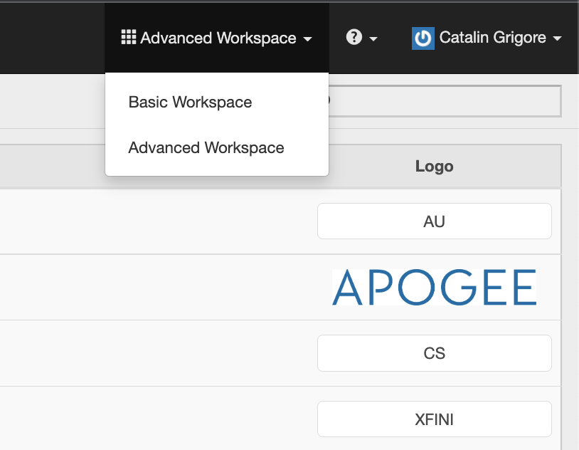

# Guida utente di Primetime TVE Dashboard {#tve-db-user-guide}

>[!NOTE]
>
>Il contenuto di questa pagina viene fornito solo a scopo informativo. L’utilizzo di questa API richiede una licenza corrente a partire da Adobe. Non è consentito alcun uso non autorizzato.

## Introduzione {#tve-db-intro}

[[!DNL Adobe] Dashboard TVE (dashboard TVE)](https://console.auth.adobe.com/) è un dashboard self-service rivolto agli utenti che lavorano per aziende multimediali (programmatori) che hanno una relazione commerciale con il team di prodotto di Adobe Primetime Authentication.

Contatta il tuo Technical Account Manager (TAM) per ottenere l&#39;accesso. Per ottenere l’accesso, è necessario configurare due nuovi gruppi di utenti nell’organizzazione Adobe Marketing Cloud:

* Lettura e scrittura dashboard TVE: i membri di questo gruppo dispongono di diritti completi in tutte le sezioni modificabili del dashboard
* Dashboard TVE di sola lettura: i membri di questo gruppo dispongono solo dei diritti di visualizzazione sull&#39;intero dashboard

Prima di immergerti in questa guida utente, ti consigliamo di consultare le seguenti risorse per avere una buona comprensione dei flussi e delle funzioni forniti dal team del prodotto Adobe Primetime Authentication e per acquisire familiarità con i termini utilizzati nel presente documento:

* [Carta tecnica TVE](/help/authentication/technical-paper.md)
* [Guida di Kickstart per programmatori](/help/authentication/programmer-kickstart-guide.md)
* [Flusso di adesione](/help/authentication/entitlement-flow.md)
* [Glossario](/help/authentication/glossary.md)

Continuando alle sezioni successive di questa guida utente, scoprirai come amministrare diverse impostazioni per i canali, i programmatori o le integrazioni tra canali e MVPD (distributori di programmi video multicanale) della tua azienda.

>[!IMPORTANT]
>Dashboard TVE offre l&#39;opzione di passare da un&#39;area di lavoro di base a un&#39;area di lavoro avanzata. Per farlo, seleziona l’icona nell’angolo in alto a destra. L’area di lavoro avanzata è destinata agli utenti con conoscenze tecniche sostanziali e conoscenze avanzate sulle funzioni offerte dal team di prodotto di Adobe Primetime Authentication.

*Figura 1: Menu a discesa Adobe Primetime TVE Dashboard &quot;Basic / Advanced Workspace&quot;*

## Ambienti {#authn-environments}

A seconda delle attività che un utente potrebbe essere tenuto a eseguire, potrebbe dover passare da un ambiente di autenticazione Adobe Primetime all’altro. Per informazioni dettagliate sugli ambienti di autenticazione Adobe Primetime, consulta il seguente documento: [Informazioni sugli ambienti di autenticazione di Adobe Primetime](/help/authentication/understanding-the-adobe-environments.md).

Dashboard TVE fornisce due ambienti denominati Prequal (Prequalificazione) e Release, ciascuno con due profili denominati Staging e Produzione, come illustrato di seguito:

* [Staging preliminare](https://console-prequal.auth-staging.adobe.com/)
* [Produzione preferenziale](https://console-prequal.auth.adobe.com/)
* [Fase di rilascio](https://console.auth-staging.adobe.com/)
* [Release Production](https://console.auth.adobe.com/)

Per passare da un ambiente all’altro, l’utente può fare clic sull’ambiente desiderato rappresentato dalla voce dall’elemento a discesa illustrato di seguito:

*Figura 2: Menu a discesa degli ambienti dashboard TVE di Adobe Primetime*

>[!IMPORTANT]
>È molto importante notare che quando apporti modifiche amministrative alla tua configurazione di autenticazione Adobe Primetime tramite la dashboard TVE, ti consigliamo vivamente di seguire la sequenza riportata di seguito per garantire la funzionalità corretta.

Per apportare modifiche amministrative alla configurazione di autenticazione Adobe Primetime tramite la dashboard TVE:

* Esegui le modifiche in [Release Staging e convalidarli](http://sp.auth-staging.adobe.com/apitest/api.html).
* Esegui le modifiche in [Prequalificazione della produzione e relativa convalida](http://sp.auth-staging.adobe.com/apitest/api.html).
* Esegui le modifiche in [Rilascia produzione e convalidali](http://sp.auth-staging.adobe.com/apitest/api.html).

>[!IMPORTANT]
>Affinché le modifiche amministrative diventino attive, gli utenti devono accedere alla sezione &quot;Rivedi e invia modifiche&quot; selezionando il pulsante , che verrà visualizzato nella parte in basso a sinistra della barra laterale, per esaminare le modifiche, aggiungere una descrizione delle modifiche appena create e confermare l’aggiornamento della configurazione selezionando &quot;Configurazione push&quot;.

*Figura 3: Notifica di revisione del dashboard TVE di Adobe Primetime e modifiche push*

## Sezioni {#sections}

Gli utenti che lavorano per aziende di media (programmatori) possono accedere alle seguenti sezioni della dashboard TVE dalla barra laterale:

* **Canali** - Contiene le impostazioni relative ai provider di contenuti
* **Programmatori** - Contiene le impostazioni relative all&#39;organizzazione padre che aggrega uno o più **Canali**
* **Integrazioni** - Contiene le impostazioni relative all&#39;integrazione tra **Canali** e **MVPD**
* **MVPD** - Contiene le impostazioni relative alla **MVPD**
* **Rapporti** - Contiene dati aggregati per tre tipi di rapporti: AuthN TTL, AuthZ TTL, SSO
* **Registro delle modifiche** - Contiene le ultime modifiche applicate alla configurazione del dashboard TVE

*Figura 4: Le sezioni del dashboard TVE di Adobe Primetime*

### Canali {#tve-db-channels-section}

Questa sezione consente di visualizzare e modificare le impostazioni per i canali disponibili o di crearne uno nuovo. Facendo clic su uno dei canali disponibili verrà visualizzata una schermata con le seguenti schede:

* **Dati canale**
   * **ID canale** - L&#39;ID univoco del canale utilizzato nel nostro sistema, noto anche come &quot;requestor Id&quot;.
   * **Nome visualizzato** - Il nome commerciale del canale.
* **Impostazioni generali**
   * **Configurazione di Analytics** - Configurare gli eventi di autenticazione Adobe Primetime da inoltrare ad Adobe Analytics. Per ulteriori informazioni sulla configurazione dell’ID suite di rapporti (RSID) prima di abilitare questa funzione, contatta l’Adobe .
* **Certificati**

   Contiene l’elenco dei certificati utilizzati nel flusso di autenticazione a fianco dell’organizzazione emittente, della data di rilascio e della data di scadenza. Questi certificati servono come chiavi private/pubbliche e vengono utilizzati a scopo di convalida.
* **Domini**

   Contiene l’elenco dei domini da cui il rispettivo canale comunica con l’autenticazione Adobe Primetime.
* **Integrazioni**

   Contiene l’elenco delle integrazioni con gli MVPD disponibili, insieme allo stato di ogni integrazione che potrebbe essere abilitata o meno. Per passare alla pagina Integrazione , fai clic su una voce specifica.
* **Applicazioni registrate**

   Contiene l&#39;elenco delle registrazioni delle applicazioni. Per ulteriori dettagli, consulta il documento [Gestione dinamica della registrazione client](/help/authentication/dynamic-client-registration-management.md).

* **Schemi personalizzati**

   Contiene l’elenco degli schemi personalizzati. Per ulteriori dettagli, consulta [Registrazione dell&#39;applicazione iOS/tvOS](/help/authentication/iostvos-application-registration.md) e [Gestione dinamica della registrazione client](/help/authentication/dynamic-client-registration-management.md)

#### Aggiungi/Elimina domini {#add-delete-domains}

Per avviare il processo di aggiunta di un nuovo dominio per il canale selezionato, è necessario fare clic sul pulsante &quot;Aggiungi nuovo dominio&quot; sotto l&#39;elenco Domini. Verrà creata una nuova voce di dominio in cui è possibile specificare il nome di dominio. Se nell’elenco dei domini esiste già un dominio più generico, non è consigliabile aggiungere un nuovo sottodominio.

*Figura: Scheda Domini nei canali*

### Programmatori {#tve-db-programmers-section}

Questa sezione consente di visualizzare e modificare le impostazioni per i programmatori disponibili o crearne uno nuovo. Facendo clic su uno dei programmatori disponibili verrà visualizzata una schermata con le seguenti schede:

* **Dati programmatori**
   * **ID programmatore** - L&#39;ID univoco del programmatore utilizzato nel nostro sistema.
   * **Nome visualizzato** - Nome commerciale del programmatore.
   * **URL logo** - L&#39;URL (Uniform Resource Locator) del logo del programmatore.
   * **Anteprima del logo** - Anteprima del logo commerciale del programmatore scaricandolo dall&#39;URL (Uniform Resource Locator) sopra riportato.

* **Certificati**

   Contiene l’elenco dei certificati utilizzati nel flusso di autenticazione a fianco dell’organizzazione emittente, della data di rilascio e della data di scadenza. Questi certificati servono come chiavi private/pubbliche e vengono utilizzati a scopo di convalida.

* **Canali**

   Contiene l&#39;elenco dei canali appartenenti a questo programmatore specifico. Per passare alla sezione Canali , fai clic su una voce specifica.

* **Applicazioni registrate**

   Contiene l&#39;elenco delle registrazioni delle applicazioni. Per ulteriori dettagli, consulta [Gestione dinamica della registrazione client](/help/authentication/dynamic-client-registration-management.md).

* **Schemi personalizzati**

   Contiene l’elenco degli schemi personalizzati. Per ulteriori dettagli, consulta [Registrazione dell&#39;applicazione iOS/tvOS](/help/authentication/iostvos-application-registration.md) e [Gestione dinamica della registrazione client](/help/authentication/dynamic-client-registration-management.md).

### Integrazioni {#tve-db-integrations-sec}

Questa sezione consente di visualizzare e modificare le impostazioni per le integrazioni tra i canali e gli MVPD disponibili o di crearne uno nuovo. Facendo clic su una delle integrazioni disponibili si restituisce una singola pagina quando si utilizza l’Area di lavoro di base o una schermata con le seguenti schede quando si utilizza l’Area di lavoro avanzata:

* **Dati di integrazione**
   * **ID integrazione**- Il risultato dell&#39;aggiunta dell&#39;ID univoco degli MVPD all&#39;ID univoco del canale separato dal carattere &quot;_&quot;.
   * **Nome visualizzato canale** - Il nome commerciale del canale.
   * **ID canale** - L&#39;ID univoco del canale utilizzato nel nostro sistema, noto anche come &quot;requestor Id&quot;.
   * **Nome visualizzato MVPD** - Il nome commerciale dell&#39;MVPD.
   * **ID MVPD** - L&#39;id univoco dell&#39;MVPD utilizzato nel nostro sistema.
* **Impostazioni generali**
   * **Chiavi metadati utente** - Configura le chiavi di metadati disponibili per l’integrazione specifica.
   * **Impostazioni specifiche della piattaforma** - Configura impostazioni diverse per una piattaforma specifica (ad esempio, TTL, SSO e IFrames).

* **Impostazioni di autenticazione**
   * Contiene le impostazioni relative alla funzione di autenticazione di Adobe Primetime Authentication.
* **Impostazioni di autorizzazione**
   * Contiene le impostazioni relative alla funzione di autorizzazione dell’autenticazione di Adobe Primetime.
* **Impostazioni di disconnessione**
   * Contiene le impostazioni relative alla funzione di logout dell’autenticazione di Adobe Primetime.

#### Creare un’integrazione {#create-integration}

Per creare una nuova integrazione, effettua le seguenti operazioni:

* fai clic sul pulsante &quot;Aggiungi nuova integrazione&quot;
* cerca e seleziona un canale
* cerca e seleziona un MVPD
* attendi che TVE Dashboard calcoli &quot;Integration Id&quot; e mostri gli endpoint MVPD disponibili
* seleziona endpoint di autenticazione, autorizzazione e logout o utilizza i valori predefiniti
* fai clic sul pulsante &quot;Crea integrazione&quot;
* a seconda delle impostazioni MVPD può apparire un popup e chiedere proprietà aggiuntive, che avrebbe dovuto essere fornito in precedenza dal MVPD, altrimenti avrà luogo un reindirizzamento alla pagina di integrazione appena creata

*Figura 5. Finestra Nuova integrazione dashboard TVE di Adobe Primetime*

#### Aggiorna integrazione {#update-integration}

Per aggiornare un’integrazione esistente, fai clic sulla voce della tabella relativa a tale integrazione specifica dalla sezione Integrazioni o dalla sezione Canali , che contiene una scheda Integrazioni .

Quando si utilizza la modalità Area di lavoro di base, questa sezione consente di visualizzare e modificare le impostazioni più aggiornate, ad esempio i TTL (time-to-live) dei token di autenticazione e autorizzazione e le impostazioni iFrame. Tieni presente che possono mancare le impostazioni TTL per le integrazioni con MVPD che supportano la persistenza TTL dei token a definizione dinamica (vedi la voce 1.19 in [Requisiti di integrazione MVPD](/help/authentication/mvpd-integr-features.md)).

Quando si utilizza la modalità Area di lavoro avanzata, questa sezione consente di visualizzare e modificare le impostazioni meno comuni.

Nel caso delle modalità Area di lavoro di base e avanzata, queste impostazioni possono essere modificate a livello di piattaforma (ad esempio, seleziona un valore personalizzato per il token TTL di autorizzazione su Android, predefinito su ogni altra piattaforma).

>[!IMPORTANT]
>È importante comprendere la catena di ereditarietà delle impostazioni: MVPD -> Endpoint MVPD -> Integrazione -> Piattaforma, dove Platform ha il valore più specifico e MVPD il valore predefinito più generico.

*Figura 6. Componente catena di ereditarietà delle proprietà del dashboard TVE di Adobe Primetime*

#### Impostazioni specifiche della piattaforma {#platform-sp-settings}

Questa sottosezione può essere utilizzata per ignorare le impostazioni per piattaforme specifiche. Le piattaforme disponibili sono:

* **Tutte le piattaforme** - Imposta i valori che verranno applicati a tutte le piattaforme indipendentemente dalle implementazioni del programmatore nel caso in cui non siano impostati altri valori per una piattaforma specifica.
* **Android** - Imposta i valori che verranno applicati alle implementazioni del programmatore su Adobe Primetime Authentication Android SDK.
* **API REST senza client** - Imposta i valori che verranno applicati alle implementazioni del programmatore tramite l’API REST di autenticazione Adobe Primetime.
* **Fire TV** - Imposta i valori che verranno applicati alle implementazioni del programmatore tramite Adobe Primetime Authentication FireTV SDK.
* **SDK Flash** - Questa piattaforma è obsoleta. **obsoleto**
* **SDK JavaScript** - Imposta i valori che verranno applicati alle implementazioni del programmatore tramite l&#39;SDK JavaScript per l&#39;autenticazione di Adobe Primetime.
* **Roku** - Imposta i valori che verranno applicati alle implementazioni del programmatore tramite l’API REST di autenticazione Adobe Primetime e che inviano &quot;Roku&quot; come tipo di dispositivo. Questo ha la precedenza sui valori impostati per la piattaforma API REST Clientless nel caso di dispositivi Roku.
* **SDK nativo per Xbox** - Questa piattaforma è obsoleta. **obsoleto**
* **API REST di Xbox 360** - Imposta i valori che verranno applicati alle implementazioni del programmatore tramite l’API REST di autenticazione Adobe Primetime e che inviano &quot;xbox&quot; come tipo di dispositivo. Questo ha la precedenza sui valori impostati per la piattaforma API REST Clientless nel caso di dispositivi Xbox 360.
* **API REST Xbox One** - Imposta i valori che verranno applicati alle implementazioni del programmatore tramite l’API REST di autenticazione Adobe Primetime e che inviano &quot;xboxOne&quot; come tipo di dispositivo. Questo ha la precedenza sui valori impostati per la piattaforma Api REST Clientless nel caso di dispositivi XboxOne.
* **iOS** - Imposta i valori che verranno applicati alle implementazioni del programmatore tramite l&#39;SDK di Adobe Primetime Authentication iOS.
* **tvOS** - Imposta i valori che verranno applicati alle implementazioni del programmatore su Adobe Primetime Authentication tvOS SDK.

*Figura 7. Impostazioni specifiche della piattaforma dashboard TVE di Adobe Primetime*

#### Abilita Single Sign-On Platform {#enable-platform-sso}

Segui i passaggi seguenti per abilitare/disabilitare Single Sign On per una piattaforma e un’integrazione specifiche:

* assicurati di utilizzare la modalità Area di lavoro avanzata
* Passa all’integrazione desiderata
* passa alla **Impostazioni generali** scheda
* selezionare la piattaforma desiderata su cui si desidera attivare o disattivare l&#39;accesso singolo
* attivare/disattivare **Abilita Single Sign On** contrassegnare il valore desiderato (Sì / No)

   >[!IMPORTANT]
   >È importante notare che la **Abilita Single Sign On** Flag è disponibile solo per le piattaforme iOS, tvOS, Roku e FireTV e solo per le integrazioni con MVPD che supportano Single Sign On per tali piattaforme.

* attivare/disattivare **Applica autorizzazione piattaforma** contrassegnare il valore desiderato (Sì / No)

   >[!IMPORTANT]
   >È importante notare che la **Applica autorizzazione piattaforma** Il flag controlla se verrà applicata o meno la decisione dell&#39;utente di consentire o negare l&#39;accesso alla piattaforma al proprio abbonamento a TV Provider. Considerando lo scenario quando **Abilita Single Sign On** il flag è impostato su &quot;Sì&quot;, **Applica autorizzazione piattaforma** Anche il flag è impostato su &quot;Sì&quot; e l&#39;utente sceglie di negare l&#39;accesso alla piattaforma al proprio abbonamento a TV Provider, quindi la rispettiva applicazione (canale) non sarà in grado di utilizzare il token di autenticazione Adobe Primetime ottenuto da un&#39;altra applicazione (canale).

#### Abilita autenticazione basata su home {#enable-hba}

Segui i passaggi seguenti per abilitare/disabilitare l&#39;autenticazione di Home-Base per **OAuth2** MVPD basati su:

* assicurati di utilizzare la modalità Area di lavoro avanzata
* Passa all’integrazione desiderata
* naviga a **Impostazioni di autenticazione** scheda
* naviga a **Regole dinamiche AuthN** sottoscheda
* attivare/disattivare **Attenta HBA** contrassegnare il valore desiderato (Sì / No)

>[!IMPORTANT]
>Tenere presente che il valore &quot;HBA AuthN TTL&quot; non deve mai essere ignorato, altrimenti il flusso di autorizzazione potrebbe non riuscire in modo imprevisto.

Rivolgiti a **tve-support@adobe.com** per informazioni sull&#39;abilitazione dell&#39;autenticazione di base per gli MVPD basati su SAML.

### MVPD {#tve-db-mvpds-sec}

Questa sezione consente di visualizzare le impostazioni per gli MVPD disponibili. Facendo clic su uno degli MVPD disponibili verrà visualizzata una schermata con le seguenti schede:

* **Dati MVPD**
   * **ID MVPD** - L&#39;id univoco dell&#39;MVPD utilizzato nel nostro sistema.
   * **Nome visualizzato** - Il nome commerciale dell&#39;MVPD che può essere utilizzato nel selettore dell&#39;utente.
   * **URL logo** - L&#39;URL (Uniform Resource Locator) del logo commerciale MVPD.
   * **Anteprima del logo** - L&#39;anteprima del logo commerciale MVPD scaricandolo dall&#39;URL (Uniform Resource Locator) sopra riportato.
* **Impostazioni generali**
   * **Chiavi metadati utente**
      * Tasti di metadati disponibili per l&#39;MVPD specifico.
   * **Proprietà dati client**
      * **Auth/Aggregator** - Se è impostato su &quot;Sì&quot;, è necessario un nuovo token di autenticazione per ogni nuovo canale a cui l’utente sta tentando di accedere.
      * **Autenticazione passiva abilitata** - Se il flag Auth / Aggregator è impostato su &quot;Yes&quot; e se Passive AuthN Enabled è impostato su &quot;Yes&quot;, il processo di autenticazione con un altro canale avverrà in background senza la necessità di un reindirizzamento completo del browser e la visualizzazione del selettore.
      * **Sessione di autenticazione/browser** - Se è impostato su &quot;Sì&quot;, l&#39;utente verrà disconnesso dopo la chiusura del browser. Se impostato su &quot;No&quot;, l&#39;utente può riavviare il browser e rimanere connesso.
      * **IFrame richiesto** - Se impostato su &quot;Sì&quot;, indica che la finestra di accesso MVPD richiede un iFrame. I campi &quot;Larghezza iFrame&quot; e &quot;Altezza iFrame&quot; rappresentano le dimensioni necessarie per l&#39;iFrame che carica la pagina di accesso MVPD.
* **Impostazioni di autenticazione**
   * **Seleziona endpoint**
      * Questo campo indica gli endpoint di autenticazione esposti dall&#39;MVPD. L’endpoint può differire a seconda del protocollo di autenticazione utilizzato.
   * **Impostazioni generali di AuthN**
      * Questa sottoscheda visualizza il protocollo di autenticazione utilizzato dall&#39;MVPD e le informazioni relative al protocollo.
   * **Certificati AuthN**
      * Questa sottoscheda visualizza i certificati utilizzati dall’MVPD nel flusso di autenticazione accanto all’organizzazione emittente, la data di emissione e la data di scadenza. Questi certificati servono come chiavi private/pubbliche e vengono utilizzati a scopo di convalida.
   * **Regole dinamiche AuthN**
      * In questa sottoscheda vengono visualizzate le regole applicabili al processo di autenticazione. Premendo sul diagramma Request / Response / Token, puoi vedere come evidenziato i parametri applicati a quella parte del flusso di autenticazione.
* **Impostazioni di autorizzazione**
   * **Seleziona endpoint**
      * Questo campo indica l&#39;endpoint di autorizzazione esposto dall&#39;MVPD. L&#39;endpoint può variare a seconda del protocollo di autorizzazione utilizzato. I protocolli di autorizzazione disponibili sono SOAP, REST (per dispositivi senza client), SAML, XACML e OAUTH.
   * **Impostazioni generali di AuthZ**
      * In questa sottoscheda viene visualizzato il protocollo di autorizzazione utilizzato dall&#39;MVPD e le informazioni relative al protocollo.
      * **Configurazione di Preflight**
         * Descrive il numero di risorse che possono essere preautorizzate da un MVPD in una singola chiamata, il modello di preFlight utilizzato e la soglia di timeout. A volte, il numero di risorse può essere diverso per una determinata integrazione. Per gestirlo è necessario modificare il &quot;**Numero massimo di risorse di verifica preliminare**&quot;, disponibile nella scheda Impostazioni generali. Questa proprietà è disponibile solo per una determinata integrazione e, se impostata, verrà utilizzata al posto del valore definito in Impostazioni autorizzazione -> Configurazione preFlight -> Risorse massime preFlight.
      * **Protezione DOS**
         * Descrive la protezione Denial-of-Service sull&#39;endpoint di autorizzazione MVPD. Per una descrizione esatta di ciascun campo, vedere le descrizioni comandi passando il mouse sui campi di protezione DOS.
      * Se l&#39;MVPD è un **TempPass**, quindi **Impostazioni generali di AuthZ** contiene inoltre informazioni relative alla durata di TempPass.
      * Se l&#39;MVPD è un **FlexibleTempPass**, quindi **Impostazioni generali di AuthZ** contiene inoltre informazioni relative alla durata TempPass, al numero massimo di risorse e al campo di identificazione (vedi l&#39;immagine seguente).
   * **Certificati AuthZ**
      * In questa sottoscheda vengono visualizzati i certificati utilizzati dall&#39;MVPD nel flusso di autorizzazione insieme all&#39;organizzazione emittente, alla data di emissione e alla data di scadenza. Questi certificati servono come chiavi private/pubbliche e vengono utilizzati a scopo di convalida.
   * **Regole dinamiche AuthZ**
      * In questa sottoscheda vengono visualizzate le regole applicabili al processo di autorizzazione. Premendo sul diagramma **Richiesta/risposta/token**, puoi visualizzare come evidenziati i parametri applicati a quella parte del flusso di autorizzazione.
* **Impostazioni di disconnessione**
   * **Seleziona endpoint**
      * Questo campo indica l’endpoint di logout esposto dall’MVPD. I protocolli forniti possono essere SAML o OAuth2.
      * **Impostazioni generali della disconnessione**
         * In questa sottoscheda viene visualizzato il protocollo di logout utilizzato dall’MVPD e le informazioni relative al protocollo.
         * **Richiedi risposta di disconnessione firmata** - Se è impostato su &quot;Sì&quot;, la risposta deve essere firmata da un certificato attendibile.
      * **Certificati di disconnessione**
         * In questa sottoscheda vengono visualizzati i certificati utilizzati dall’MVPD nel flusso di logout insieme all’organizzazione emittente, alla data di emissione e alla data di scadenza. Questi certificati servono come chiavi private/pubbliche e vengono utilizzati a scopo di convalida.
      * **Regole dinamiche di disconnessione**
         * In questa sottoscheda vengono visualizzate le regole applicabili al processo di logout. Premendo sul diagramma **Richiesta/risposta/token**, puoi visualizzare come evidenziati i parametri applicati a quella parte del flusso di logout.

### Rapporti {#tve-db-reports-sec}

Per passare a questa sezione, fai clic su &quot;Rapporti&quot; in &quot;[Sezioni del dashboard](#sections)&quot;. Viene visualizzata una schermata con 3 schede, che verrà presentata in dettaglio nelle seguenti sottosezioni: [Report TTL di AuthN](#authn-ttl-reports), [Report TTL di AuthZ](#authz-ttl-reports), [Rapporti SSO](#sso-reports).

Questa sezione consente di visualizzare ed esportare i dati aggregati per diversi tipi di report per l&#39;integrazione/i dei canali con vari MVPD in tutte le piattaforme.

#### Piattaforme {#report-platforms}

Tutti i rapporti aggregano i valori nelle seguenti piattaforme:

**BROWSER**
Visualizza i valori che verranno applicati alle implementazioni del programmatore tramite Adobe Primetime Authentication JavaScript SDK.

**MOBILE: IOS**
Visualizza i valori che verranno applicati alle implementazioni del programmatore tramite Adobe Primetime Authentication iOS SDK.

**MOBILE: ANDROID**
Visualizza i valori che verranno applicati alle implementazioni del programmatore tramite Adobe Primetime Authentication Android SDK.

**MOBILE: ALTRI**
Visualizza i valori che verranno applicati alle implementazioni del programmatore tramite l’API REST di autenticazione Adobe Primetime sviluppata per i dispositivi mobili.

**TVCD: ROKU**
Visualizza i valori che verranno applicati alle implementazioni del programmatore tramite l’API REST di autenticazione Adobe Primetime e che inviano &quot;Roku&quot; come tipo di dispositivo.

**TVCD: FIRETV**
Visualizza i valori che verranno applicati alle implementazioni del programmatore tramite Adobe Primetime Authentication FireTV SDK.

**TVCD: APPLETV**
Visualizza i valori che verranno applicati alle implementazioni del programmatore tramite Adobe Primetime Authentication tvOS SDK.

**TVCD: ALTRI**
Visualizza i valori che verranno applicati alle implementazioni del programmatore tramite l&#39;API REST di autenticazione Adobe Primetime sviluppata per i dispositivi collegati alla TV.

**PIATTAFORMA: NOTO**
Visualizza i valori che verranno applicati alle implementazioni del programmatore per le quali i servizi di autenticazione di Adobe Primetime rilevano un tipo di dispositivo sconosciuto.

Rivedere il meccanismo di [trasmissione di informazioni sul client](/help/authentication/passing-client-information-device-connection-and-application.md) per ulteriori informazioni su come inviare il tipo di dispositivo desiderato (ad esempio, &quot;Roku&quot;), vai alle API o agli SDK REST di autenticazione di Adobe Primetime.

Tutti i rapporti aggregano i valori calcolati in base alla configurazione specifica per ogni ambiente di autenticazione Adobe Primetime. Pertanto, puoi aspettarti dati di reporting diversi quando passi da un ambiente TVE Dashboard a un altro.

Controlla la [Ambienti](#authn-environments) per ulteriori dettagli relativi agli ambienti disponibili di autenticazione Adobe Primetime.

##### Selezione di canali/MVPD specifici {#selecting-specific-channels-mvpds}

Tutti i rapporti consentono di utilizzare i filtri selezionando canali specifici o selezionando MVPD specifici da includere nei rapporti risultanti.

Per selezionare uno o più canali, utilizzare la **elenco a discesa** posizionato dopo l’etichetta &quot;Canali selezionati per il report&quot;. Cfr. figura 8./9./10. immagini dal basso.

Per selezionare uno o più MVPD/s, utilizzare il **elenco a discesa** posizionato dopo l’etichetta &quot;MVPD selezionati per il report&quot;. Cfr. figura 8./9./10. immagini dal basso.

Per impostazione predefinita, i dati sono aggregati su tutti i canali della tua azienda (&quot;Tutti i canali&quot;) e sugli MVPD con cui sono integrati (&quot;Tutti gli MVPD&quot;).

Se scegli di deselezionare &quot;Tutti i canali&quot; o &quot;Tutti gli MVPD&quot; senza scegliere opzioni specifiche, l’interfaccia utente mostrerà un segnaposto &quot;Nessun dato disponibile&quot;.

##### Rapporto esportazioni {#export-report}

Tutti i rapporti consentono l’esportazione di dati in un file CSV (Comma-Separated Values).

Per esportare i dati, utilizza il pulsante &quot;Esporta rapporto&quot; posto nell’angolo in alto a destra della finestra. Cfr. figura 8./9./10. immagini dal basso.

Un file denominato **Report.csv** verrà scaricato automaticamente nel computer. Pertanto, assicurati che le impostazioni del tuo browser consentano il download dei file.

L’icona di caricamento &quot;Esportazione di dati&quot; sarà presente sullo schermo durante il calcolo del file Report.csv , che può occupare **a un paio di minuti** a seconda delle dimensioni dei dati da esportare.

#### Rapporti TTL di AuthN (#authn-ttl-reports)

Questo rapporto visualizza il valore TTL (Time-To-Live) del token di autenticazione configurato per l&#39;integrazione/i Canale/i con vari MVPD in tutte le piattaforme.

Il token di autenticazione Time-To-Live, noto anche come **AuthN TTL**, viene visualizzato in valori leggibili dall’utente quali: **giorni, ore, minuti, secondi**.

In termini di esperienza utente, i rapporti TTL di AuthN ti consentono di controllare visivamente il tempo di autenticazione di un utente, considerando un MVPD specifico e una piattaforma specifica.

Per passare a questo tipo di rapporto, fai clic sulla scheda &quot;Report TTL AuthN&quot; dalla sezione &quot;Rapporti&quot;.

*Figura 8: Scheda Report TTL di Adobe Primetime TVE Dashboard AuthN TTL*

La tabella Rapporti TTL di AuthN contiene pagine ed è scorrevole in orizzontale e verticale a seconda delle dimensioni dello schermo.

Se ritieni di apportare una modifica a un valore TTL di AuthN, controlla il [Integrazioni](#tve-db-integrations-sec) sezione .

>[!IMPORTANT]
>&quot;**Impostato da MVPD**&quot; segnaposto viene utilizzato nei casi in cui l&#39;MVPD sarà quello che applica il valore TTL di AuthN e non la configurazione di autenticazione di Adobe Primetime.

#### Report TTL di AuthZ {#authz-ttl-reports}

Questo rapporto visualizza il valore TTL (Time-To-Live) del token di autorizzazione configurato per l&#39;integrazione/i Canale/i con vari MVPD in tutte le piattaforme.

Il token di autorizzazione Time-To-Live, noto anche come **AuthZ TTL**, viene visualizzato in valori leggibili dall’utente quali: **giorni, ore, minuti, secondi**.

In termini di esperienza utente, i rapporti TTL AuthZ ti consentono di controllare visivamente il tempo che un utente sarà autorizzato a prendere in considerazione un MVPD specifico e una piattaforma specifica.

Per passare a questo tipo di rapporto, fai clic sulla scheda &quot;Report TTL AuthZ&quot; dalla sezione &quot;Rapporti&quot;.

*Figura 9. Scheda Report TTL del dashboard TVE di Adobe Primetime*

La tabella Rapporti TTL AuthZ contiene pagine ed è scorrevole in orizzontale e verticale a seconda delle dimensioni dello schermo.

Se consideri di apportare una modifica a un valore TTL AuthZ, consulta la sezione [Integrazioni](#tve-db-integrations-sec) sezione .

>[!IMPORTANT]
>&quot;**Impostato da MVPD**&quot; segnaposto viene utilizzato nei casi in cui l&#39;MVPD sarà quello che applica il valore TTL AuthZ e non la configurazione di autenticazione Adobe Primetime.

#### Rapporti SSO {#sso-reports}

Questo rapporto visualizza lo stato Single Sign-On (SSO) configurato per le integrazioni Canale/i con vari MVPD in tutte le piattaforme.

Lo stato Single Sign-On, noto anche come **Stato SSO**, viene visualizzato come tristato con i seguenti valori possibili: **SSO disattivato, SSO abilitato, SSO non sicuro**.

In termini di esperienza utente, i rapporti SSO ti consentono di controllare visivamente l&#39;esperienza SSO di autenticazione utente prevista considerando un MVPD specifico e una piattaforma specifica.

Per passare a questo tipo di rapporto, fai clic su &quot;**Rapporti SSO**&quot; scheda da &quot;**Rapporti**&quot; sezione.

*Figura 10: Scheda Rapporti SSO dashboard TVE di Adobe Primetime*

La tabella Rapporti SSO contiene pagine ed è scorrevole orizzontale e verticale a seconda delle dimensioni dello schermo.

Se pensi di apportare una modifica a uno stato SSO, controlla la [Integrazioni](#tve-db-integrations-sec) sezione .

>[!IMPORTANT]
>&quot;**SSO incerto**&quot; segnaposto viene utilizzato nei casi in cui l&#39;SSO è abilitato e possibile, ma le impostazioni della piattaforma utente / le decisioni dell&#39;utente (ad esempio, l&#39;opzione del browser utente per bloccare i cookie di terze parti, l&#39;utente che sceglie di negare l&#39;accesso alla piattaforma al proprio abbonamento al provider TV) o le impostazioni MVPD (ad esempio, MVPD che richiede l&#39;autenticazione per ogni canale) potrebbero impedire l&#39;accesso SSO.

### Registro delle modifiche {#tve-db-changelog-sec}

In questa sezione viene visualizzato un elenco di tutte le modifiche inviate tramite il dashboard TVE all’ambiente e alla configurazione di autenticazione di Adobe Primetime.

Sono presenti colonne che indicano la data push, l’utente che ha eseguito la modifica e lo stato del push.

Questa sezione consente anche il confronto di due voci di tabella al fine di limitare le modifiche specifiche che si desidera esaminare e persino condividere il confronto come elemento di posta.

### Feedback {#tve-db-feedback-sec}

Questa sezione consente agli utenti di inviare un feedback. Segui i passaggi per fornire feedback al team del prodotto di autenticazione Adobe Primetime:

* fare clic sul pulsante &quot;Feedback&quot; sul lato destro dello schermo
* inserire l&#39;oggetto
* inserire il messaggio
* se necessario, carica una schermata sul messaggio facendo clic sul pulsante &quot;Carica schermata&quot;
* fare clic sul pulsante &quot;Invia&quot;

*Figura 11: Sezione Feedback dashboard TVE di Adobe Primetime*

Per istruzioni su come acquisire le schermate, vedi i collegamenti seguenti:

* [Come acquisire le schermate su Windows](https://support.microsoft.com/en-us/windows/use-snipping-tool-to-capture-screenshots-00246869-1843-655f-f220-97299b865f6b#1TC=windows-7)

* [Come catturare le schermate su Mac](https://support.apple.com/en-us/HT201361)

## Risoluzione dei problemi {#tve-db-troubleshoot}

### Modalità di manutenzione {#maintenance-mode}

*Figura: App TVE in modalità di manutenzione*

Nel caso in cui il dashboard TVE sia in &quot;modalità manutenzione&quot;, gli utenti non potranno visualizzare o apportare nuove modifiche.

Se si verifica questa situazione, è necessario attendere che il team di progettazione dell’autenticazione di Adobe Primetime finisca il lavoro di manutenzione sul dashboard TVE.

### Stato degradato {#degraded-state}

*Figura: App TVE in stato di deterioramento*

Nel caso in cui il dashboard TVE sia in &quot;stato degradato&quot;, gli utenti non avranno le funzionalità di ricerca e ordinamento necessarie, ma gli utenti saranno in grado di visualizzare o apportare nuove modifiche.

Se si verifica questa situazione, è necessario attendere che il team di progettazione dell’autenticazione di Adobe Primetime finisca il lavoro di manutenzione sul dashboard TVE.
