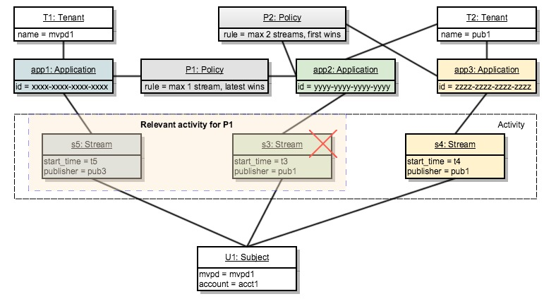

# Punto decisionale del criterio {#policy-desc-pt}

## Modello di dominio {#domain-model}

Questa pagina è destinata a fungere da riferimento per diversi casi d’uso e implementazioni di criteri. Consigliamo di consultare anche il [Glossario](/help/concurrency-monitoring/cm-glossary.md) parte della documentazione relativa alle definizioni dei termini.

A **tenant** possiede **applicazioni** per la quale intende dare esecuzione **criteri**. **Applicazioni client** deve essere configurato con **ID applicazione** (fornito dall’Adobe).

Il tenant associa quindi ogni applicazione a uno o più criteri, creati da lui o condivisi da altri. I criteri possono essere collegati tra più tenant.

Il **attività soggetto** è costituito da tutti i flussi (indipendentemente dall&#39;applicazione) segnalati al monitoraggio della concorrenza per un determinato soggetto.

Quando un flusso deve essere autorizzato per un determinato soggetto, il sistema controlla innanzitutto tutti i criteri definiti per l&#39;applicazione che ha creato il flusso.

Per ciascuno dei criteri applicabili, è quindi necessario raccogliere tutte le **attività rilevante** che verrà passato alla regola. Il **attività rilevante** per una policy, P includerà un flusso S solo se soddisfa la seguente condizione:

**Il flusso &quot;S&quot; viene avviato da un&#39;applicazione che include il criterio &quot;P&quot; tra i criteri.**

## Casi di utilizzo di esecuzione di prova {#dry-run-use-cases}

La procedura dettagliata seguente mira a convalidare il modello rispetto ad alcuni casi d’uso. Lo faremo gradualmente, iniziando con una configurazione di base e aggiungendo complessità in vari modi.

### 1. Un locatario. Un&#39;applicazione. Una regola. Un flusso {#onetenant-oneapp-onepolicy-onestream}

Inizieremo con un singolo tenant, con una singola applicazione e un singolo criterio associato. Supponiamo che il criterio stabilisca che possa esserci al massimo un flusso attivo per qualsiasi utente (è consentita la riproduzione del flusso più recente).

Una volta avviato un flusso, l’attività sarà costituita solo da tale flusso e può essere riprodotta.

### 2. Un locatario. Un&#39;applicazione. Una regola. Due ruscelli. {#onetenant-oneapp-onepolicy-twostreams}

Una volta avviato un secondo flusso (dallo stesso soggetto utilizzando la stessa applicazione), l’attività utilizzata per la convalida sarà costituita da entrambi **s1** e **s2**.

Il limite è stato superato perché il criterio stabilisce che è consentito riprodurre un solo flusso, quindi verrà consentito solo il flusso più recente (**s2**) per la riproduzione.

>[!NOTE]
>
>I diagrammi rappresentano la vista di sistema sull’attività dell’utente. Per i tentativi di inizializzazione del flusso, la decisione di accesso verrà inclusa nella risposta. Per i flussi attivi, la decisione viene restituita alla risposta heartbeat.

### 3. Due locatari. Due applicazioni. Una regola. Due ruscelli. {#twotenant-twoapp-onepolicy-twostreams}

Supponiamo ora che un nuovo tenant desideri applicare lo stesso criterio nelle proprie applicazioni:

Poiché i due tenant sono collegati dalla stessa policy, la situazione descritta nel caso di utilizzo 2 è applicabile in questo caso e **s3** è consentito riprodurre in quanto si tratta dello streaming più recente.

### 4. Due locatari. Tre domande. Due criteri. Due ruscelli. {#twotenants-threeapps-twopolicies-twostreams}

Ora, supponiamo che il secondo tenant distribuisca una nuova applicazione e desideri definire un nuovo criterio che verrà condiviso tra **app2** e **app3**.

In questo momento, i flussi attivi **s3** e **s4** sono entrambi consentiti. Per **s3**, quando la policy **P1** viene valutato, il sistema conteggerà solo **s3** as **attività rilevante** (**s4** non è in alcun modo correlato alla policy **P1**) quindi non si verifica alcuna violazione.

Policy **P2** viene applicato a entrambi i flussi e includerà entrambi **s3** e **s4** come attività pertinente. Poiché questa attività si trova entro i limiti di due flussi, sono consentiti entrambi.

### 5. Due affittuari. Tre domande. Due criteri. Tre ruscelli. {#twotenants-threeapps-twopolicies-threestreams}

Ora si presuppone che venga eseguito un nuovo tentativo di inizializzazione del flusso utilizzando **app2**:

**s5** può iniziare **P1** (che consente ai flussi più recenti di prendere il controllo), ma viene negato da **P2** Quindi non partirà.

Lo stesso accadrà se si tenta di avviare un flusso con l’app3: lo stesso criterio P2 negherà l’accesso a tale flusso.

Ora vediamo cosa accade se l’utente tenta di creare un nuovo flusso utilizzando l’app1:

L’applicazione app1 non è in alcun modo correlata al criterio **P2**, quindi applicherà solo il criterio **P1**: che consente l’avvio del nuovo flusso e nega quello precedente (**s3** in questo caso).

