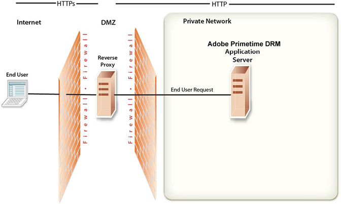

# Panoramica della topologia di rete {#network-topology-overview}

Dopo aver implementato con successo  Accesso al Adobe, è importante mantenere la sicurezza dell&#39;ambiente. In questa sezione vengono descritte le attività necessarie per mantenere la sicurezza del server di produzione  Access.

Utilizzate un *proxy inverso* per garantire che diversi set di URL per  applicazioni Web di accesso ai Adobi siano disponibili sia per gli utenti esterni che per quelli interni. Questa configurazione è più sicura che consentire agli utenti di connettersi direttamente al server dell&#39;applicazione su cui è in esecuzione  accesso al Adobe. Il proxy inverso esegue tutte le richieste HTTP per il server applicazione che esegue  Adobe Access. Gli utenti dispongono solo dell&#39;accesso di rete al proxy inverso e possono tentare solo le connessioni URL supportate dal proxy inverso.

<!---->

