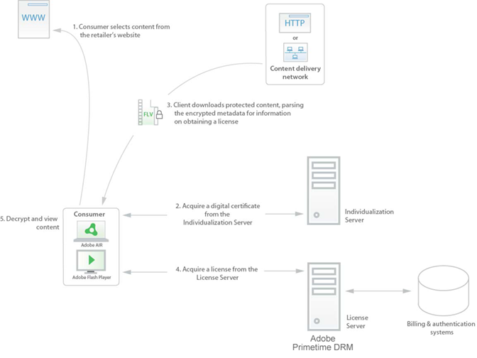

# Acquisizione di contenuti{#content-acquisition}

Quando un consumatore acquisisce un file di contenuto protetto da un sito Web o da una rete CDN, deve anche acquisire una licenza contenente una chiave per decifrare il video prima di poter essere riprodotto. I passaggi seguenti illustrano un flusso di lavoro comune per determinare in che modo un computer con Flash Player o  Adobe AIR acceda al contenuto protetto:

1. Il consumatore visita il sito Web del rivenditore e seleziona un video da guardare. Il consumatore tenta di scaricare o trasmettere in streaming al proprio computer il video protetto tramite un&#39;applicazione Adobe AIR  o Flash Player.

   Se si tratta della prima volta che il consumatore ha tentato di accedere al contenuto protetto utilizzando questo computer specifico, il Flash Player o  runtime Adobe AIR deve essere innanzitutto individualizzato come descritto al passaggio 2. Se il client runtime è già stato personalizzato, il processo di acquisizione di una licenza avviene come descritto al punto 3.

1. Il client runtime Adobe AIR di Flash Player o  acquisisce un certificato digitale univoco (denominato *computer certificate*) da un server  Adobe ospitato da un server .

   Questo processo di assegnazione di un certificato univoco è denominato *individualizzazione*. L&#39;individuazione identifica in modo univoco sia il computer che il runtime Adobe AIR di Flash Player o  utilizzato per riprodurre il contenuto.

   Il processo di individualizzazione consente di associare le licenze scaricate a uno specifico computer in cui è installato il client. A ogni computer viene assegnata una credenziale univoca (chiave privata del computer e certificato del computer). Se uno specifico client dovesse essere compromesso, potrebbe essere revocato e non sarebbe possibile acquisire licenze per i nuovi contenuti.

1. Il client analizza il contenuto protetto mentre inizia a scaricare o trasmettere in streaming al computer del consumatore, ed estrae l&#39;URL del server licenze del rivenditore dai metadati DRM di Primetime incorporati nel file.

   I metadati DRM di Primetime in genere sono separati dal contenuto, ad esempio incorporati in un file manifesto di accompagnamento o come BLOB binari, ma possono anche essere incorporati nel file di contenuto. Il client contatta il server licenze all’URL specificato e acquisisce una licenza (come descritto di seguito al passaggio 4).
1. Il client acquisisce una licenza dal server licenze del rivenditore.

   Durante l&#39;acquisizione della licenza, il client invia al server licenze del rivenditore le informazioni che identificano il contenuto richiesto (i *metadati DRM di Primetime*) e il certificato del computer (che identifica il computer del consumatore). La richiesta di licenza inviata al server è crittografata utilizzando la chiave pubblica di trasporto, inclusa anche nei metadati DRM di Primetime.

   Server licenze — che possono essere integrati nell&#39;infrastruttura di fatturazione e autenticazione del rivenditore — può eseguire un controllo delle regole aziendali per verificare che l&#39;utente sia autorizzato a visualizzare il contenuto richiesto. Se le regole aziendali lo consentono, il server licenze rilascia una licenza contenente la chiave di crittografia del contenuto per decifrare il contenuto e le regole di utilizzo associate all&#39;account dell&#39;utente. Per elaborare una richiesta di licenza, il server licenze decrittografa la richiesta utilizzando la chiave privata Trasporto. Il CEK nei metadati viene decifrato utilizzando la chiave privata del server licenze e crittografato di nuovo per eseguire il binding della licenza con il dispositivo che effettua la richiesta. La licenza viene firmata utilizzando la chiave privata del server licenze. La risposta di licenza viene firmata utilizzando la chiave privata Trasporto e crittografata prima di essere restituita al client.

   Se consentito dalla licenza, il client memorizza la licenza per abilitare l&#39;accesso *offline* alla licenza. Il caching delle licenze consente al consumatore di visualizzare il contenuto protetto senza riacquisire una licenza ogni volta che desidera visualizzare il contenuto.

1. Una volta che il Flash Player o  client runtime Adobe AIR dispone di una licenza, il client estrae il CEK dalla licenza e il consumatore può visualizzare il contenuto a cui è autorizzato.

   <!---->

   

   Nell’esempio precedente viene illustrato solo un possibile flusso di lavoro. In alternativa, potete utilizzare un flusso di lavoro con un download proattivo del contenuto in cui l&#39;acquisizione della licenza avviene molto più tardi. Un&#39;altra opzione consiste nell&#39;implementare un flusso di lavoro di pre-ordine in cui l&#39;acquisizione della licenza avviene prima dell&#39;accesso al contenuto.

