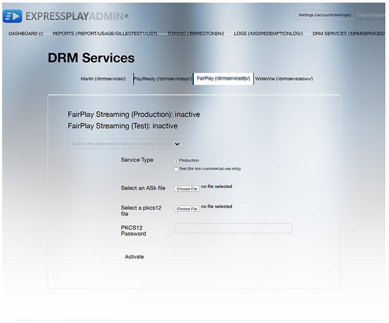

# Flusso di lavoro DRM multiplo per FairPlay {#multi-drm-workflow-for-fairplay}

I flussi di lavoro DRM prevedono la creazione di pacchetti di contenuti, la concessione di licenze per i contenuti e la riproduzione di contenuti protetti dalla propria applicazione video. Il flusso di lavoro è generalmente simile per ogni soluzione DRM, ma con alcune differenze è nei dettagli.

Questo flusso di lavoro multi-DRM consente di configurare, creare pacchetti, concedere licenze e riprodurre contenuti HLS protetti con Apple FairPlay. Questo flusso di lavoro include anche istruzioni facoltative per l’implementazione della riproduzione offline e della rotazione delle licenze.

## Abilitare il servizio ExpressPlay per FairPlay {#enable-expressplay-service-for-fairplay}

La soluzione DRM FairPlay di Apple richiede una configurazione quando viene utilizzata con i servizi DRM ExpressPlay. Ciò comporta l’ottenimento delle credenziali da Apple e il loro caricamento su ExpressPlay.

Segui questi passaggi per abilitare il servizio ExpressPlay per la protezione dei contenuti FairPlay.

1. Ottieni le credenziali da Apple.

   Queste credenziali vengono fornite in modo univoco a ciascun provider di servizi. È necessario richiederli compilando il seguente modulo: [https://developer.apple.com/contact/fps/](https://developer.apple.com/contact/fps/).

   >[!NOTE]
   >
   >Seleziona **[!UICONTROL Content Provider]** per il ruolo principale.

   Una volta approvata la richiesta, Apple ti invierà una *Pacchetto di distribuzione in streaming FairPlay*.
1. Genera una richiesta di firma del certificato.

   È possibile utilizzare [!DNL openssl] per generare la coppia di chiavi pubblica/privata e la richiesta con firma del certificato (CSR, Certificate Sign Request).

   1. Genera la coppia di chiavi.

      ```
      openssl genrsa -aes256 -out privatekey.pem 1024 
      ```

   1. Genera la tua CSR.

      ```
      openssl req -new -sha1 -key privatekey.pem -out certreq.csr  
        -subj "/CN=SubjectName /OU=OrganizationalUnit /O=Organization /C=US"
      ```

      >[!NOTE]
      >
      >Le istruzioni per questo passaggio si trovano nel *Pacchetto di distribuzione in streaming FairPlay*, ma sono inclusi qui per comodità. In caso di problemi con questa parte del processo, consulta le istruzioni in *FairPlayCertificateCreation.pdf* (nel pacchetto di distribuzione).

1. Carica la tua CSR tramite il portale per sviluppatori di Apple.
   1. L’agente del team per il team di sviluppo deve accedere a [!DNL developer.apple.com/account].
   1. Fai clic su **[!UICONTROL Certificates, Identifiers & Profiles]**, quindi seleziona la **[!UICONTROL iOS, tvOS, watchOS]** in alto a sinistra, quindi fai clic su **[!UICONTROL Certificates->Production]** a sinistra della pagina.
   1. Fai clic su **[!UICONTROL +]** in alto a destra per richiedere un nuovo certificato. Seleziona la **[!UICONTROL FairPlay Streaming Certificate]** opzione in **[!UICONTROL Production]**.

      Il *Aggiungi certificato iOS* viene visualizzata una finestra di dialogo.
   1. In *Aggiungi certificato iOS*, carica il file CSR generato nel passaggio 2.b e fai clic su **[!UICONTROL Generate]**.

      La chiave del segreto dell&#39;applicazione (ASK) viene visualizzata nella stessa finestra di dialogo.
   1. Annotare il ASK e conservarlo in un luogo sicuro.
   1. Chiave nella richiesta di completamento della generazione del certificato e fai clic su **[!UICONTROL Continue]**.
   1. Dopo aver verificato di aver salvato l&#39;ASK, fare clic su **[!UICONTROL Generate]** per continuare.

      >[!NOTE]
      >
      >È importante salvare una copia del ASK e conservarla in modo sicuro. *Se l&#39;ASK è compromessa, non sarà più possibile proteggere i contenuti con FairPlay Streaming.* Al team è assegnato un solo (1) ASK. Il valore non verrà più fornito e non potrai recuperarlo in un secondo momento.

   1. Scarica il certificato FPS.

      Assicurati di salvare in un luogo sicuro una copia di backup della tua chiave privata (dal passaggio 2.a.) e della tua chiave pubblica (il certificato FPS scaricato in questo passaggio).
1. Configura il tuo account ExpressPlay con le tue credenziali FairPlay.
   1. Supponiamo che il nome del certificato scaricato nel passaggio 3.h sia [!DNL fairplay.cer].
   1. Apri [!DNL fairplay.cer] file con l&#39;utility Apple Keychain Access.
   1. Filtra i numerosi certificati immettendo &quot; `fairplay`&quot; nel campo di ricerca in alto a destra.
   1. Identifica il certificato FairPlay della tua azienda.

      Il nome della tua società deve essere associato al certificato rilasciato da Apple.
   1. Espandi il certificato selezionando la freccia di espansione e fai clic con il pulsante destro del mouse sulla chiave privata.
   1. Seleziona **[!UICONTROL Export "Your Company Name"]** e salva [!DNL .p12] file.

      Ti verrà chiesto di assegnare una password per proteggere il file. Prendere nota di questa password in quanto è necessario inviarla con il pacchetto di credenziali.
   1. Accedi al tuo account su [www.expressplay.com](https://www.expressplay.com).
   1. Clic **[!UICONTROL DRM SERVICES]** in alto a sinistra, quindi seleziona la **[!UICONTROL FairPlay]** scheda.
   1. Carica le credenziali FairPlay sul tuo account ExpressPlay.

      1. Crea un file di testo contenente il valore dell’ASK (che deve essere di 32 caratteri, ad esempio: `1234567890abcdef1234567890abcdef`) e seleziona questo file per il caricamento.
      1. Selezionate il file PKCS12 dal punto 4.f per il caricamento.
      1. Immettere la password del file PKCS12 dal punto 4.f.
      1. Fai clic sul pulsante Carica.

Ora puoi creare applicazioni iOS o pagine HTML5 con la protezione dei contenuti FairPlay e le [!DNL fairplay.cer] utilizzando il servizio ExpressPlay per FairPlay.

<!--<a id="fig_sjr_2pn_sv"></a>-->



### Creare pacchetti per FairPlay {#package-your-content-for-fairplay}

Per creare il pacchetto dei contenuti, è possibile utilizzare Adobe Offline Packager o altri strumenti come Bento4 Packager di ExpressPlay.

I package preparano il video per la riproduzione (ad esempio, frammentando il file originale e inserendolo in un manifesto) e lo proteggono con la soluzione DRM scelta (in questo caso FairPlay):

* [Adobe Offline Packager per DRM FairPlay](https://helpx.adobe.com/content/dam/help/en/primetime/guides/offline_packager_getting_started.pdf#page=21)
* [Pacchetti ExpressPlay - Bento4 per HLS](https://www.bento4.com/developers/hls/)

<!--<a id="fig_jbn_fw5_xw"></a>-->


1. Creare un pacchetto dei contenuti.

   Di seguito è riportato un esempio di creazione di pacchetti utilizzando Adobe Offline Packager. Il Packager utilizza un file di configurazione (ad esempio, [!DNL fairplay.xml]), che si presenta così:

   ```
   <config>
   <in_path>mp4_file_path</in_path>
   <out_type>hls</out_type>
   <out_path>out_file_path</out_path>
   <drm/>
   <drm_sys>FAIRPLAY</drm_sys>
   <frag_dur>4</frag_dur>
   <target_dur>6</target_dur>
   <key_file_path>creds/fairplay.bin</key_file_path>
   <iv_file_path>creds/iv.bin</iv_file_path>
   <key_url>user_provided_value</key_url>
   <content_id>_default_</content_id>
   </config>
   ```

   * `in_path` - Questa voce punta alla posizione del video sorgente sul vostro confezionatore locale.
   * `out_type` - Questa voce descrive il tipo di output del pacchetto, in questo caso HLS per FairPlay.
   * `out_path` : la posizione sul computer locale in cui desideri spostare l’output.
   * `drm_sys` - La soluzione DRM per la quale si sta effettuando il packaging. Questo è `FAIRPLAY` in questo caso.
   * `frag_dur` - Durata del frammento in secondi.
   * `target_dur` - La durata target per l’output HLS.
   * `key_file_path` : si tratta della posizione del file di licenza sul computer di creazione pacchetti che funge da chiave di crittografia del contenuto (CEK). È una stringa esadecimale a 16 byte con codifica Base-64.
   * `iv_file_path` - Posizione del file IV sul confezionatore.
   * `key_url` - Parametro URI della proprietà `EXT-X-KEY` tag di [!DNL .m3u8] file.
   * `content_id` - Valore predefinito.

   Come indicato nella [Documentazione di Packager](https://helpx.adobe.com/content/dam/help/en/primetime/guides/offline_packager_getting_started.pdf#page=7), &quot;Come best practice, crea un file di configurazione contenente le opzioni comuni che desideri utilizzare per generare gli output. Quindi, crea l’output fornendo opzioni specifiche come argomento della riga di comando.&quot;

   ```
   java -jar OfflinePackager.jar -in_path sample.mp4 -out_type hls 
   -out_path out_file_path -drm -drm_sys FAIRPLAY -key_file_path "creds/fairplay.bin" 
   -key_url "user_provided_value"
   ```

   Il file M3U8 generato ha un `EXT-X-KEY` attributo visualizzato come segue:

   ```
   #EXT-X-KEY:METHOD=SAMPLE-AES,URI="user_provided_value",​
   KEYFORMAT="com.apple.streamingkeydelivery",KEYFORMATVERSIONS="1" 
   ```

### Impostazione dei criteri per FairPlay {#setting-policies-for-fairplay}

È possibile impostare i criteri per i contenuti protetti da FairPlay utilizzando un server per l&#39;adesione. Puoi impostare un server di adesione personalizzato o utilizzare un server di adesione di esempio fornito dall’Adobe.

In questo Adobe viene fornito un esempio di server di diritti ExpressPlay (SEES) che illustra come eseguire *basato sul tempo* e *associazione a dispositivo* diritto. Questo server di adesione di esempio è basato sui servizi ExpressPlay.

[Server di riferimento: Sample ExpressPlay Entitlement Server (SEES)](../../multi-drm-workflows/feature-topics/sees-reference-server.md)

* [Servizio di riferimento: diritto basato sul tempo](../../multi-drm-workflows/feature-topics/sees-reference-server-time-entitlement.md)
* [Servizio di riferimento: diritto di associazione dispositivo](../../multi-drm-workflows/feature-topics/sees-reference-server-binding-entitlement.md)

## Licenze e riproduzione per FairPlay {#licensing-and-playback-for-fairplay}

La concessione di licenze e la riproduzione di contenuti protetti con FairPlay richiedono lo scambio di schemi URL, tra lo schema utilizzato nel file del manifesto video (skd:) e quello utilizzato nelle richieste di token ExpressPlay (https:).

Le istruzioni per l’implementazione della licenza e della riproduzione da un client iOS TVSDK sono disponibili qui: [Abilitare Apple FairPlay nelle applicazioni TVSDK](../../../programming/tvsdk-3x-ios-prog/ios-3x-drm-content-security/ios-3x-apple-fairplay-tvsdk.md). Facoltativamente, puoi anche implementare la riproduzione offline e la rotazione delle licenze per FairPlay.

## HLS offline con FairPlay {#section_047A05D1E3B64883858BC601CFC8F759}

È possibile consentire agli utenti di riprodurre contenuti protetti da FairPlay quando la licenza non è recuperabile perché il lettore è isolato dal web (ad esempio su un aereo).

Prima di iniziare questa attività, scarica e leggi il documento di Apple **&quot;Riproduzione offline con FairPlay Streaming e HTTP Live Streaming&quot;**. Leggi la guida per scoprire come scaricare i segmenti Transport Stream (TS) e salvarli nel computer locale.

Implementa il gioco offline per FairPlay con questo flusso di lavoro:

1. Scarica il segmento HLS TS.
1. Richiedi licenza di noleggio permanente dal server FairPlay (vedi **&quot;Politica di noleggio persistente FairPlay&quot;**).
1. Salva il `persistentContentKey`.
1. Riproduci il contenuto FairPlay offline.

>[!NOTE]
>
>FairPlay Streaming sul client non avvia la decrittografia se la chiave di contenuto persistente è scaduta. Tuttavia, se la chiave del contenuto scade durante la riproduzione, l’esperienza utente continuerà.
>
>Consulta [Utilizzo di HTTP Live Streaming](https://developer.apple.com/library/content/documentation/AudioVideo/Conceptual/MediaPlaybackGuide/Contents/Resources/en.lproj/HTTPLiveStreaming/HTTPLiveStreaming.html#//apple_ref/doc/uid/TP40016757-CH11-SW3) per ulteriori dettagli.

### Rotazione delle licenze FairPlay {#section_D32AA08C61474B4F876AC2A5F18CB879}

La rotazione delle licenze è uno schema per impedire l’hacking delle licenze di contenuti che vengono riprodotti per molto tempo.

In un manifesto M3U8, ogni tag chiave verrà applicato ai seguenti segmenti TS fino al tag chiave successivo o fino alla fine del file.

Per aggiungere la rotazione delle licenze, eseguire le operazioni seguenti:

* Inserire un nuovo tag chiave FairPlay durante il tempo di rotazione della licenza.

   È possibile aggiungere un numero qualsiasi di tag chiave.

   Per i contenuti lineari, assicurati di mantenere il tag chiave più recente nella finestra M3U8. iOS richiederà il prossimo M3U8 quando saranno rimasti circa due segmenti TS da riprodurre (circa 20 secondi). Se il nuovo M3U8 contiene nuovi tag chiave, tutte le richieste chiave avverranno immediatamente. Le chiavi esistenti precedenti non verranno richieste di nuovo. iOS attenderà il completamento di tutte le richieste chiave prima di avviare la riproduzione.

   Per i contenuti VOD con rotazione delle licenze, tutte le richieste chiave si verificheranno all’inizio della riproduzione.

   Di seguito è riportato un esempio di M3U8 con rotazione dei tasti:

   ```
   #EXTM3U
   #EXT-X-TARGETDURATION:10
   #EXT-X-VERSION:5
   #EXT-X-MEDIA-SEQUENCE:0
   #EXT-X-PLAYLIST-TYPE:VOD
   #EXT-X-KEY:METHOD=SAMPLE-AES,URI="skd://one?cek=1dc2cc71d913f4f74eca0c4632
   212b25&iv=e21f0f72b6363ff6143737cb1e9ca8d7",KEYFORMAT="com.apple.streaming
   keydelivery",KEYFORMATVERSIONS="1"
   #EXTINF:10,
   fileSequence0.ts
   #EXTINF:10,
   fileSequence1.ts
   #EXTINF:10,
   fileSequence2.ts
   #EXTINF:10,
   fileSequence3.ts
   #EXTINF:10,
   fileSequence4.ts
   #EXTINF:10,
   fileSequence5.ts
   #EXTINF:10,
   fileSequence6.ts
   #EXTINF:10,
   fileSequence7.ts
   #EXTINF:10,
   #EXT-X-KEY:METHOD=SAMPLE-AES,URI="skd://two?cek=f6efc698b96cf8f4fa46d5237d
   337c77&iv=18401077091784bcda8079acf978dc95",KEYFORMAT="com.apple.streaming
   keydelivery",KEYFORMATVERSIONS="1"
   #EXTINF:10,
   fileSequence8.ts
   #EXTINF:10,
   ```
