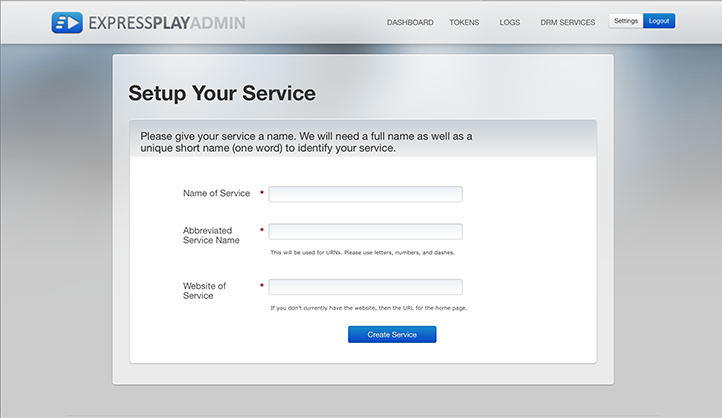

# Ottieni provisioning (account, ecc.) {#get-provisioned-accounts-etc}

Per iniziare a utilizzare Primetime DRM Cloud con tecnologia ExpressPlay, devi configurare gli account Adobe Cert ed ExpressPlay con l’aiuto del tuo rappresentante Adobe.

1. Contatta il tuo rappresentante di Adobe e richiedi gli account Adobe Cert e ExpressPlay necessari per implementare Multi-DRM con TVSDK.

   Fornisci al tuo rappresentante di Adobe l&#39;indirizzo e-mail che userai come punto di contatto. Ad Adobe, vengono creati due account:

   * ***Account del portale certificati*** - ( https://certportal.primetime.adobe.com) : La *Team di gestione delle registrazioni dei certificati DRM di Adobe Access / Primetime* invia un’e-mail agli indirizzi che hai fornito. L’e-mail include l’URL del portale di creazione Adobe, insieme a un collegamento alla documentazione di registrazione dei certificati di Adobe (gli ultimi documenti sono disponibili qui: [Guida alla registrazione dei certificati](../../../digital-rights-management/certificate-enrollment-guide/about-certs.md)).

   * ***Account ExpressPlay*** - Adobe invia un’e-mail contenente un collegamento utilizzato per registrarsi al tuo account amministratore ExpressPlay.

1. Accedi al portale di creazione Adobe utilizzando il tuo Adobe ID (usa lo stesso indirizzo e-mail fornito al tuo rappresentante di Adobe). Se non disponi ancora di un Adobe ID, puoi crearne uno rapidamente seguendo le *Ottieni un Adobe ID* link dal portale cert:

   <!---->

   

1. Sul portale del certificato di Adobe, richiedi un *Versione di prova* cert.

   Per la versione di prova Multi-DRM, un singolo certificato di prova includerà tutti questi aspetti della protezione dei contenuti: imballaggio, licenze e trasporto. Dovrai fornire il tuo [CSR](../../../digital-rights-management/certificate-enrollment-guide/request-certs/gen-cert-signing-req.md) per richiedere un certificato:
   <!---->

   

   L’Adobe ti invierà un’e-mail che indica l’accettazione o il rifiuto della tua richiesta di certificato. Puoi visualizzare lo stato delle richieste di certificati nel *Cronologia richieste* scheda sul portale del cert:
   <!---->

   

1. Crea il tuo account amministratore ExpressPlay.

   Segui il collegamento a ExpressPlay fornito dall’Adobe. Viene aperta la *Creare un account* su ExpressPlay. Compila le informazioni richieste e invia il modulo. Riceverai un’e-mail da `operations@expressplay.com` contenente un collegamento di attivazione valido per una settimana. Dopo l&#39;attivazione, configura il servizio ExpressPlay:
   <!---->

   

   Dopo aver creato il servizio, riceverai la tua pagina di amministrazione. Insieme ad alcuni campi di tracciamento delle attività, potrai vedere la tua produzione e il tuo test *autenticatori clienti* (chiavi API) e gli URL del servizio Produzione e test:

   <!---->

    

1. Se utilizzi FairPlay, sono necessari ulteriori passaggi (sul sito per sviluppatori Apple) per la configurazione con ExpressPlay. Vedi [Abilita il servizio ExpressPlay per FairPlay](../../multi-drm-workflows/p-l-and-p/fairplay-workflow.md#enable-expressplay-service-for-fairplay) per istruzioni.
