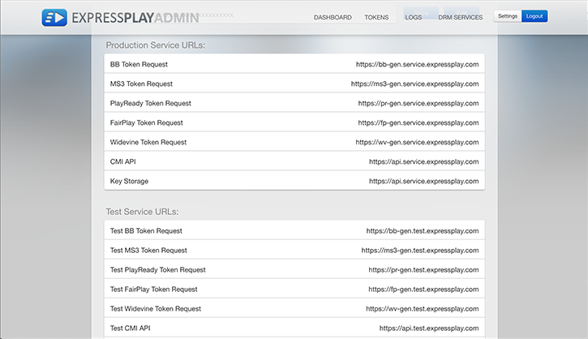

# Get Provisioning (account, ecc.) {#get-provisioned-accounts-etc}

Per iniziare a utilizzare Primetime DRM Cloud, basato su ExpressPlay, devi configurare  account Cert e ExpressPlay del Adobe con l&#39;aiuto del tuo rappresentante del Adobe .

1. Contattate il rappresentante del Adobe  e richiedete gli account  Adobe Cert e ExpressPlay necessari per implementare Multi-DRM con TVSDK.

       Fornite al rappresentante  Adobe l&#39;indirizzo e-mail che verrà utilizzato come punto di contatto.  Adobe crea quindi due account:
   
   * ***Account***  portale certificati - ( https://certportal.primetime.adobe.com): Il  *Adobe Accesso /* Team di gestione delle registrazioni DRM di Primetime invia un&#39;e-mail agli indirizzi che hai fornito. L&#39;e-mail include l&#39;URL del portale di certificati di Adobe , insieme a un collegamento alla documentazione di iscrizione  certificati di Adobe (i documenti più recenti sono disponibili qui: [Guida all&#39;iscrizione ai certificati](../../../digital-rights-management/certificate-enrollment-guide/about-certs.md)).

   * ***ExpressPlay Account*** -  Adobe invia un&#39;e-mail contenente un collegamento che consente di registrarsi per l&#39;account ExpressPlay Admin.

1. Effettuate l&#39;accesso al portale del certificato del Adobe  utilizzando l&#39;Adobe ID  (utilizzate lo stesso indirizzo e-mail fornito al Adobe rappresentante del ). Se non disponete ancora di un Adobe ID , potete crearne rapidamente uno seguendo il collegamento *Ottieni un Adobe ID* dal portale del certificato:

   <!---->

   

1. Sul portale del certificato del Adobe , richiedete un certificato *di prova*.

   Per la versione di prova Multi-DRM, un singolo certificato di prova coprirà tutti gli aspetti seguenti della protezione dei contenuti: imballaggio, licenze e trasporto. Per richiedere un certificato è necessario fornire il proprio [CSR](../../../digital-rights-management/certificate-enrollment-guide/request-certs/gen-cert-signing-req.md):
   <!---->

   

    Adobe vi invierà un&#39;e-mail che indica l&#39;accettazione o il rifiuto della vostra richiesta di certificato. Potete visualizzare lo stato delle richieste di certificati nella scheda *Cronologia richieste* del portale certificati:
   <!---->

   

1. Crea il tuo account ExpressPlay Admin.

   Seguite il collegamento a ExpressPlay fornito  Adobe. Viene aperta la pagina *Create an Account* in ExpressPlay. Compila le informazioni richieste e invia il modulo. Riceverai un&#39;e-mail da `operations@expressplay.com` contenente un collegamento di attivazione valido per una settimana. Dopo l&#39;attivazione, configura il servizio ExpressPlay:
   <!---->

   

   Dopo aver creato il servizio, ti verrà presentata la tua pagina Admin. Insieme ad alcuni campi di tracciamento dell&#39;attività, vedrete gli *autenticatori cliente di produzione e test* (chiavi API) e gli URL del servizio di produzione e test:

   <!---->

    

1. Se utilizzate FairPlay, sono necessari ulteriori passaggi (sul sito sviluppatori Apple) per ottenere la configurazione con ExpressPlay. Per istruzioni, vedere [Abilita servizio ExpressPlay per FairPlay](../../multi-drm-workflows/p-l-and-p/fairplay-workflow.md#enable-expressplay-service-for-fairplay).
