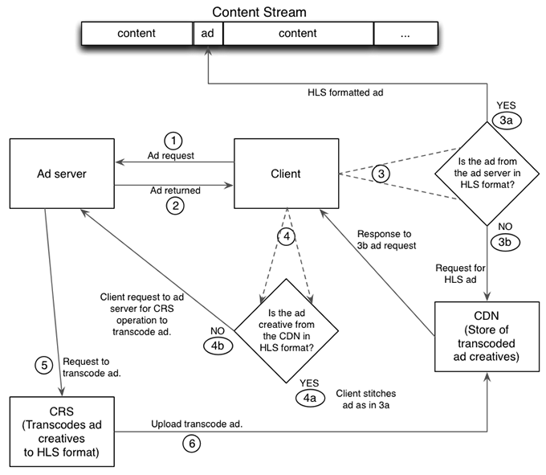

# Flussi di lavoro dettagliati per il riconfezionamento JIT {#detailed-workflows-for-jit-repackaging}

Un lettore video client o il server manifest possono interagire con CRS per ottenere il repackaging JIT. Entrambi utilizzano la stessa logica di selezione degli annunci.

## Reimballaggio JIT avviato dal server manifesto {#section_1F1C1B7DD146403890C2B43E24FEF0EB}

Il flusso di lavoro per il repackaging JIT sul lato server del manifesto è il seguente:

1. Il server manifesto invia una richiesta al server di annunci.
1. Il server manifest riceve un contenuto creativo dell&#39;annuncio che non è in formato HLS.
1. Il server di manifesto invia una richiesta al server CDN per una versione HLS precedentemente trascodificata della creatività dell’annuncio.

   >[!NOTE]
   >
   >In una configurazione con più reti CDN, il server manifest utilizza `ptcdn` parametro nell’URL di avvio per identificare il server CDN.

1. Il server di manifesto controlla la risposta:

   1. Se la richiesta ha esito positivo, il server di manifesto inserisce nel flusso di contenuto la versione HLS precedentemente trascodificata della creatività dell’annuncio.
   1. Se la richiesta non riesce, il server manifest genera una voce di registro e richiede una versione transcodificata da CRS.

1. CRS transcodifica la creatività dell’annuncio e carica la versione HLS sul server CDN per utilizzi futuri.

Per tutte le richieste successive per tale contenuto creativo, il server dei manifesti recupera la versione HLS dalla rete CDN e la inserisce nel flusso di contenuto.

## Reimballaggio JIT avviato dal client {#section_FBC97D40043F4FDD98247A08BB6195B0}

<!---->

Un client basato su TVSDK o con funzionalità simili può interagire con CRS per ottenere il repackaging JIT, come segue:

1. Il client richiede un annuncio dal server di annunci.
1. Il server dell’annuncio restituisce l’annuncio al client.
1. Il client controlla il formato dell’annuncio dal server dell’annuncio:

   1. Se l’annuncio creativo è in formato HLS, il client lo inserisce (unisce) nel contenuto ed è completato.
   1. Se l’annuncio non è in formato HLS, il client ne richiede uno dal server CDN.

      >[!NOTE]
      >
      >In una configurazione con più reti CDN, il server manifest utilizza `ptcdn` parametro nell’URL di avvio per identificare il server CDN.

1. Il client controlla la risposta dal server CDN.

   1. Se la rete CDN fornisce una versione HLS, il client la inserisce (unisce) nel contenuto ed è possibile.
   1. Se il server CDN non fornisce una versione HLS, il client chiede al server di annunci di richiederne una a CRS. Il client non inserisce l’annuncio nel contenuto.

1. Il server di annunci richiede che il non-HLS sia stato transcodificato in HLS.
1. CRS crea una versione HLS e la carica sul server CDN per utilizzarla in futuro.

## Priorità e timeline del formato dell’annuncio {#section_A74DE37A57BF45D7B6D09E3DE40F8E61}

Il server manifesto e il client utilizzano la stessa logica di selezione per determinare le priorità per la riproduzione degli annunci disponibili. Gli annunci in formato HLS hanno priorità assoluta, seguiti da MP4, FLV e infine WebM.

Il CRS richiede in genere 2-4 minuti per elaborare un annuncio non HLS creativo e in genere meno di 3 minuti.

CRS produce diversi bit rate HLS, in modo che l&#39;annuncio possa essere riprodotto ad una velocità adatta alla velocità di connessione e alla larghezza di banda disponibili. Se sono disponibili più velocità bit, CRS sceglie la velocità bit più alta disponibile. Se CRS riceve un annuncio non HLS creativo, produce una versione HLS alla massima risoluzione disponibile.