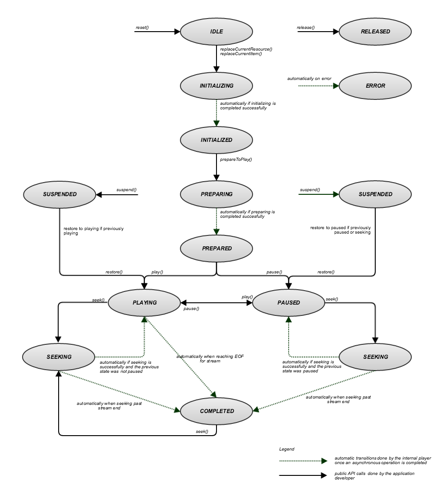

# Ciclo di vita e stati dell&#39;oggetto MediaPlayer{#lifecycle-and-statuses-of-the-mediaplayer-object}

Lo stato del lettore multimediale determina quali azioni sono legali.

Per utilizzare gli stati del lettore multimediale:

* È possibile recuperare lo stato corrente del `MediaPlayer` oggetto con `MediaPlayer.getStatus()`.

* L’elenco degli stati è definito nella sezione [MediaPlayerStatus](https://help.adobe.com/en_US/primetime/api/psdk/javadoc_2.5/com/adobe/mediacore/MediaPlayerStatus.html) enum.

Diagramma di transizione di stato per il ciclo di vita di una `MediaPlayer` istanza:

<!--<a id="fig_A6425F24C7734DC681D992859D2A6743"></a>-->



La tabella seguente fornisce dettagli sul ciclo di vita e gli stati del lettore multimediale:

<table id="table_82757A0043EB4AACA474E6B30326A6B7"> 
 <thead> 
  <tr> 
   <th colname="col1" class="entry"> Stato </th> 
   <th colname="col2" class="entry"> Si verifica quando </th> 
  </tr> 
 </thead>
 <tbody> 
  <tr> 
   <td colname="col1"> INATTIVO </td> 
   <td colname="col2"> <p>Stato iniziale del lettore multimediale. Il lettore viene creato ed è in attesa di specificare un elemento del lettore multimediale. </p> </td> 
  </tr> 
  <tr> 
   <td colname="col1"> INIZIALIZZAZIONE </td> 
   <td colname="col2"> <p>Chiamate dell'applicazione <span class="codeph"> MediaPlayer.replaceCurrentItem() </span>. </p> <p>Caricamento dell’elemento del lettore multimediale in corso. </p> </td> 
  </tr> 
  <tr> 
   <td colname="col1"> INIZIALIZZATO </td> 
   <td colname="col2"> <p>TVSDK: impostazione dell'elemento del lettore multimediale completata. </p> </td> 
  </tr> 
  <tr> 
   <td colname="col1"> PREPARAZIONE </td> 
   <td colname="col2"> <p>Chiamate dell'applicazione <span class="codeph"> MediaPlayer.preparationToPlay() </span>. Il lettore multimediale sta caricando l’elemento del lettore multimediale e tutte le risorse associate. </p> </td> 
  </tr> 
  <tr> 
   <td colname="col1"> PREPARATO </td> 
   <td colname="col2"> <p>TVSDK ha preparato il flusso multimediale e ha tentato di eseguire la risoluzione e l’inserimento di annunci (se abilitati). Il contenuto viene preparato e gli annunci sono stati inseriti nella timeline, oppure la procedura dell’annuncio non è riuscita. </p> <p>Può iniziare il buffering o la riproduzione. </p> </td> 
  </tr> 
  <tr> 
   <td colname="col1"> RIPRODUZIONE/PAUSA </td> 
   <td colname="col2"> <p>Quando l’applicazione riproduce e mette in pausa il contenuto multimediale, il lettore multimediale si sposta tra questi stati. </p> </td> 
  </tr> 
  <tr> 
   <td colname="col1"> SOSPESO </td> 
   <td colname="col2"> <p>Se l’applicazione si allontana dalla riproduzione, arresta il dispositivo o cambia applicazione durante la riproduzione o la pausa del lettore multimediale, quest’ultimo viene sospeso e le risorse vengono rilasciate. </p> <p>Chiamata <span class="codeph"> MediaPlayer.restore() </span> riporta il lettore allo stato in cui si trovava prima della SOSPENSIONE. L’eccezione è se il lettore è SEKING quando viene chiamato SUSPENDED, il lettore viene MESSO IN PAUSA e quindi SUSPENDED. </p> <p>Importante:  <p>Tenere presenti le seguenti informazioni: 
      <ul id="ul_1B21668994D1474AAA0BE839E0D69B00"> 
       <li id="li_08459A3AB03C45588D73FA162C27A56C">Il <span class="codeph"> MediaPlayer </span> chiamate automatiche <span class="codeph"> sospendi </span> solo quando l'oggetto superficie utilizzato dall'oggetto <span class="codeph"> MediaPlayerView </span> viene distrutto. </li> 
       <li id="li_B9926AA2E7B9441490F37D24AE2678A1">Il <span class="codeph"> MediaPlayer </span> chiamate automatiche <span class="codeph"> restore() </span> solo quando viene utilizzato un nuovo oggetto superficie da <span class="codeph"> MediaPlayerView </span> viene creato. </li> 
      </ul> </p> </p> <p>Se si desidera che la riproduzione venga sempre sospesa al ripristino di MediaPlayer, richiedere all'applicazione di chiamare <span class="codeph"> MediaPlayer.pause() </span> nelle attività Android di <span class="codeph"> onPause() </span> metodo. </p> </td> 
  </tr> 
  <tr> 
   <td colname="col1"> COMPLETATO </td> 
   <td colname="col2"> <p>Il lettore ha raggiunto la fine del flusso e la riproduzione si è interrotta. </p> </td> 
  </tr> 
  <tr> 
   <td colname="col1"> RILASCIATO </td> 
   <td colname="col2"> <p>L’applicazione ha rilasciato il lettore multimediale, con tutte le risorse associate. Non è più possibile utilizzare questa istanza. </p> </td> 
  </tr> 
  <tr> 
   <td colname="col1"> ERRORE </td> 
   <td colname="col2"> <p>Si è verificato un errore durante il processo. Un errore può inoltre influire sulle operazioni successive dell’applicazione. Per ulteriori informazioni, consulta <a href="../../../tvsdk-3x-android-prog/android-3x-content-playback-options-android2/android-3x-error-handling-set-up.md" format="dita" scope="local"> Configurare la gestione degli errori </a>. </p> </td> 
  </tr> 
 </tbody> 
</table>

>[!TIP]
>
>È possibile utilizzare lo stato per fornire un feedback sul processo o, ad esempio, un’attività di rotazione in attesa della successiva modifica dello stato oppure eseguire i passaggi successivi nella riproduzione del file multimediale, ad esempio attendere lo stato appropriato prima di chiamare il metodo successivo.

Ad esempio:

```java
mediaPlayer.addEventListener(MediaPlayerEvent STATUS_CHANGED, new StatusChangeEventListener() { 
    @Override  
    public void onStatusChanged(MediaPlayerStatusChangeEvent event) { 
        switch(event.getStatus()) { 
            case INITIALIZED: 
                mediaPlayer.prepareToPlay(); 
                break; 
            case PREPARING: 
                showBufferingSpinner(); 
                break; 
            case PREPARED: 
                hideBufferingSpinner(); 
                mediaPlayer.play(); 
                break; 
            ...                
        } 
        ... 
    } 
}); 
```
