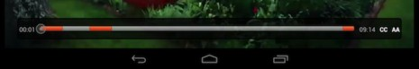

# Visualizza la durata, l&#39;ora corrente e il tempo rimanente del video {#display-the-duration-current-time-and-remaining-time-of-the-video}

È possibile utilizzare TVSDK per recuperare informazioni sulla posizione del lettore nel supporto e visualizzarlo sulla barra di ricerca.

1. Attendi che il lettore sia almeno nello stato PREPARATO.
1. Recupera l&#39;ora corrente della testina di riproduzione utilizzando `MediaPlayer.getCurrentTime` metodo .

   Restituisce la posizione corrente dell&#39;indicatore di riproduzione sulla timeline virtuale, in millisecondi. Il tempo viene calcolato in base al flusso risolto che potrebbe contenere più istanze di contenuto alternativo, ad esempio più annunci o interruzioni pubblicitarie unite nel flusso principale. Per i flussi in tempo reale/lineare, il tempo restituito è sempre nell&#39;intervallo della finestra di riproduzione.

   ```java
   long getCurrentTime() throws MediaPlayerException;
   ```

1. Recupera l&#39;intervallo di riproduzione del flusso e determina la sua durata.
   1. Utilizza la `MediaPlayer.getPlaybackRange` per ottenere l&#39;intervallo di tempo della timeline virtuale.

      ```java
      TimeRange getPlaybackRange() throws MediaPlayerException;
      ```

   1. Utilizza la `MediaPlayer.getPlaybackRange` per ottenere l&#39;intervallo di tempo della timeline virtuale.

      * Per VOD, l’intervallo inizia sempre con zero e il valore finale è uguale alla somma della durata del contenuto principale e delle durate del contenuto aggiuntivo nel flusso (annunci).
      * Per una risorsa lineare/live, l’intervallo rappresenta l’intervallo della finestra di riproduzione. Questo intervallo cambia durante la riproduzione.

         Chiamate TVSDK `ITEM_Updated` callback per indicare che l’elemento multimediale è stato aggiornato e che i relativi attributi, compreso l’intervallo di riproduzione, sono stati aggiornati.

1. Utilizza i metodi disponibili in `MediaPlayer` e `SeekBar` in Android SDK per impostare i parametri della barra di ricerca.

   Ad esempio, ecco un possibile layout che contiene la barra di ricerca e due `TextView` elementi.

   ```xml
   <LinearLayout 
    android:id="@+id/controlBarLayout" 
    android:layout_width="match_parent" 
    android:layout_height="wrap_content" 
    android:layout_alignParentBottom="true" 
    android:background="@android:color/black" 
    android:orientation="horizontal" > 
    <TextView 
       android:id="@+id/playerCurrentTimeText" 
       android:layout_width="wrap_content" 
       android:layout_height="wrap_content" 
       android:layout_margin="7dp" 
       android:text="00:00" 
       android:textColor="@android:color/white" /> 
    <SeekBar 
       android:id="@+id/playerSeekBar" 
       android:layout_width="wrap_content" 
       android:layout_height="wrap_content" 
       android:layout_weight="1" /> 
    <TextView 
       android:id="@+id/playerTotalTimeText" 
       android:layout_width="wrap_content" 
       android:layout_height="wrap_content" 
       android:layout_margin="7dp" 
       android:text="00:00" 
       android:textColor="@android:color/white" /> 
   </LinearLayout>
   ```

1. Utilizzare un timer per recuperare periodicamente l&#39;ora corrente e aggiornare la barra di ricerca, come mostrato nella figura:

   <!--<a id="fig_689CEDDD02094C0C8E91C5195F8EAD3F"></a>-->

   {width="477.000pt"}

   Nell&#39;esempio seguente viene utilizzato il `Clock.java` classe helper, disponibile in `ReferencePlayer`, come timer. Questa classe imposta un listener di eventi e attiva un `onTick` ogni secondo, o un altro valore di timeout che è possibile specificare.

   ```java
   playbackClock = new Clock(PLAYBACK_CLOCK, CLOCK_TIMER); 
   playbackClockEventListener = new Clock.ClockEventListener() { 
       @Override 
       public void onTick(String name) { 
           // Timer event is received. Update the seek bar here. 
       } 
   }; 
   playbackClock.addClockEventListener(playbackClockEventListener);
   ```

   Su ogni segno di spunta dell&#39;orologio, questo esempio recupera la posizione corrente del lettore multimediale e aggiorna la barra di ricerca. Usa i due `TextView` elementi per contrassegnare l’ora corrente e la posizione finale dell’intervallo di riproduzione come valori numerici.

   ```java
   @Override 
   public void onTick(String name) { 
       if (mediaPlayer != null &&  
         mediaPlayer.getStatus() == MediaPlayerStatus.PLAYING) { 
           handler.post(new Runnable() { 
               @Override 
               public void run() { 
                   seekBar.setProgress((int) mediaPlayer.getCurrentTime()); 
                   currentTimeText.setText(timeStampToText(mediaPlayer.getCurrentTime())); 
                   totalTimeText.setText(timeStampToText(mediaPlayer.getPlaybackRange().getEnd())); 
               } 
           }); 
       } 
   } 
   ```
